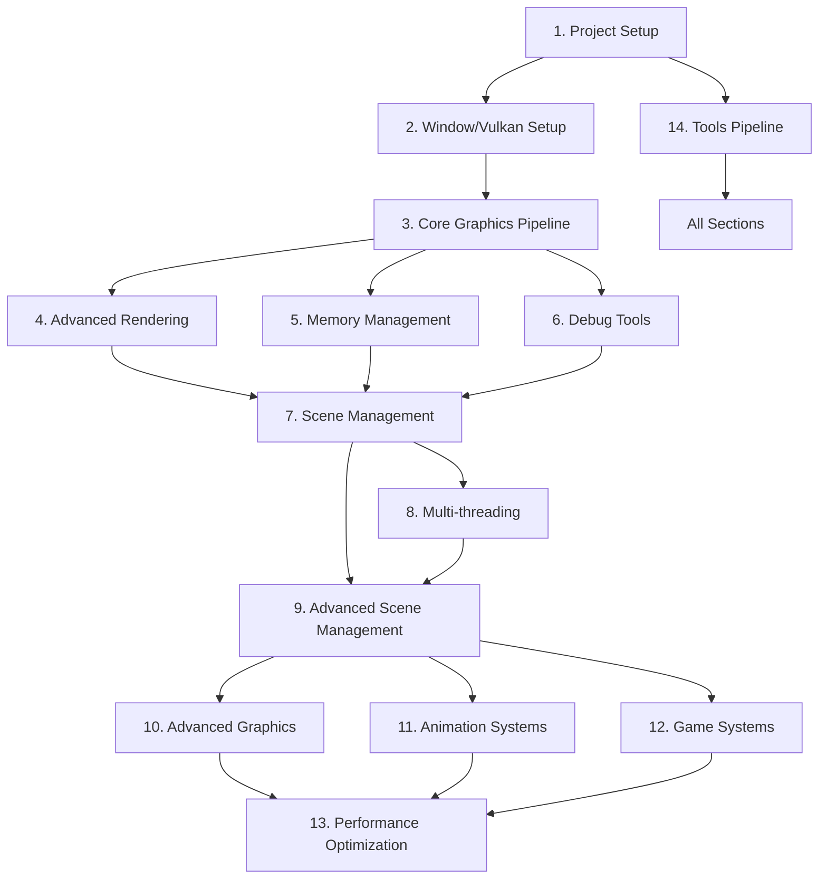

# Praxis Engine Development Roadmap

This document outlines the development roadmap for the Praxis Engine, a learning project to build a modern game engine with C++23 and Vulkan.

## Overview
The roadmap is organized into major milestones, each with specific goals, dependencies, and measurable progress metrics. The development approach focuses on incremental learning and implementation, with each section building upon previous work.

### Dependencies Overview

### Priority Legend
🔴 Essential—Must have for a working engine

🟡 Important—Should have for a full-featured engine

🟢 Optional—Nice to have, can be added later

## Milestones

### 1. Project Setup and Build System 📗
- [x] Set up basic directory structure
- [x] Create initial CMake configuration
- [x] Add core external dependencies
- [x] Create basic abstraction headers
- [ ] Build app and run tests on GitHub CI
- **Learning**: CMake in Practice (book), [CMake Tutorial](https://cmake.org/cmake/help/latest/guide/tutorial/index.html)

### 2. Window Creation and Basic Vulkan Setup 📙
- [x] Initialize SDL window
- [x] Create Vulkan instance
- [x] Set up validation layers
- [x] Create device and queues
- [x] Initialize swapchain
- [x] Basic render pass setup
- [ ] Implement proper error recovery
- [ ] Add device lost handling
- [ ] Add validation layer message filtering
- [ ] Add debug utils extension support
- [ ] Implement device feature queries
- **Learning**: 
  - [Vulkan Tutorial](https://vulkan-tutorial.com/)
  - "Game Engine Architecture" Ch. 15 (Graphics Engine Low-Level)
  - "Real-Time Rendering" Ch. 1 (Graphics Pipeline Overview)

### 3. Core Graphics Pipeline Implementation 📘
- [ ] Graphics pipeline setup
- [ ] Shader management system
  - [ ] SPIR-V compilation
  - [ ] Runtime shader hot-reload
  - [ ] Shader reflection
- [ ] Vertex/Index buffer management
- [ ] Uniform buffer system
- [ ] Descriptor set/layout handling
- [ ] Material system foundation
- [ ] Pipeline state objects
- [ ] Pipeline layout management
- [ ] Push constant optimization
- [ ] Pipeline derivatives
- [ ] Pipeline cache serialization
- **Learning**: 
  - [Vulkan Shader Resource Binding](https://www.khronos.org/blog/vulkan-shader-resource-binding)
  - "Real-Time Rendering" Ch. 2-3 (GPU Architecture, Graphics Pipeline)
  - "Game Engine Architecture" Ch. 15.4 (Graphics Resource Management)
  - "Foundations of Game Engine Development, Vol. 2" Ch. 1-2 (Rendering Pipeline, Shader Programs)

### 4. Advanced Rendering Features 📕
- [ ] Depth buffer implementation
- [ ] Multisampling (MSAA) support
- [ ] Texture loading and management
- [ ] Multiple render targets (MRT)
- [ ] Pipeline caching
- [ ] Command buffer optimization
- [ ] Modern Vulkan features
  - [ ] Dynamic state
  - [ ] Timeline semaphores
  - [ ] Buffer device address
- [ ] Bindless rendering setup
- [ ] Mesh shaders integration
- [ ] Ray tracing foundation
- [ ] GPU-driven rendering pipeline
- **Learning**: 
  - "Real-Time Rendering" Ch. 5 (Shading Basics), Ch. 9 (Pipeline Optimization)
  - "Physically Based Rendering" Ch. 7 (Sampling and Reconstruction)
  - "Foundations of Game Engine Development, Vol. 2" Ch. 4 (Advanced Rendering)

### 5. Memory and Resource Management 📗
- [ ] Vulkan Memory Allocator (VMA) integration
- [ ] Staging buffer system
- [ ] Resource pooling
- [ ] Texture streaming
- [ ] Buffer defragmentation
- [ ] Resource lifetime management
- [ ] Memory budget tracking
- [ ] Resource residency management
- [ ] Memory defragmentation strategies
- [ ] Resource aliasing
- **Learning**: 
  - "Game Engine Architecture" Ch. 5.3 (Memory Management)
  - "Foundations of Game Engine Development, Vol. 1" Ch. 2 (Memory Management)
  - [Vulkan Memory Management](https://gpuopen.com/learn/vulkan-memory-management/)

### 6. Performance and Debug Tools 📙
- [ ] Debug markers and labels
- [ ] Performance markers
- [ ] GPU timestamp queries
- [ ] Memory leak detection
- [ ] Pipeline statistics
- [ ] Frame capture support
- [ ] Resource tracking
- [ ] Shader debugging support
- [ ] RenderDoc integration
- [ ] Performance counter tracking
- [ ] Automated performance testing
- **Learning**: 
  - "Game Engine Architecture" Ch. 5.4 (Debug Systems)
  - "Real-Time Rendering" Ch. 23 (Graphics Pipeline Performance)

### 7. Scene Management and Rendering 📘
- [ ] Scene graph implementation
- [ ] Frustum culling
- [ ] LOD system
- [ ] Instanced rendering
- [ ] Indirect drawing
- [ ] Occlusion culling
- [ ] View frustum optimization
- [ ] Portal culling system
- [ ] Dynamic batching system
- [ ] Instance data management
- **Learning**: 
  - "Real-Time Rendering" Ch. 19 (Acceleration Algorithms)
  - "Game Engine Architecture" Ch. 14 (Scene Graph/Culling Optimizations)
  - "Foundations of Game Engine Development, Vol. 2" Ch. 3 (Scene Management)

### 8. Multi-threading Support 📕
- [ ] Command buffer multi-threading
- [ ] Resource loading thread
- [ ] Async compute
- [ ] Job system integration
- [ ] Thread pool management
- [ ] Command buffer recording parallelization
- [ ] Pipeline state creation threading
- [ ] Resource upload threading
- [ ] Parallel frustum culling
- **Learning**: 
  - "Game Engine Architecture" Ch. 7 (Multi-threading)
  - "Foundations of Game Engine Development, Vol. 1" Ch. 4 (Parallel Algorithms)

### 9. Advanced Scene Management 📘
- [ ] Spatial partitioning system
  - [ ] Octree/quadtree implementation
  - [ ] Dynamic scene subdivision
  - [ ] Visibility determination
- [ ] World streaming system
  - [ ] Chunk-based loading/unloading
  - [ ] Distance-based LOD management
  - [ ] Async resource streaming
- [ ] Scene serialization
  - [ ] Binary scene format
  - [ ] Delta compression for saves
  - [ ] Scene diffing and patching
- [ ] Scene editor tools
  - [ ] WYSIWYG editor integration
  - [ ] Scene hierarchy manipulation
  - [ ] Property editors
- [ ] Hierarchical Z-buffer occlusion
- [ ] Dynamic object management
- [ ] Scene graph optimization
- **Learning**: 
  - "Game Engine Architecture" Ch. 14.7 (Scene Graph Design and Implementation)
  - "Foundations of Game Engine Development, Vol. 2" Ch. 3 (Scene Graph Systems)

### 10. Advanced Graphics Features 📕
- [ ] Advanced lighting system
  - [ ] Dynamic time of day
  - [ ] Global illumination
  - [ ] Volumetric lighting
  - [ ] Dynamic weather effects
- [ ] Post-processing pipeline
  - [ ] HDR rendering
  - [ ] Tone mapping
  - [ ] Bloom and eye adaptation
  - [ ] Screen-space effects (SSAO, SSR)
- [ ] Terrain system
  - [ ] Height-field terrain
  - [ ] Dynamic tessellation
  - [ ] Terrain LOD
  - [ ] Foliage system
- [ ] Advanced materials
  - [ ] PBR workflow
  - [ ] Material layering
  - [ ] Decal system
  - [ ] Dynamic surface effects (wetness, snow)
- [ ] Clustered forward/deferred rendering
- [ ] Tiled light management
- [ ] Shadow mapping techniques
  - [ ] Cascaded shadow maps
  - [ ] Variance shadow maps
  - [ ] Moment shadow maps
- **Learning**: 
  - "Real-Time Rendering" Ch. 7-8 (Shadows), Ch. 10-11 (Local and Global Illumination)
  - "Physically Based Rendering" Ch. 8 (Reflection Models), Ch. 11 (Volume Rendering)
  - "Foundations of Game Engine Development, Vol. 2" Ch. 5 (Lighting and Materials)

### 11. Animation and Characters 📗
- [ ] Animation system
  - [ ] Skeletal animation
  - [ ] Animation blending
  - [ ] Inverse kinematics
  - [ ] Ragdoll physics
- [ ] Character system
  - [ ] Character customization
  - [ ] Equipment system
  - [ ] Dynamic cloth simulation
  - [ ] Hair/fur rendering
- [ ] Crowd system
  - [ ] Instanced character rendering
  - [ ] LOD for animated characters
  - [ ] Animation compression
- [ ] GPU-driven skinning
- [ ] Animation compression
- [ ] Motion matching system
- **Learning**: 
  - "Game Engine Architecture" Ch. 11 (Animation Systems)
  - "Real-Time Rendering" Ch. 4 (Animation and Skinning)

### 12. Game Systems Integration 📙
- [ ] Quest system
  - [ ] Quest state management
  - [ ] Trigger system
  - [ ] Dialog system integration
- [ ] Inventory system
  - [ ] Item database
  - [ ] Equipment management
  - [ ] Crafting system
- [ ] AI and NPC system
  - [ ] Behavior trees
  - [ ] Pathfinding
  - [ ] Dynamic NPC scheduling
  - [ ] Combat AI
- [ ] Save/Load system
  - [ ] State serialization
  - [ ] Save file management
  - [ ] Backwards compatibility
- [ ] Event system optimization
- [ ] Component serialization
- [ ] System dependencies management
- **Learning**: 
  - "Game Engine Architecture" Ch. 6 (Game Loop/Update), Ch. 13 (Runtime Gameplay Systems)

### 13. Performance Optimization for Open Worlds 📕
- [ ] Memory management
  - [ ] Custom allocators for game systems
  - [ ] Memory defragmentation
  - [ ] Resource streaming optimization
- [ ] CPU optimization
  - [ ] Job system for game logic
  - [ ] SIMD optimizations
  - [ ] Cache-friendly data structures
- [ ] GPU optimization
  - [ ] Draw call batching
  - [ ] GPU-driven rendering
  - [ ] Mesh shader pipeline
  - [ ] Compute shader utilization
- [ ] Loading optimization
  - [ ] Background loading
  - [ ] Asset compression
  - [ ] Load time profiling
- [ ] Streaming distance optimization
- [ ] Memory residency prediction
- [ ] Dynamic quality scaling
- **Learning**: 
  - "Real-Time Rendering" Ch. 21 (Acceleration Algorithms), Ch. 23 (Graphics Pipeline Performance)
  - "Game Engine Architecture" Ch. 7 (High-Level Engine Systems)
  - "Foundations of Game Engine Development, Vol. 1" Ch. 5 (Performance and Optimization)

### 14. Tools and Pipeline 📘
- [ ] Asset pipeline
  - [ ] Asset preprocessing
  - [ ] Asset versioning
  - [ ] Hot reload system
- [ ] Development tools
  - [ ] Scene editor
  - [ ] Material editor
  - [ ] Particle editor
  - [ ] Animation editor
- [ ] Debugging tools
  - [ ] Performance profiler
  - [ ] Memory tracker
  - [ ] Scene inspector
  - [ ] State debugger
- [ ] Build pipeline
  - [ ] Asset packaging
  - [ ] Dependency tracking
  - [ ] Distribution preparation
- [ ] Asset dependency tracking
- [ ] Incremental build system
- [ ] Runtime performance analysis
- **Learning**: 
  - "Game Engine Architecture" Ch. 16 (Tools and Asset Pipeline)
  - "Physically Based Rendering" Ch. 6 (Texture and Materials Pipeline)