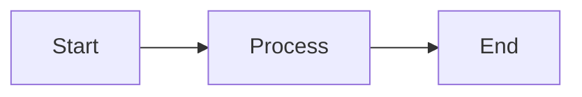

# Praxis Documentation System

This directory contains the Praxis game engine course site built with MkDocs Material. It provides multi-language code examples, interactive tabs, and comprehensive learning paths.

## Features

### 🌐 Multi-Language Support
- **Pseudocode** - Abstract algorithm descriptions
- **Rust (Praxis)** - ECS-based implementation
- **C++ (Unreal-style)** - Object-oriented approach
- **C# (Unity-style)** - Component-based approach

### ✨ Interactive Features
- **Content Tabs** - Switch between languages with one click
- **Persistent Preferences** - Language choice saved automatically
- **Keyboard Shortcuts** - Quick language switching (Alt+1-4)
- **Copy Buttons** - Easy code copying
- **Search** - Full-text search across all content

### 📚 Comprehensive Content
- **Course Curriculum** - Structured learning path
- **Code Examples** - Side-by-side implementations
- **Universal Patterns** - Engine-agnostic design patterns
- **Exercises** - Hands-on practice
- **Projects** - Complete implementations
- **API Reference** - Detailed documentation

## Quick Start

### Local Development

1. **Install Python dependencies:**
   ```bash
   pip install -r requirements-docs.txt
   ```

2. **Run local server:**
   ```bash
   mkdocs serve
   ```

3. **Open in browser:**
   ```
   http://localhost:8000
   ```

### Building Static Site

```bash
mkdocs build
```

Output is in `site/` directory.

## Structure

```
docs/
├── index.md                    # Home page
├── course/                     # Course content
│   ├── index.md               # Course overview
│   ├── CURRICULUM.md          # Course outline
│   ├── CODE_EXAMPLES.md       # Multi-language examples
│   ├── LANGUAGE_GUIDE.md      # Translation guide
│   ├── glossary.md            # Terminology
│   ├── examples/              # Detailed examples
│   │   ├── transform-propagation.md
│   │   ├── frustum-culling.md
│   │   ├── fixed-timestep-physics.md
│   │   └── ecs-vs-oop.md
│   ├── patterns/              # Universal patterns
│   │   ├── index.md
│   │   ├── game-loop-patterns.md
│   │   ├── component-storage-strategies.md
│   │   ├── rendering-architecture-patterns.md
│   │   └── memory-management-approaches.md
│   ├── exercises/             # Hands-on exercises
│   ├── projects/              # Complete projects
│   └── comparisons/           # Engine comparisons
├── getting-started/           # Installation and setup
├── guides/                    # Task-oriented tutorials
├── concepts/                  # Theoretical foundations
├── reference/                 # API documentation
├── learning-paths/            # Structured progressions
├── editor/                    # Editor documentation
├── stylesheets/               # Custom CSS
│   └── extra.css
└── javascripts/               # Custom JS
    ├── extra.js
    └── mathjax.js
```

## Configuration

### Main Config: `mkdocs.yml`

Key settings:

```yaml
theme:
  name: material
  features:
    - navigation.tabs          # Top-level tabs
    - content.tabs.link        # Sync tabs across page
    - content.code.copy        # Copy buttons
    - search.suggest           # Search suggestions

markdown_extensions:
  - pymdownx.tabbed:           # Content tabs
      alternate_style: true
  - pymdownx.superfences       # Code blocks
  - pymdownx.highlight         # Syntax highlighting
```

### Custom Styling: `stylesheets/extra.css`

Enhanced tab styling, language icons, responsive design, and accessibility features.

### Custom Scripts: `javascripts/extra.js`

- Language preference persistence
- Tab synchronization
- Keyboard shortcuts
- Progress tracking

## Writing Content

### Adding Code Examples

Use tabbed content for multi-language examples:

````markdown
=== "Pseudocode"

    ```
    FUNCTION example():
        PRINT "Hello"
    ```

=== "Rust (Praxis)"

    ```rust
    fn example() {
        println!("Hello");
    }
    ```

=== "C++ (Unreal)"

    ```cpp
    void Example() {
        UE_LOG(LogTemp, Log, TEXT("Hello"));
    }
    ```

=== "C# (Unity)"

    ```csharp
    void Example() {
        Debug.Log("Hello");
    }
    ```
````

### Difficulty Badges

```html
<span class="difficulty-badge difficulty-beginner">Beginner</span>
<span class="difficulty-badge difficulty-intermediate">Intermediate</span>
<span class="difficulty-badge difficulty-advanced">Advanced</span>
```

### Admonitions

```markdown
!!! tip "Pro Tip"
    Use keyboard shortcuts for faster navigation!

!!! warning "Caution"
    This operation cannot be undone.

!!! info "Note"
    Additional context here.

!!! danger "Important"
    Critical information.
```

### Feature Grids

```html
<div class="feature-grid">
  <div class="feature-card">
    <h3>Title</h3>
    <p>Description</p>
    <a href="link.html">Learn More →</a>
  </div>
</div>
```

## GitHub Pages Deployment

### Automatic Deployment

The site deploys automatically when pushing to `main`:

1. `.github/workflows/docs.yml` builds the site
2. GitHub Pages serves from `gh-pages` branch
3. Available at `https://yourusername.github.io/praxis/`

### Manual Deployment

```bash
mkdocs gh-deploy
```

This builds and pushes to `gh-pages` branch.

### Setup GitHub Pages

1. Go to repository **Settings** → **Pages**
2. Source: **Deploy from a branch**
3. Branch: **gh-pages** / **(root)**
4. Save

## Search Configuration

Search is powered by MkDocs Material's built-in search:

```yaml
plugins:
  - search:
      separator: '[\s\-,:!=\[\]()"/]+|(?!\b)(?=[A-Z][a-z])|\.(?!\d)|&[lg]t;'
      lang:
        - en
```

## Analytics (Optional)

Enable Google Analytics in `mkdocs.yml`:

```yaml
extra:
  analytics:
    provider: google
    property: G-XXXXXXXXXX  # Your tracking ID
```

## MathJax Support

Mathematical expressions are supported:

Inline: `\( E = mc^2 \)`

Display:
```
\[
\frac{\partial u}{\partial t} = \nabla^2 u
\]
```

## Mermaid Diagrams

Create diagrams with Mermaid syntax:

````markdown

````

## Best Practices

### Content Organization
- One concept per page
- Use clear headings (H2, H3)
- Include navigation links at bottom
- Cross-reference related content

### Code Examples
- Always provide all four language variants
- Keep examples focused and minimal
- Explain key patterns in each language
- Include comments for clarity

### Accessibility
- Use semantic HTML
- Provide alt text for images
- Ensure sufficient contrast
- Support keyboard navigation

### Performance
- Optimize images (WebP, compress)
- Use code splitting for large pages
- Enable minification in production
- Lazy-load heavy content

## Maintenance

### Updating Dependencies

```bash
pip install --upgrade -r requirements-docs.txt
```

### Checking Links

```bash
mkdocs build --strict  # Fails on warnings
```

### Validating

Run locally before deploying:

```bash
mkdocs serve
# Check all pages manually
# Test language tabs
# Verify search
# Check mobile responsive
```

## Troubleshooting

### Tabs Not Working
- Ensure `pymdownx.tabbed` is enabled
- Check for proper `===` syntax
- Verify alternate_style is true

### Search Not Finding Content
- Rebuild search index: `mkdocs build --clean`
- Check `search` plugin is enabled
- Verify content is in markdown files

### Styles Not Applying
- Clear browser cache
- Check `extra_css` path in config
- Verify CSS file exists

### Deployment Failing
- Check GitHub Actions logs
- Verify `requirements-docs.txt` is up to date
- Ensure all dependencies are pinned

## Contributing

### Adding New Pages

1. Create markdown file in appropriate directory
2. Add to `nav` in `mkdocs.yml`
3. Follow existing format and style
4. Include multi-language examples
5. Add cross-references

### Improving Examples

1. Keep implementations functionally identical
2. Show idiomatic code for each language
3. Highlight key differences
4. Explain trade-offs

### Reporting Issues

- Use GitHub Issues
- Include page URL
- Describe expected vs actual
- Provide browser/OS info

## Resources

- [MkDocs Documentation](https://www.mkdocs.org/)
- [Material for MkDocs](https://squidfunk.github.io/mkdocs-material/)
- [PyMdown Extensions](https://facelessuser.github.io/pymdown-extensions/)
- [Markdown Guide](https://www.markdownguide.org/)

## License

Documentation content is licensed under CC BY 4.0.
Code examples follow the main repository license.
