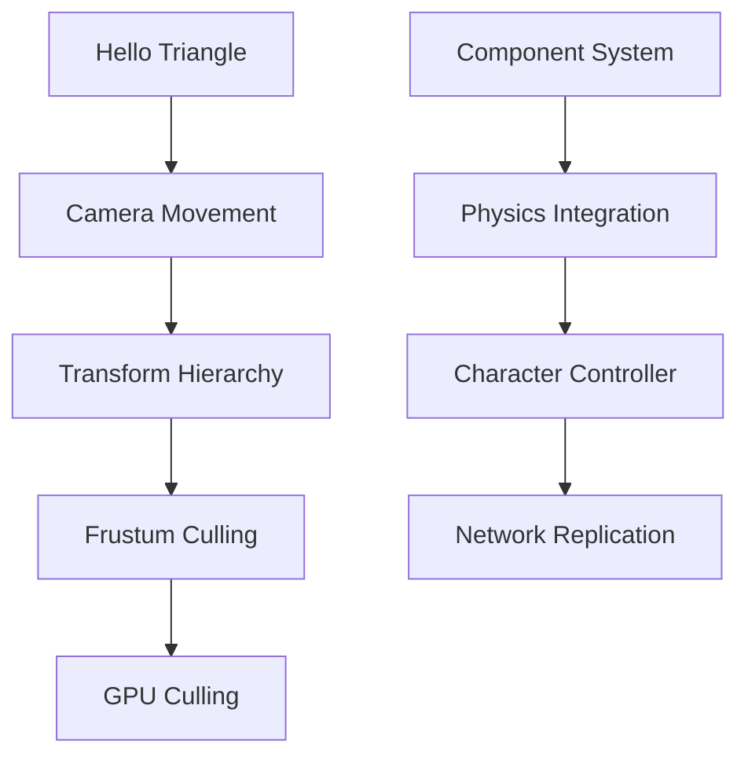

# Exercises

Hands-on exercises to reinforce concepts and build practical skills. Each exercise includes starter code, requirements, and solutions in multiple languages.

## By Difficulty

### Beginner Exercises
Beginner

Perfect for getting started:

1. **Hello Triangle** - Render your first triangle
2. **Camera Movement** - Implement WASD controls
3. **Transform Hierarchy** - Build a simple scene graph
4. **Component System** - Create custom components

### Intermediate Exercises
Intermediate

Build on fundamentals:

1. **Frustum Culling** - Optimize rendering
2. **Animation Blending** - Smooth transitions
3. **Physics Integration** - Add rigid bodies
4. **Simple AI** - Pathfinding and behavior

### Advanced Exercises
Advanced

Master complex systems:

1. **GPU Culling** - Compute shader optimization
2. **Network Replication** - Multiplayer sync
3. **Custom Renderer** - Build a render pipeline
4. **Editor Tools** - Implement undo/redo

## By Topic

### Rendering
- Basic forward rendering
- Deferred G-buffer setup
- Shadow mapping
- Post-processing effects

### Animation
- Skeletal animation playback
- Blend trees
- Inverse kinematics
- Ragdoll physics

### Physics
- Collision detection
- Character controller
- Vehicle physics
- Cloth simulation

### Performance
- Spatial partitioning
- LOD implementation
- Object pooling
- Profiling and optimization

## Exercise Format

Each exercise includes:

1. **Objective** - What you'll build
2. **Prerequisites** - Required knowledge
3. **Starter Code** - Multi-language templates
4. **Requirements** - Specific goals
5. **Hints** - Guidance when stuck
6. **Solution** - Complete implementation
7. **Extensions** - Further challenges

## Multi-Language Support

All exercises provide starter code in:

=== "Rust"
    Praxis-based implementation

=== "C++"
    Unreal-style approach

=== "C#"
    Unity-style approach

## Progression

Exercises are designed to build on each other:

## Submission

Want to share your solution?

1. Fork the repository
2. Add your solution to `exercises/solutions/`
3. Submit a pull request
4. Get feedback from the community

---

  
<strong>Coming Soon!</strong>

  
Exercises are being developed. Check back soon for hands-on practice.

