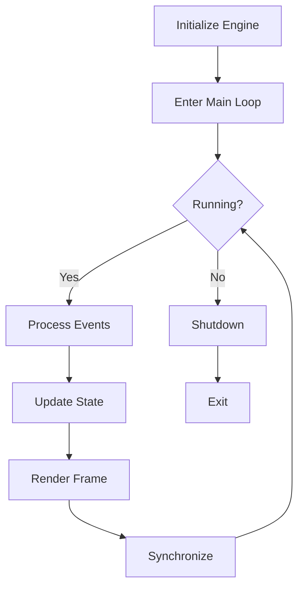
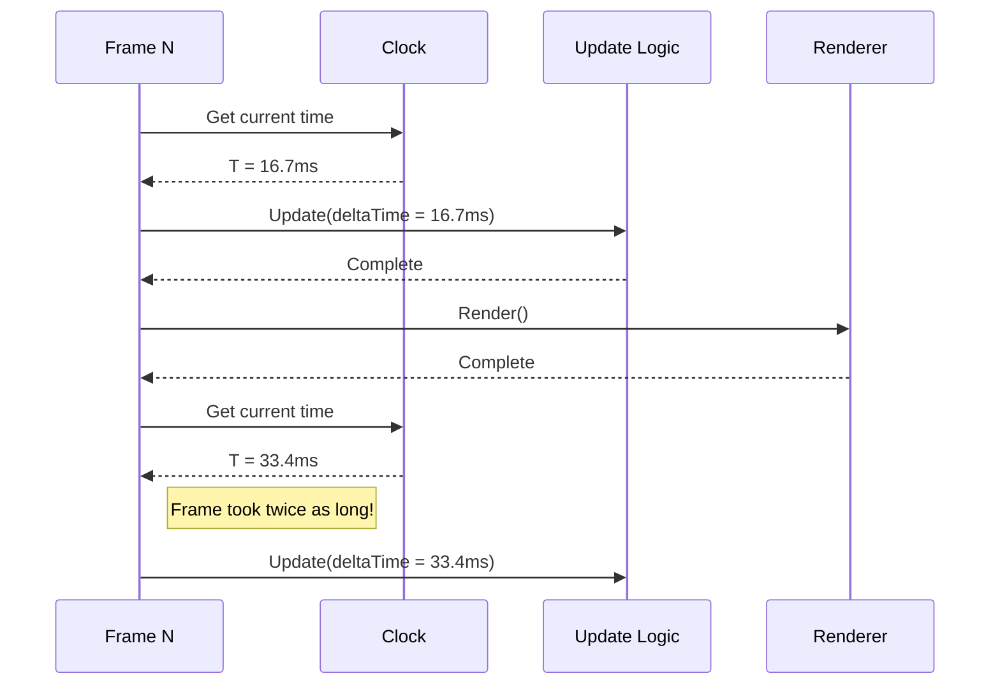
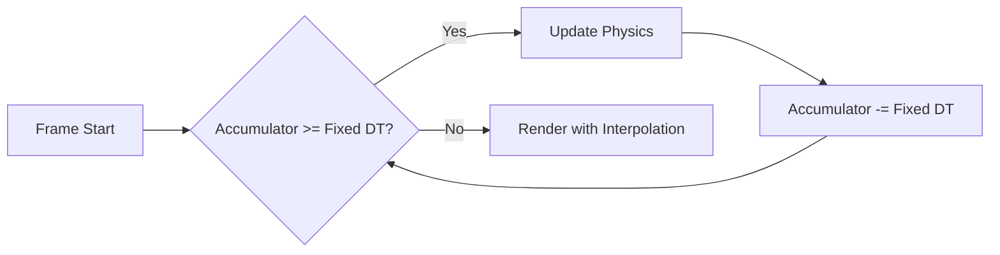
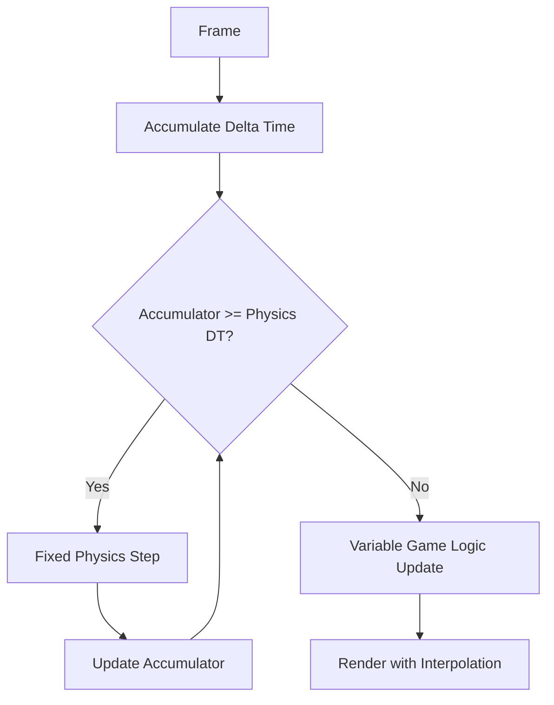
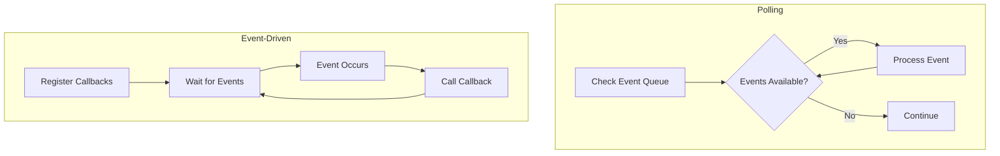
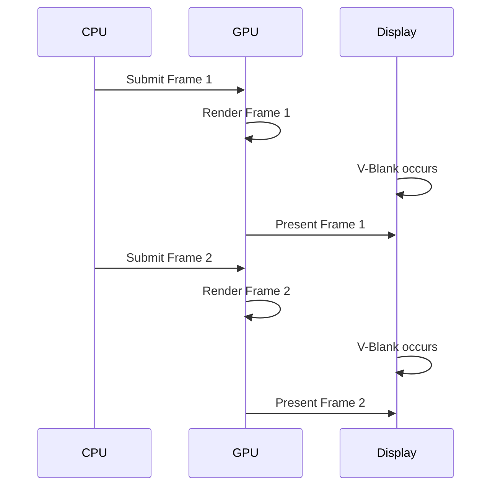
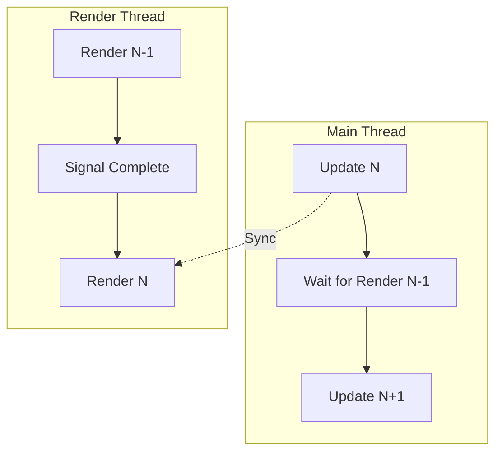

# Module 1: Game Loop Fundamentals

**Duration**: 2-3 weeks  
**Complexity**: Beginner

## Abstract

The game loop is the heartbeat of any real-time interactive application. This module explores the fundamental execution pattern that drives continuous updates, rendering, and event processing in game engines, independent of programming language or platform.

## Core Architecture

### Conceptual Model



### The Universal Game Loop Pattern

Every game loop follows this abstract structure:

```
PROCEDURE Initialize()
    CREATE window
    INITIALIZE graphics subsystem
    INITIALIZE audio subsystem
    INITIALIZE input subsystem
    LOAD initial assets
    SET running = true
END PROCEDURE

PROCEDURE MainLoop()
    WHILE running DO
        ProcessEvents()
        UpdateSimulation()
        RenderFrame()
        SynchronizeFrame()
    END WHILE
END PROCEDURE

PROCEDURE Shutdown()
    RELEASE all resources
    DESTROY subsystems
    CLOSE window
END PROCEDURE
```

## Timestep Strategies

### Variable Timestep

Updates based on actual elapsed time since last frame.



**Algorithm**:

```
DATA last_time = GetCurrentTime()

PROCEDURE VariableTimestepLoop()
    WHILE running DO
        current_time = GetCurrentTime()
        delta_time = current_time - last_time
        last_time = current_time
        
        Update(delta_time)
        Render()
    END WHILE
END PROCEDURE
```

**Characteristics**:
- **Advantages**: Simple, smooth rendering, adapts to performance
- **Disadvantages**: Non-deterministic physics, numerical instability, variable behavior
- **Use Cases**: Non-physics-critical applications, prototypes

### Fixed Timestep

Updates in constant time increments using an accumulator.



**Algorithm**:

```
CONSTANT FIXED_TIMESTEP = 1.0 / 60.0  // 60 updates per second
DATA accumulator = 0.0
DATA last_time = GetCurrentTime()

PROCEDURE FixedTimestepLoop()
    WHILE running DO
        current_time = GetCurrentTime()
        frame_time = current_time - last_time
        last_time = current_time
        
        // Clamp to prevent spiral of death
        IF frame_time > 0.25 THEN
            frame_time = 0.25
        END IF
        
        accumulator = accumulator + frame_time
        
        // Update in fixed steps
        WHILE accumulator >= FIXED_TIMESTEP DO
            UpdatePhysics(FIXED_TIMESTEP)
            accumulator = accumulator - FIXED_TIMESTEP
        END WHILE
        
        // Calculate interpolation for rendering
        alpha = accumulator / FIXED_TIMESTEP
        Render(alpha)
    END WHILE
END PROCEDURE
```

**Characteristics**:
- **Advantages**: Deterministic simulation, stable physics, reproducible behavior
- **Disadvantages**: More complex, requires interpolation
- **Use Cases**: Physics simulation, multiplayer games, deterministic gameplay

### Semi-Fixed (Hybrid) Timestep

Combines fixed physics updates with variable rendering.



**Algorithm**:

```
CONSTANT PHYSICS_TIMESTEP = 1.0 / 60.0
DATA physics_accumulator = 0.0
DATA previous_state = {}
DATA current_state = {}

PROCEDURE HybridTimestepLoop()
    WHILE running DO
        delta_time = CalculateDeltaTime()
        
        // Fixed physics updates
        physics_accumulator = physics_accumulator + delta_time
        WHILE physics_accumulator >= PHYSICS_TIMESTEP DO
            previous_state = current_state
            UpdatePhysics(current_state, PHYSICS_TIMESTEP)
            physics_accumulator = physics_accumulator - PHYSICS_TIMESTEP
        END WHILE
        
        // Variable game logic
        UpdateGameLogic(delta_time)
        
        // Interpolate physics for rendering
        alpha = physics_accumulator / PHYSICS_TIMESTEP
        interpolated_state = Interpolate(previous_state, current_state, alpha)
        Render(interpolated_state)
    END WHILE
END PROCEDURE
```

## Frame Interpolation

Smooth visual representation between discrete physics states.

```
FUNCTION Interpolate(previous, current, alpha)
    RETURN previous * (1.0 - alpha) + current * alpha
END FUNCTION

// For positions
interpolated_position = Interpolate(previous_position, current_position, alpha)

// For rotations (requires spherical interpolation)
interpolated_rotation = SphericalInterpolate(previous_rotation, current_rotation, alpha)
```

## Event Processing Patterns

### Polling vs. Event-Driven



**Polling Pattern**:

```
PROCEDURE ProcessEventsByPolling()
    WHILE HasEvents() DO
        event = GetNextEvent()
        
        MATCH event.type
            CASE QUIT:
                running = false
            CASE KEY_PRESSED:
                HandleKeyPress(event.key)
            CASE MOUSE_MOVED:
                HandleMouseMove(event.x, event.y)
            DEFAULT:
                // Ignore unknown events
        END MATCH
    END WHILE
END PROCEDURE
```

**Event-Driven Pattern**:

```
PROCEDURE SetupEventHandlers()
    RegisterCallback(QUIT, OnQuit)
    RegisterCallback(KEY_PRESSED, OnKeyPressed)
    RegisterCallback(MOUSE_MOVED, OnMouseMoved)
END PROCEDURE

FUNCTION OnQuit(event)
    running = false
END FUNCTION

FUNCTION OnKeyPressed(event)
    HandleKeyPress(event.key)
END FUNCTION
```

### Input Buffering

Handle inputs that occur between frames:

```
DATA input_buffer = Queue()

PROCEDURE CaptureInput()
    WHILE HasInputEvent() DO
        input_buffer.Enqueue(GetInputEvent())
    END WHILE
END PROCEDURE

PROCEDURE ProcessBufferedInput()
    WHILE NOT input_buffer.IsEmpty() DO
        input = input_buffer.Dequeue()
        ProcessInput(input)
    END WHILE
    input_buffer.Clear()
END PROCEDURE
```

## Frame Budget Analysis

### Time Budget for 60 FPS

```
Target frame time: 16.67ms (1000ms / 60 frames)

Typical budget allocation:
┌──────────────────────────────────┐
│ Input Processing:      0.5ms (3%) │
│ Game Logic:           3.0ms (18%) │
│ Physics:              4.0ms (24%) │
│ Animation:            2.0ms (12%) │
│ Rendering:            6.0ms (36%) │
│ Audio:                0.5ms (3%)  │
│ Other/Overhead:       0.67ms (4%) │
├──────────────────────────────────┤
│ Total:               16.67ms      │
└──────────────────────────────────┘
```

### Performance Monitoring

```
DATA frame_samples = CircularBuffer(60)
DATA frame_start_time
DATA frame_end_time

PROCEDURE MonitorPerformance()
    frame_start_time = GetCurrentTime()
    
    // ... game loop work ...
    
    frame_end_time = GetCurrentTime()
    frame_duration = frame_end_time - frame_start_time
    
    frame_samples.Add(frame_duration)
    
    IF frame_duration > TARGET_FRAME_TIME THEN
        LogWarning("Frame budget exceeded: " + frame_duration + "ms")
    END IF
    
    // Calculate statistics
    average_frame_time = frame_samples.Average()
    min_frame_time = frame_samples.Min()
    max_frame_time = frame_samples.Max()
    fps = 1000.0 / average_frame_time
END PROCEDURE
```

## Common Anti-Patterns

### Spiral of Death

When updates take longer than the timestep, causing infinite catching up:

```
// PROBLEMATIC CODE
WHILE accumulator >= FIXED_DT DO
    Update(FIXED_DT)  // This might take 20ms
    accumulator -= FIXED_DT  // Remove 16.67ms
    // accumulator keeps growing!
END WHILE
```

**Solution**: Clamp maximum frame time:

```
// CORRECTED CODE
frame_time = MIN(frame_time, MAX_FRAME_TIME)
accumulator += frame_time
```

### Frame Rate Dependent Logic

```
// WRONG: Movement depends on frame rate
position += velocity  // Moves faster at higher FPS

// CORRECT: Scale by time
position += velocity * delta_time  // Consistent speed
```

### Sleeping Incorrectly

```
// INACCURATE: Sleep is not precise
target_sleep = TARGET_FRAME_TIME - elapsed
Sleep(target_sleep)  // May oversleep or undersleep

// BETTER: Busy-wait for last microseconds
IF remaining_time > 1ms THEN
    Sleep(remaining_time - 1ms)
END IF
WHILE GetElapsedTime() < TARGET_FRAME_TIME DO
    // Spin wait
END WHILE
```

## Frame Synchronization Strategies

### V-Sync (Vertical Synchronization)



**Interface**:

```
INTERFACE SwapchainConfiguration
    METHOD EnableVSync(enabled: Boolean)
    METHOD SetPresentMode(mode: PresentMode)
        // PresentMode: IMMEDIATE, MAILBOX, FIFO, FIFO_RELAXED
END INTERFACE
```

### Triple Buffering

```
Buffers:
[Front Buffer]  ← Currently displayed
[Back Buffer 1] ← GPU rendering
[Back Buffer 2] ← CPU preparing

Rotation each frame:
Front → Available for CPU
Back1 → Front
Back2 → Back1
```

### Frame Pacing

```
DATA target_frame_time = 1.0 / TARGET_FPS
DATA frame_start

PROCEDURE PacedFrame()
    frame_start = GetCurrentTime()
    
    // Game loop work
    Update()
    Render()
    
    // Wait for target time
    elapsed = GetCurrentTime() - frame_start
    remaining = target_frame_time - elapsed
    
    IF remaining > 0 THEN
        PreciseSleep(remaining)
    END IF
END PROCEDURE
```

## Multi-Threaded Game Loop

### Parallel Update and Render



**Algorithm**:

```
SHARED DATA render_data
SHARED DATA render_semaphore
SHARED DATA update_semaphore

THREAD MainThread()
    WHILE running DO
        Update()
        
        // Wait for previous render to complete
        Wait(render_semaphore)
        
        // Copy data for renderer
        render_data = CopyCurrentState()
        
        // Signal render thread
        Signal(update_semaphore)
    END WHILE
END THREAD

THREAD RenderThread()
    WHILE running DO
        // Wait for new data
        Wait(update_semaphore)
        
        // Render using copied data
        Render(render_data)
        
        // Signal completion
        Signal(render_semaphore)
    END WHILE
END THREAD
```

## Advanced Patterns

### Adaptive Quality

Dynamically adjust quality based on performance:

```
DATA quality_level = MEDIUM
DATA consecutive_slow_frames = 0

PROCEDURE AdaptiveQuality()
    IF frame_time > TARGET_FRAME_TIME THEN
        consecutive_slow_frames++
        
        IF consecutive_slow_frames > 5 THEN
            IF quality_level > LOW THEN
                quality_level = quality_level - 1
                ApplyQualitySettings(quality_level)
                consecutive_slow_frames = 0
            END IF
        END IF
    ELSE
        consecutive_slow_frames = 0
    END IF
END PROCEDURE
```

### Delta Time Smoothing

Reduce jitter from frame time variance:

```
DATA smoothed_delta_time = TARGET_FRAME_TIME
CONSTANT SMOOTHING_FACTOR = 0.9

PROCEDURE SmoothDeltaTime(measured_delta_time)
    smoothed_delta_time = smoothed_delta_time * SMOOTHING_FACTOR + 
                          measured_delta_time * (1.0 - SMOOTHING_FACTOR)
    RETURN smoothed_delta_time
END PROCEDURE
```

## Assessment Exercises

1. **Implement Variable Timestep Loop**: Create a basic loop with delta time calculation
2. **Implement Fixed Timestep Loop**: Add accumulator pattern for physics
3. **Add Interpolation**: Smooth rendering between physics steps
4. **Profile Frame Budget**: Measure time spent in each subsystem
5. **Handle Spiral of Death**: Implement frame time clamping
6. **Create Frame Rate Independence**: Convert frame-dependent code to time-based

## Key Takeaways

- The game loop is the fundamental execution pattern in real-time applications
- Fixed timestep ensures deterministic physics; variable timestep provides smooth rendering
- Interpolation bridges the gap between physics updates and rendering
- Frame budget analysis identifies performance bottlenecks
- Proper synchronization prevents visual artifacts and ensures smooth gameplay
- Language and platform are irrelevant; the pattern remains constant
