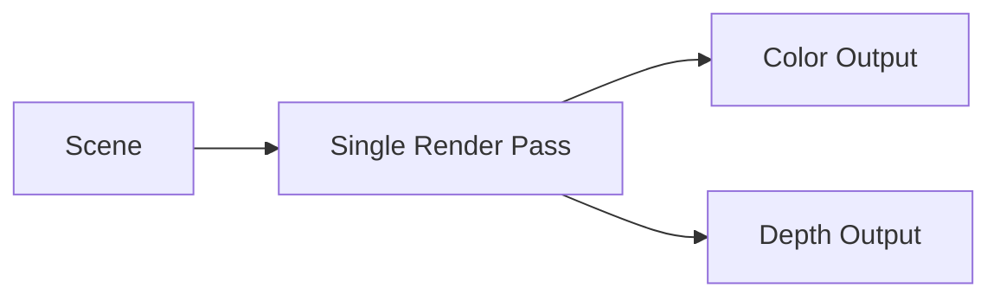
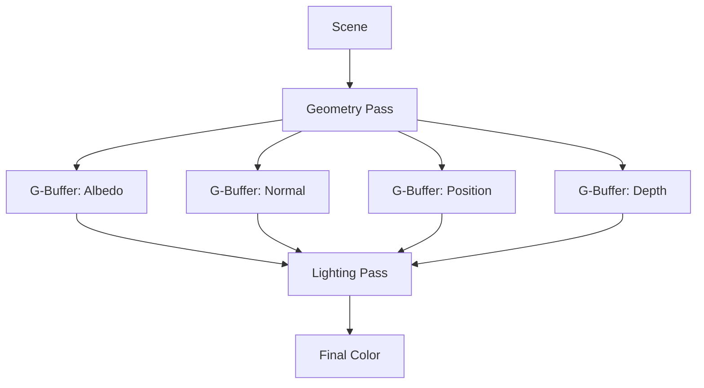
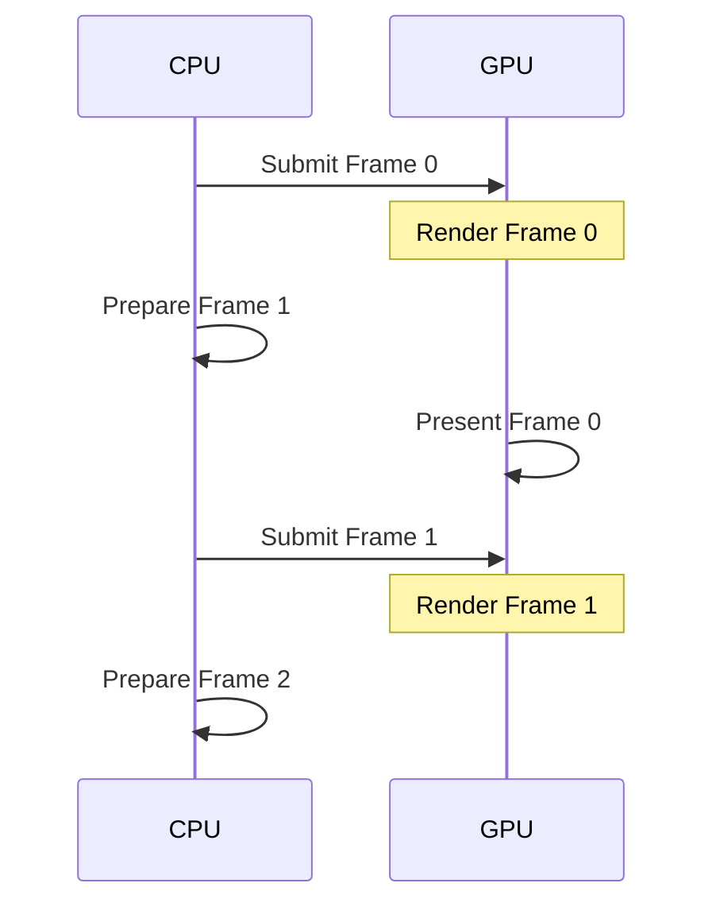

# Module 2: Rendering Architecture Patterns

**Duration**: 3-4 weeks  
**Complexity**: Intermediate

## Abstract

Rendering architecture defines how an engine transforms 3D scene data into 2D images. This module explores fundamental rendering paradigms, pipeline state management, and command buffer patterns that apply across all modern graphics APIs.

## Rendering Paradigm Comparison


### Immediate Mode Rendering

Direct rendering commands executed immediately:

```
PROCEDURE RenderImmediate()
    FOR EACH object IN scene DO
        BindShader(object.shader)
        BindTexture(object.texture)
        SetUniform("modelMatrix", object.transform)
        SetUniform("color", object.color)
        DrawMesh(object.mesh)
    END FOR
END PROCEDURE
```

**Characteristics**:
- **Simple mental model**: What you call is what executes
- **Minimal state**: No scene graph required
- **Poor batching**: Each object is separate draw call
- **No reordering**: Can't optimize draw order
- **Legacy approach**: OpenGL 1.x/2.x style

### Retained Mode Rendering

Build scene representation, then render optimally:

```
INTERFACE SceneNode
    PROPERTY transform: Matrix4x4
    PROPERTY children: List<SceneNode>
    PROPERTY renderable: RenderableComponent
    
    METHOD Update(deltaTime: Float)
    METHOD Render(context: RenderContext)
END INTERFACE

PROCEDURE RenderRetained(sceneRoot: SceneNode)
    // Build list of visible objects
    visibleObjects = CullScene(sceneRoot, camera.frustum)
    
    // Sort for optimal rendering
    SortByMaterial(visibleObjects)
    SortByDepth(visibleObjects)
    
    // Batch similar objects
    batches = CreateBatches(visibleObjects)
    
    // Render batches
    FOR EACH batch IN batches DO
        BindMaterial(batch.material)
        DrawInstanced(batch.meshes, batch.transforms)
    END FOR
END PROCEDURE
```

**Characteristics**:
- **Better optimization**: Sorting, batching, culling
- **State retention**: Scene graph persists
- **Complex management**: Need to update graph
- **Modern approach**: Most game engines

### Command Buffer Pattern

Record rendering commands for deferred execution:

```
INTERFACE CommandBuffer
    METHOD BeginRecording()
    METHOD BindPipeline(pipeline: Pipeline)
    METHOD BindDescriptorSet(set: DescriptorSet)
    METHOD SetViewport(x, y, width, height: Integer)
    METHOD DrawIndexed(indexCount, instanceCount: Integer)
    METHOD EndRecording()
    METHOD Execute()
END INTERFACE

PROCEDURE RenderWithCommandBuffer()
    commandBuffer = CreateCommandBuffer()
    
    commandBuffer.BeginRecording()
    
    // Record all commands
    FOR EACH drawCall IN sortedDrawCalls DO
        commandBuffer.BindPipeline(drawCall.pipeline)
        commandBuffer.BindDescriptorSet(drawCall.descriptors)
        commandBuffer.DrawIndexed(drawCall.indexCount, drawCall.instanceCount)
    END FOR
    
    commandBuffer.EndRecording()
    
    // Execute on GPU (potentially async)
    commandBuffer.Execute()
END PROCEDURE
```

**Characteristics**:
- **Deferred execution**: Record now, execute later
- **Multi-threading**: Record on multiple threads
- **Reusable**: Re-execute same commands
- **Vulkan/DX12/Metal**: Modern API requirement

## Graphics Pipeline Abstraction


### Pipeline State Object (PSO)

Encapsulates all fixed-function and shader state:

```
INTERFACE PipelineState
    // Shader stages
    PROPERTY vertexShader: ShaderModule
    PROPERTY fragmentShader: ShaderModule
    PROPERTY geometryShader: Optional<ShaderModule>
    
    // Vertex input
    PROPERTY vertexBindings: List<VertexBinding>
    PROPERTY vertexAttributes: List<VertexAttribute>
    
    // Input assembly
    PROPERTY topology: PrimitiveTopology  // TRIANGLE_LIST, LINE_STRIP, etc.
    
    // Rasterization
    PROPERTY cullMode: CullMode  // NONE, FRONT, BACK
    PROPERTY frontFace: FrontFace  // CLOCKWISE, COUNTER_CLOCKWISE
    PROPERTY polygonMode: PolygonMode  // FILL, LINE, POINT
    
    // Depth/Stencil
    PROPERTY depthTestEnable: Boolean
    PROPERTY depthWriteEnable: Boolean
    PROPERTY depthCompareOp: CompareOp  // LESS, GREATER, EQUAL, etc.
    
    // Blending
    PROPERTY blendEnable: Boolean
    PROPERTY srcColorBlendFactor: BlendFactor
    PROPERTY dstColorBlendFactor: BlendFactor
    PROPERTY colorBlendOp: BlendOp
    
    METHOD Compile() -> CompiledPipeline
END INTERFACE
```

### Pipeline Creation Pattern

```
PROCEDURE CreatePipeline()
    pipelineDesc = PipelineDescription()
    
    // Shaders
    pipelineDesc.vertexShader = LoadShader("vertex.spv")
    pipelineDesc.fragmentShader = LoadShader("fragment.spv")
    
    // Vertex input
    pipelineDesc.vertexBindings = [
        VertexBinding(0, STRIDE=32, RATE=PER_VERTEX)
    ]
    pipelineDesc.vertexAttributes = [
        VertexAttribute(location=0, binding=0, format=RGB32F, offset=0),   // position
        VertexAttribute(location=1, binding=0, format=RG32F, offset=12),   // uv
        VertexAttribute(location=2, binding=0, format=RGB32F, offset=20)   // normal
    ]
    
    // Fixed function state
    pipelineDesc.topology = TRIANGLE_LIST
    pipelineDesc.cullMode = BACK
    pipelineDesc.depthTestEnable = true
    pipelineDesc.depthCompareOp = LESS
    
    // Compile pipeline
    pipeline = Device.CreatePipeline(pipelineDesc)
    
    RETURN pipeline
END PROCEDURE
```

### Pipeline Caching Strategy

```
INTERFACE PipelineCache
    DATA cache: Map<PipelineHash, CompiledPipeline>
    
    METHOD GetOrCreate(desc: PipelineDescription) -> CompiledPipeline
        hash = ComputeHash(desc)
        
        IF cache.Contains(hash) THEN
            RETURN cache.Get(hash)
        ELSE
            pipeline = CompilePipeline(desc)
            cache.Insert(hash, pipeline)
            RETURN pipeline
        END IF
    END METHOD
    
    METHOD Serialize(filePath: String)
        // Save compiled pipelines to disk
    END METHOD
    
    METHOD Deserialize(filePath: String)
        // Load pre-compiled pipelines
    END METHOD
END INTERFACE
```

## Render Pass Architecture

### Single-Pass Forward Rendering



```
PROCEDURE ForwardRenderPass()
    renderPass = CreateRenderPass(
        attachments = [
            ColorAttachment(format=RGBA8, loadOp=CLEAR, storeOp=STORE),
            DepthAttachment(format=D32F, loadOp=CLEAR, storeOp=DONT_CARE)
        ]
    )
    
    BeginRenderPass(renderPass, framebuffer)
    
    FOR EACH object IN visibleObjects DO
        BindPipeline(object.material.pipeline)
        BindDescriptors(object.material.descriptors)
        
        // Set per-object uniforms
        PushConstants(object.transform, object.materialParams)
        
        DrawIndexed(object.mesh.indexCount)
    END FOR
    
    EndRenderPass()
END PROCEDURE
```

### Multi-Pass Deferred Rendering



**Geometry Pass**:

```
PROCEDURE GeometryPass()
    renderPass = CreateRenderPass(
        attachments = [
            ColorAttachment(0, format=RGBA8),      // Albedo
            ColorAttachment(1, format=RGBA16F),    // Normal
            ColorAttachment(2, format=RGBA16F),    // Position
            DepthAttachment(format=D32F)
        ]
    )
    
    BeginRenderPass(renderPass, gBuffer)
    
    FOR EACH object IN visibleObjects DO
        BindPipeline(geometryPipeline)
        DrawObject(object)
    END FOR
    
    EndRenderPass()
END PROCEDURE
```

**Lighting Pass**:

```
PROCEDURE LightingPass()
    renderPass = CreateRenderPass(
        attachments = [
            ColorAttachment(format=RGBA8, loadOp=CLEAR, storeOp=STORE)
        ]
    )
    
    BeginRenderPass(renderPass, screenFramebuffer)
    
    BindPipeline(lightingPipeline)
    
    // Bind G-buffer textures
    BindTexture(0, gBuffer.albedo)
    BindTexture(1, gBuffer.normal)
    BindTexture(2, gBuffer.position)
    BindTexture(3, gBuffer.depth)
    
    // Full-screen quad
    DrawFullscreenQuad()
    
    FOR EACH light IN lights DO
        // Additive blending
        SetBlendMode(ADD)
        
        // Bind light data
        PushConstants(light.position, light.color, light.radius)
        
        // Draw light volume
        DrawLightVolume(light)
    END FOR
    
    EndRenderPass()
END PROCEDURE
```

## Descriptor Set Management

### Resource Binding Abstraction

```
INTERFACE DescriptorSet
    METHOD BindUniformBuffer(binding: Integer, buffer: Buffer)
    METHOD BindTexture(binding: Integer, texture: Texture)
    METHOD BindSampler(binding: Integer, sampler: Sampler)
    METHOD Update()
END INTERFACE

INTERFACE DescriptorLayout
    PROPERTY bindings: List<DescriptorBinding>
    
    METHOD CreateSet() -> DescriptorSet
END INTERFACE

TYPE DescriptorBinding
    binding: Integer
    type: DescriptorType  // UNIFORM_BUFFER, SAMPLED_IMAGE, STORAGE_BUFFER
    stage: ShaderStage    // VERTEX, FRAGMENT, COMPUTE
    count: Integer
END TYPE
```

### Binding Strategy

```
// Define layout
layout = CreateDescriptorLayout([
    DescriptorBinding(0, UNIFORM_BUFFER, VERTEX, 1),      // Camera data
    DescriptorBinding(1, UNIFORM_BUFFER, FRAGMENT, 1),    // Material params
    DescriptorBinding(2, SAMPLED_IMAGE, FRAGMENT, 1),     // Albedo texture
    DescriptorBinding(3, SAMPLED_IMAGE, FRAGMENT, 1),     // Normal texture
    DescriptorBinding(4, SAMPLER, FRAGMENT, 1)            // Texture sampler
])

// Create and update set
descriptorSet = layout.CreateSet()
descriptorSet.BindUniformBuffer(0, cameraBuffer)
descriptorSet.BindUniformBuffer(1, materialBuffer)
descriptorSet.BindTexture(2, albedoTexture)
descriptorSet.BindTexture(3, normalTexture)
descriptorSet.BindSampler(4, linearSampler)
descriptorSet.Update()

// Use in rendering
commandBuffer.BindDescriptorSet(descriptorSet)
commandBuffer.DrawIndexed(mesh.indexCount)
```

## Draw Call Batching

### Static Batching

Combine static meshes into single draw call:

```
PROCEDURE StaticBatch(objects: List<StaticObject>)
    // Group by material
    groups = GroupByMaterial(objects)
    
    FOR EACH group IN groups DO
        // Merge meshes
        mergedVertices = []
        mergedIndices = []
        transforms = []
        
        FOR EACH object IN group.objects DO
            // Bake transform into vertices
            bakedVertices = TransformVertices(object.mesh.vertices, object.transform)
            mergedVertices.Append(bakedVertices)
            mergedIndices.Append(object.mesh.indices)
        END FOR
        
        // Create single mesh
        batchedMesh = CreateMesh(mergedVertices, mergedIndices)
        
        // Single draw call
        DrawMesh(batchedMesh)
    END FOR
END PROCEDURE
```

### Dynamic Batching

Batch dynamic objects per frame:

```
PROCEDURE DynamicBatch(objects: List<DynamicObject>)
    batches = GroupByMaterial(objects)
    
    FOR EACH batch IN batches DO
        IF batch.objects.Count <= MAX_BATCH_SIZE THEN
            // Use instancing
            transforms = [obj.transform FOR obj IN batch.objects]
            
            BindMaterial(batch.material)
            BindTransformBuffer(transforms)
            DrawInstanced(batch.prototype.mesh, transforms.Count)
        ELSE
            // Fall back to individual draws
            FOR EACH object IN batch.objects DO
                DrawObject(object)
            END FOR
        END IF
    END FOR
END PROCEDURE
```

### GPU Instancing

```
INTERFACE InstancedDrawCall
    PROPERTY mesh: Mesh
    PROPERTY instanceCount: Integer
    PROPERTY instanceBuffer: Buffer  // Per-instance data
    
    METHOD Draw()
        BindVertexBuffer(mesh.vertexBuffer)
        BindIndexBuffer(mesh.indexBuffer)
        BindInstanceBuffer(instanceBuffer)
        DrawIndexedInstanced(mesh.indexCount, instanceCount)
    END METHOD
END INTERFACE

// Per-instance data structure
TYPE InstanceData
    transform: Matrix4x4
    color: Vector4
    textureIndex: Integer
END TYPE
```

## Shader Compilation Pipeline


### Shader Module Interface

```
INTERFACE ShaderModule
    PROPERTY stage: ShaderStage  // VERTEX, FRAGMENT, COMPUTE, etc.
    PROPERTY entryPoint: String
    PROPERTY bytecode: ByteArray
    
    METHOD Reflect() -> ShaderReflection
END INTERFACE

TYPE ShaderReflection
    inputs: List<VertexAttribute>
    outputs: List<OutputAttribute>
    uniforms: List<UniformBinding>
    pushConstants: PushConstantRange
END TYPE
```

### Runtime Compilation

```
PROCEDURE CompileShader(source: String, stage: ShaderStage)
    // Parse source
    AST = ParseShaderSource(source)
    
    // Optimize
    optimizedAST = OptimizeAST(AST)
    
    // Generate intermediate representation
    spirv = CompileToSPIRV(optimizedAST, stage)
    
    // Create shader module
    module = CreateShaderModule(spirv, stage)
    
    // Reflect bindings
    reflection = module.Reflect()
    
    RETURN (module, reflection)
END PROCEDURE
```

### Shader Caching

```
INTERFACE ShaderCache
    DATA cache: Map<ShaderHash, ShaderModule>
    DATA diskCache: PersistentCache
    
    METHOD GetOrCompile(source: String, stage: ShaderStage) -> ShaderModule
        hash = ComputeHash(source, stage)
        
        // Check memory cache
        IF cache.Contains(hash) THEN
            RETURN cache.Get(hash)
        END IF
        
        // Check disk cache
        IF diskCache.Contains(hash) THEN
            module = diskCache.Load(hash)
            cache.Insert(hash, module)
            RETURN module
        END IF
        
        // Compile and cache
        module = CompileShader(source, stage)
        cache.Insert(hash, module)
        diskCache.Save(hash, module)
        
        RETURN module
    END METHOD
END INTERFACE
```

## Frame Synchronization

### Double Buffering



### Triple Buffering with Semaphores

```
INTERFACE Fence
    METHOD Wait(timeout: Integer)
    METHOD Reset()
    METHOD IsSignaled() -> Boolean
END INTERFACE

INTERFACE Semaphore
    METHOD Signal()
    METHOD Wait()
END INTERFACE

PROCEDURE TripleBufferedRender()
    CONSTANT FRAMES_IN_FLIGHT = 3
    
    DATA frameFences: Array[FRAMES_IN_FLIGHT] of Fence
    DATA imageAvailableSemaphores: Array[FRAMES_IN_FLIGHT] of Semaphore
    DATA renderFinishedSemaphores: Array[FRAMES_IN_FLIGHT] of Semaphore
    DATA currentFrame = 0
    
    LOOP
        // Wait for this frame's resources to be available
        frameFences[currentFrame].Wait()
        frameFences[currentFrame].Reset()
        
        // Acquire swapchain image
        imageIndex = AcquireNextImage(imageAvailableSemaphores[currentFrame])
        
        // Record command buffer
        commandBuffer = commandBuffers[currentFrame]
        RecordCommands(commandBuffer, imageIndex)
        
        // Submit rendering
        SubmitInfo = {
            waitSemaphores: [imageAvailableSemaphores[currentFrame]],
            commandBuffers: [commandBuffer],
            signalSemaphores: [renderFinishedSemaphores[currentFrame]],
            fence: frameFences[currentFrame]
        }
        SubmitToQueue(SubmitInfo)
        
        // Present
        Present(imageIndex, renderFinishedSemaphores[currentFrame])
        
        // Next frame
        currentFrame = (currentFrame + 1) MOD FRAMES_IN_FLIGHT
    END LOOP
END PROCEDURE
```

## Performance Optimization Patterns

### State Change Minimization

```
PROCEDURE OptimizedRender(drawCalls: List<DrawCall>)
    // Sort to minimize state changes
    SortDrawCalls(drawCalls, BY=[
        pipeline,     // Most expensive
        descriptorSet,
        vertexBuffer,
        indexBuffer   // Least expensive
    ])
    
    currentPipeline = NULL
    currentDescriptorSet = NULL
    currentVertexBuffer = NULL
    
    FOR EACH call IN drawCalls DO
        // Only change state when necessary
        IF call.pipeline != currentPipeline THEN
            BindPipeline(call.pipeline)
            currentPipeline = call.pipeline
        END IF
        
        IF call.descriptorSet != currentDescriptorSet THEN
            BindDescriptorSet(call.descriptorSet)
            currentDescriptorSet = call.descriptorSet
        END IF
        
        IF call.vertexBuffer != currentVertexBuffer THEN
            BindVertexBuffer(call.vertexBuffer)
            currentVertexBuffer = call.vertexBuffer
        END IF
        
        DrawIndexed(call.indexCount)
    END FOR
END PROCEDURE
```

### Occlusion Culling

```
PROCEDURE OcclusionCulling(objects: List<RenderObject>)
    // First pass: Render depth only
    BeginRenderPass(depthOnlyPass)
    FOR EACH object IN potentiallyVisibleObjects DO
        DrawDepthOnly(object)
    END FOR
    EndRenderPass()
    
    // Query occlusion
    visibleObjects = []
    FOR EACH object IN objects DO
        IF IsVisible(object.boundingBox, depthBuffer) THEN
            visibleObjects.Add(object)
        END IF
    END FOR
    
    // Second pass: Render visible objects
    BeginRenderPass(colorPass)
    FOR EACH object IN visibleObjects DO
        DrawObject(object)
    END FOR
    EndRenderPass()
    
    RETURN visibleObjects
END PROCEDURE
```

## Assessment Exercises

1. **Implement Command Buffer Pattern**: Record and execute rendering commands
2. **Create Pipeline Cache**: Avoid redundant pipeline compilations
3. **Build Render Pass System**: Support multi-pass rendering
4. **Optimize Draw Calls**: Sort and batch rendering commands
5. **Profile Rendering**: Measure GPU time per render pass
6. **Implement Deferred Rendering**: Multi-pass G-buffer approach

## Key Takeaways

- Modern rendering uses command buffers for flexibility and multi-threading
- Pipeline state objects encapsulate all rendering configuration
- Descriptor sets bind resources (buffers, textures) to shaders
- Render passes organize multiple rendering stages efficiently
- Draw call batching and state sorting are critical for performance
- Synchronization primitives (fences, semaphores) coordinate CPU-GPU work
- These patterns apply universally across Vulkan, DirectX 12, and Metal
