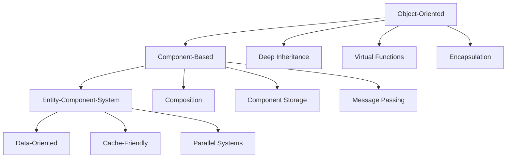
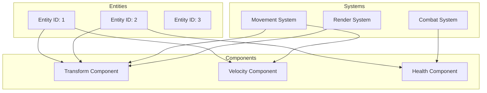
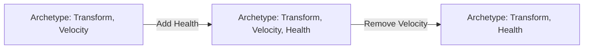
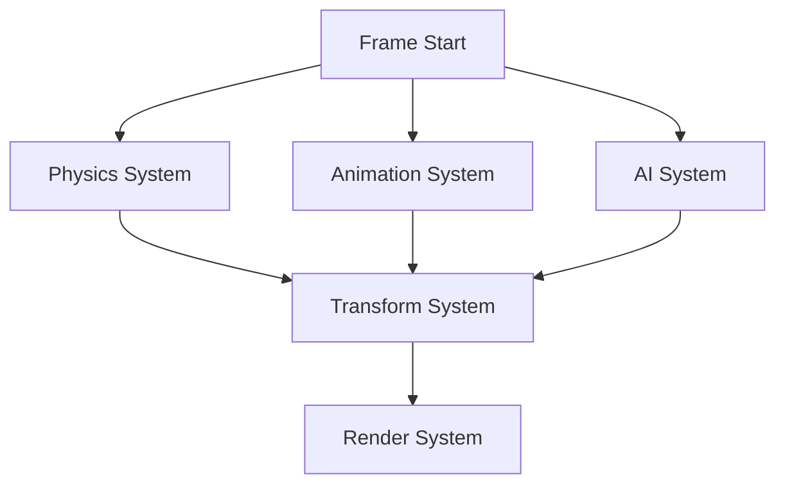

# Module 3: Entity Management Systems

**Duration**: 3-4 weeks  
**Complexity**: Intermediate

## Abstract

Entity management defines how game objects are represented, organized, and manipulated. This module explores the evolution from object-oriented hierarchies to data-oriented Entity-Component-System (ECS) architectures, emphasizing cache-friendly patterns and parallelization.

## Architecture Evolution



### Object-Oriented Hierarchy

```
INTERFACE GameObject
    PROPERTY position: Vector3
    PROPERTY rotation: Quaternion
    PROPERTY children: List<GameObject>
    
    METHOD ABSTRACT Update(deltaTime: Float)
    METHOD ABSTRACT Render()
END INTERFACE

CLASS Enemy EXTENDS GameObject
    PROPERTY health: Float
    PROPERTY speed: Float
    PROPERTY target: GameObject
    
    METHOD Update(deltaTime: Float)
        MoveTowards(target.position, speed * deltaTime)
        IF InRange(target) THEN
            Attack(target)
        END IF
    END METHOD
END CLASS

CLASS FlyingEnemy EXTENDS Enemy
    PROPERTY altitude: Float
    
    METHOD Update(deltaTime: Float)
        SUPER.Update(deltaTime)
        AdjustAltitude(altitude)
    END METHOD
END CLASS
```

**Problems**:
- Deep inheritance hierarchies hard to maintain
- Virtual function call overhead
- Poor cache locality (scattered memory)
- Inflexible (hard to add new behaviors)
- The "deadly diamond" of multiple inheritance

### Component-Based Architecture

```
INTERFACE Component
    METHOD Update(deltaTime: Float)
END INTERFACE

CLASS GameObject
    PROPERTY components: Map<ComponentType, Component>
    
    METHOD AddComponent(component: Component)
        components.Insert(component.GetType(), component)
    END METHOD
    
    METHOD GetComponent(type: ComponentType) -> Component
        RETURN components.Get(type)
    END METHOD
    
    METHOD Update(deltaTime: Float)
        FOR EACH component IN components.Values() DO
            component.Update(deltaTime)
        END FOR
    END METHOD
END CLASS

// Usage
enemy = GameObject()
enemy.AddComponent(TransformComponent(position, rotation))
enemy.AddComponent(HealthComponent(100))
enemy.AddComponent(AIComponent("aggressive"))
enemy.AddComponent(RenderComponent(mesh, material))
```

**Improvements**:
- Composition over inheritance
- More flexible combinations
- Easier to add new component types

**Remaining Issues**:
- Still scattered memory layout
- Components call each other (tight coupling)
- Hard to parallelize

## Entity-Component-System (ECS) Architecture



### Core Concepts

**Entity**: Just an identifier (typically integer)

```
TYPE Entity = Integer  // Unique ID

// Entities are lightweight
entity1 = CreateEntity()  // Returns: 1
entity2 = CreateEntity()  // Returns: 2
```

**Component**: Pure data, no logic

```
TYPE TransformComponent
    position: Vector3
    rotation: Quaternion
    scale: Vector3
END TYPE

TYPE VelocityComponent
    linear: Vector3
    angular: Vector3
END TYPE

TYPE HealthComponent
    current: Float
    maximum: Float
END TYPE
```

**System**: Pure logic, operates on components

```
PROCEDURE MovementSystem(deltaTime: Float)
    // Query entities with Transform AND Velocity
    QUERY entities WITH (Transform, Velocity)
    
    FOR EACH (transform, velocity) IN entities DO
        transform.position += velocity.linear * deltaTime
        transform.rotation *= QuaternionFromAngularVelocity(velocity.angular * deltaTime)
    END FOR
END PROCEDURE

PROCEDURE DamageSystem()
    QUERY entities WITH (Health)
    
    FOR EACH health IN entities DO
        IF health.current <= 0 THEN
            DestroyEntity(health.GetEntity())
        END IF
    END FOR
END PROCEDURE
```

## Archetype-Based Storage

### Memory Layout

```
Archetype: (Transform, Velocity, Health)
┌─────────────────────────────────────────────────────┐
│ Entity IDs:    [1]      [2]      [3]      [4]       │
├─────────────────────────────────────────────────────┤
│ Transforms:    [T1]     [T2]     [T3]     [T4]      │ ← Contiguous
│ Velocities:    [V1]     [V2]     [V3]     [V4]      │ ← Contiguous
│ Healths:       [H1]     [H2]     [H3]     [H4]      │ ← Contiguous
└─────────────────────────────────────────────────────┘

Different Archetype: (Transform, Mesh)
┌─────────────────────────────────────────────────────┐
│ Entity IDs:    [5]      [6]      [7]                │
├─────────────────────────────────────────────────────┤
│ Transforms:    [T5]     [T6]     [T7]               │
│ Meshes:        [M5]     [M6]     [M7]               │
└─────────────────────────────────────────────────────┘
```

### Archetype Table Structure

```
INTERFACE ArchetypeTable
    PROPERTY componentTypes: Set<ComponentType>
    PROPERTY entities: DynamicArray<Entity>
    PROPERTY componentArrays: Map<ComponentType, DynamicArray<ComponentData>>
    
    METHOD AddEntity(entity: Entity, components: Map<ComponentType, ComponentData>)
        entities.Add(entity)
        FOR EACH (type, data) IN components DO
            componentArrays[type].Add(data)
        END FOR
    END METHOD
    
    METHOD RemoveEntity(entity: Entity)
        index = entities.FindIndex(entity)
        entities.RemoveAt(index)
        FOR EACH array IN componentArrays.Values() DO
            array.RemoveAt(index)  // Swap-remove for O(1)
        END FOR
    END METHOD
    
    METHOD GetComponent(entity: Entity, type: ComponentType) -> ComponentData
        index = entities.FindIndex(entity)
        RETURN componentArrays[type][index]
    END METHOD
END INTERFACE
```

### Archetype Migration

When adding/removing components, entity moves to different archetype:

```
PROCEDURE AddComponent(entity: Entity, type: ComponentType, data: ComponentData)
    // Find current archetype
    currentArchetype = FindArchetype(entity)
    
    // Determine new archetype
    newTypes = currentArchetype.componentTypes.Clone()
    newTypes.Add(type)
    newArchetype = FindOrCreateArchetype(newTypes)
    
    // Move entity data
    componentData = currentArchetype.ExtractEntity(entity)
    componentData[type] = data
    newArchetype.AddEntity(entity, componentData)
    
    // Update entity record
    UpdateEntityRecord(entity, newArchetype)
END PROCEDURE
```



## Query Patterns

### Basic Query

```
INTERFACE Query
    METHOD With(componentTypes: List<ComponentType>) -> Query
    METHOD Without(componentTypes: List<ComponentType>) -> Query
    METHOD Execute() -> Iterator<ComponentTuple>
END INTERFACE

// Usage
QUERY entities WITH (Transform, Velocity) WITHOUT (Frozen)
FOR EACH (transform, velocity) IN entities DO
    // Only entities with Transform and Velocity, but not Frozen
    transform.position += velocity.linear * deltaTime
END FOR
```

### Query Implementation

```
PROCEDURE ExecuteQuery(requiredTypes: Set<ComponentType>, excludedTypes: Set<ComponentType>)
    matchingEntities = []
    
    FOR EACH archetype IN world.archetypes DO
        // Check if archetype matches query
        IF archetype.componentTypes.ContainsAll(requiredTypes) AND
           NOT archetype.componentTypes.ContainsAny(excludedTypes) THEN
            
            // Add all entities from this archetype
            FOR EACH entity IN archetype.entities DO
                components = []
                FOR EACH type IN requiredTypes DO
                    components.Add(archetype.GetComponent(entity, type))
                END FOR
                matchingEntities.Add((entity, components))
            END FOR
        END IF
    END FOR
    
    RETURN matchingEntities
END PROCEDURE
```

### Query Caching

```
INTERFACE QueryCache
    DATA cachedResults: Map<QuerySignature, List<Archetype>>
    
    METHOD GetMatchingArchetypes(signature: QuerySignature) -> List<Archetype>
        IF cachedResults.Contains(signature) THEN
            RETURN cachedResults[signature]
        ELSE
            archetypes = FindMatchingArchetypes(signature)
            cachedResults[signature] = archetypes
            RETURN archetypes
        END IF
    END METHOD
    
    METHOD InvalidateCache(archetype: Archetype)
        // When archetype created/destroyed, invalidate affected queries
        FOR EACH (signature, archetypes) IN cachedResults DO
            IF ArchetypeMatchesSignature(archetype, signature) THEN
                archetypes.Add(archetype)
            END IF
        END FOR
    END METHOD
END INTERFACE
```

## Storage Strategies Comparison

### Table-Based (Archetype)

```
// Memory layout: Structure of Arrays (SoA)
positions = [pos1, pos2, pos3, pos4, ...]     ← Contiguous
velocities = [vel1, vel2, vel3, vel4, ...]    ← Contiguous
healths = [hp1, hp2, hp3, hp4, ...]          ← Contiguous
```

**Advantages**:
- Excellent cache locality for iteration
- Parallel-friendly
- Fast queries

**Disadvantages**:
- Moving entities between archetypes is expensive
- More memory fragmentation

### Sparse Set

```
INTERFACE SparseSet
    DATA sparse: Array<Integer>  // Maps entity ID to dense index
    DATA dense: Array<ComponentData>  // Packed component data
    DATA entities: Array<Entity>  // Packed entity IDs
    
    METHOD Add(entity: Entity, component: ComponentData)
        denseIndex = dense.Length
        dense.Add(component)
        entities.Add(entity)
        sparse[entity] = denseIndex
    END METHOD
    
    METHOD Get(entity: Entity) -> ComponentData
        denseIndex = sparse[entity]
        RETURN dense[denseIndex]
    END METHOD
    
    METHOD Remove(entity: Entity)
        denseIndex = sparse[entity]
        
        // Swap-remove: move last element to deleted position
        lastEntity = entities[entities.Length - 1]
        dense[denseIndex] = dense[dense.Length - 1]
        entities[denseIndex] = lastEntity
        sparse[lastEntity] = denseIndex
        
        dense.RemoveLast()
        entities.RemoveLast()
    END METHOD
END INTERFACE
```

**Advantages**:
- O(1) component lookup
- O(1) add/remove
- No archetype migration

**Disadvantages**:
- Less cache-friendly for iteration
- Memory overhead for sparse array

### Hybrid Approach

```
// Hot components: archetype storage (frequently iterated)
ARCHETYPE_STORAGE = [Transform, Velocity, Health]

// Cold components: sparse set (rarely accessed together)
SPARSE_STORAGE = [Name, Description, Tags]

PROCEDURE GetComponent(entity: Entity, type: ComponentType)
    IF type IN ARCHETYPE_STORAGE THEN
        RETURN GetFromArchetype(entity, type)
    ELSE
        RETURN GetFromSparseSet(entity, type)
    END IF
END PROCEDURE
```

## Change Detection

Track which components were modified:

```
INTERFACE ChangeDetection
    DATA changeFlags: Map<Entity, Set<ComponentType>>
    DATA lastCheckTick: Integer
    DATA currentTick: Integer
    
    METHOD MarkChanged(entity: Entity, type: ComponentType)
        changeFlags[entity].Add(type)
    END METHOD
    
    METHOD GetChanged(type: ComponentType) -> List<Entity>
        changed = []
        FOR EACH (entity, types) IN changeFlags DO
            IF types.Contains(type) THEN
                changed.Add(entity)
            END IF
        END FOR
        RETURN changed
    END METHOD
    
    METHOD ClearChanges()
        changeFlags.Clear()
        lastCheckTick = currentTick
        currentTick++
    END METHOD
END INTERFACE

// Usage
QUERY entities WITH Changed(Transform)
FOR EACH transform IN entities DO
    // Only process entities with modified transforms
    UpdateGlobalTransform(transform)
END FOR
```

## Parallel System Execution



### Dependency Graph

```
INTERFACE SystemScheduler
    DATA systems: List<System>
    DATA dependencies: Map<System, Set<System>>
    
    METHOD AddSystem(system: System, dependsOn: List<System>)
        systems.Add(system)
        dependencies[system] = Set(dependsOn)
    END METHOD
    
    METHOD Execute()
        completed = Set()
        
        WHILE completed.Size < systems.Size DO
            ready = []
            
            // Find systems with satisfied dependencies
            FOR EACH system IN systems DO
                IF system NOT IN completed THEN
                    deps = dependencies[system]
                    IF deps.IsSubsetOf(completed) THEN
                        ready.Add(system)
                    END IF
                END IF
            END FOR
            
            // Execute ready systems in parallel
            ParallelFor(ready, LAMBDA(system)
                system.Execute()
            END LAMBDA)
            
            completed.AddAll(ready)
        END WHILE
    END PROCEDURE
END INTERFACE
```

### Read/Write Access Declaration

```
INTERFACE System
    METHOD GetReadAccess() -> Set<ComponentType>
    METHOD GetWriteAccess() -> Set<ComponentType>
    METHOD Execute()
END INTERFACE

// Example: Movement system reads Velocity, writes Transform
CLASS MovementSystem IMPLEMENTS System
    METHOD GetReadAccess()
        RETURN {VelocityComponent}
    END METHOD
    
    METHOD GetWriteAccess()
        RETURN {TransformComponent}
    END METHOD
    
    METHOD Execute()
        QUERY entities WITH (Transform, Velocity)
        FOR EACH (transform, velocity) IN entities DO
            transform.position += velocity.linear * deltaTime
        END FOR
    END METHOD
END CLASS

// Automatic conflict detection
PROCEDURE CanRunInParallel(system1: System, system2: System) -> Boolean
    reads1 = system1.GetReadAccess()
    writes1 = system1.GetWriteAccess()
    reads2 = system2.GetReadAccess()
    writes2 = system2.GetWriteAccess()
    
    // Conflict if one writes what the other reads/writes
    hasConflict = writes1.Intersects(reads2) OR
                  writes1.Intersects(writes2) OR
                  writes2.Intersects(reads1)
    
    RETURN NOT hasConflict
END PROCEDURE
```

## Entity Lifetime Management

### Generational Indices

Prevent use-after-free with versioned entity IDs:

```
TYPE Entity
    index: Integer      // Index into entity array
    generation: Integer // Version number
END TYPE

INTERFACE EntityRegistry
    DATA entities: Array<EntityRecord>
    DATA freeList: List<Integer>
    
    METHOD Create() -> Entity
        IF freeList.IsEmpty() THEN
            index = entities.Length
            generation = 0
            entities.Add(EntityRecord(alive=true, generation=0))
        ELSE
            index = freeList.Pop()
            generation = entities[index].generation + 1
            entities[index] = EntityRecord(alive=true, generation=generation)
        END IF
        
        RETURN Entity(index, generation)
    END METHOD
    
    METHOD Destroy(entity: Entity)
        record = entities[entity.index]
        
        // Validate generation
        IF record.generation == entity.generation AND record.alive THEN
            record.alive = false
            freeList.Add(entity.index)
        END IF
    END METHOD
    
    METHOD IsAlive(entity: Entity) -> Boolean
        record = entities[entity.index]
        RETURN record.alive AND record.generation == entity.generation
    END METHOD
END INTERFACE
```

### Deferred Operations

Avoid modifying ECS during iteration:

```
INTERFACE CommandBuffer
    DATA commands: Queue<Command>
    
    METHOD CreateEntity() -> Entity
        entity = AllocateTemporaryEntity()
        commands.Enqueue(CreateEntityCommand(entity))
        RETURN entity
    END METHOD
    
    METHOD DestroyEntity(entity: Entity)
        commands.Enqueue(DestroyEntityCommand(entity))
    END METHOD
    
    METHOD AddComponent(entity: Entity, type: ComponentType, data: ComponentData)
        commands.Enqueue(AddComponentCommand(entity, type, data))
    END METHOD
    
    METHOD Flush()
        WHILE NOT commands.IsEmpty() DO
            command = commands.Dequeue()
            command.Execute()
        END WHILE
    END METHOD
END INTERFACE

// Usage
PROCEDURE DamageSystem()
    commandBuffer = CreateCommandBuffer()
    
    QUERY entities WITH (Health, Transform)
    FOR EACH (health, transform) IN entities DO
        IF health.current <= 0 THEN
            // Defer destruction
            commandBuffer.DestroyEntity(health.GetEntity())
            
            // Spawn death effect
            effect = commandBuffer.CreateEntity()
            commandBuffer.AddComponent(effect, Transform, transform)
            commandBuffer.AddComponent(effect, ParticleEmitter, deathParticles)
        END IF
    END FOR
    
    // Apply all changes at once
    commandBuffer.Flush()
END PROCEDURE
```

## Performance Optimization

### Component Packing

```
// Bad: Each component is separate type
TYPE TransformComponent
    position: Vector3      // 12 bytes
    rotation: Quaternion   // 16 bytes
    scale: Vector3         // 12 bytes
END TYPE  // Total: 40 bytes, but likely padded to 48

// Good: Pack related data
TYPE Transform
    position: Vector3      // 12 bytes
    scale: Vector3         // 12 bytes
    rotation: Quaternion   // 16 bytes
END TYPE  // Total: 40 bytes, tightly packed
```

### Iteration Optimization

```
// Inefficient: Multiple queries
PROCEDURE UpdateGame()
    QUERY entities WITH (Transform, Velocity)
    FOR EACH (transform, velocity) IN entities DO
        transform.position += velocity.linear * deltaTime
    END FOR
    
    QUERY entities WITH (Transform, AngularVelocity)
    FOR EACH (transform, angular) IN entities DO
        transform.rotation *= QuaternionFromAngular(angular.value * deltaTime)
    END FOR
END PROCEDURE

// Efficient: Single query with optional components
PROCEDURE UpdateGameOptimized()
    QUERY entities WITH (Transform) AND OPTIONAL (Velocity, AngularVelocity)
    FOR EACH (transform, velocity, angular) IN entities DO
        IF velocity IS NOT NULL THEN
            transform.position += velocity.linear * deltaTime
        END IF
        IF angular IS NOT NULL THEN
            transform.rotation *= QuaternionFromAngular(angular.value * deltaTime)
        END IF
    END FOR
END PROCEDURE
```

## Assessment Exercises

1. **Implement Basic ECS**: Entity registry, component storage, simple query
2. **Archetype Migration**: Handle adding/removing components efficiently
3. **Query System**: Support WITH, WITHOUT, and change detection
4. **Parallel Systems**: Schedule systems based on dependencies
5. **Generational Indices**: Prevent use-after-free errors
6. **Profile Performance**: Compare archetype vs sparse set storage

## Key Takeaways

- ECS separates data (components) from logic (systems)
- Archetype storage provides excellent cache locality for iteration
- Queries filter entities by component composition
- Parallel system execution leverages multi-core CPUs
- Generational indices prevent dangling entity references
- The pattern applies universally across languages and engines
- Modern ECS implementations (Bevy, EnTT, FLECS) share these core concepts
