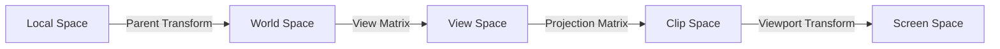
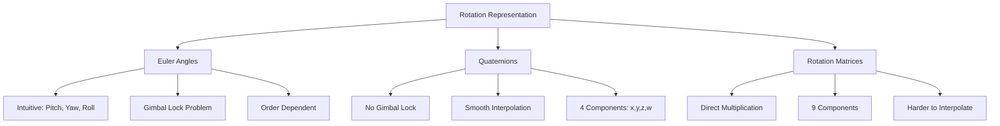
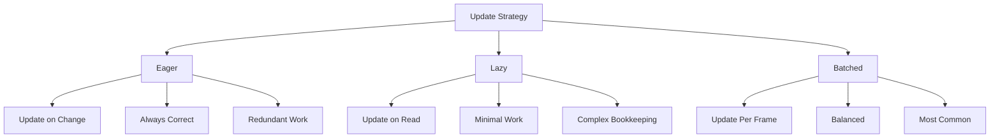

# Module 4: Transform Hierarchies

**Duration**: 2-3 weeks  
**Complexity**: Intermediate

## Abstract

Transform hierarchies enable parent-child relationships between game objects, propagating transformations through scene graphs. This module explores coordinate space transformations, matrix mathematics, and efficient update strategies for large hierarchies.

## Coordinate Spaces



### Space Definitions

**Local Space**: Position relative to parent

```
// Child object in its own coordinate system
localPosition = (2, 0, 0)  // 2 units to the right
localRotation = Identity
```

**World Space**: Absolute position in scene

```
// If parent is at (10, 5, 0) with no rotation
worldPosition = parentWorld * localPosition = (12, 5, 0)
```

**Transformation Chain**:

```
WorldTransform = ParentWorld × LocalTransform
```

## Transform Representation

### Transform Components

```
TYPE Transform
    position: Vector3      // Translation
    rotation: Quaternion   // Orientation
    scale: Vector3         // Size multiplier
END TYPE

TYPE GlobalTransform
    matrix: Matrix4x4      // Cached world transformation
END TYPE

TYPE Parent
    entity: Entity         // Parent entity ID
END TYPE

TYPE Children
    entities: List<Entity> // Child entity IDs
END TYPE
```

### Rotation Representations



**Euler Angles**:

```
TYPE EulerAngles
    pitch: Float  // Rotation around X
    yaw: Float    // Rotation around Y
    roll: Float   // Rotation around Z
END TYPE

FUNCTION EulerToQuaternion(euler: EulerAngles) -> Quaternion
    cx = cos(euler.pitch * 0.5)
    sx = sin(euler.pitch * 0.5)
    cy = cos(euler.yaw * 0.5)
    sy = sin(euler.yaw * 0.5)
    cz = cos(euler.roll * 0.5)
    sz = sin(euler.roll * 0.5)
    
    RETURN Quaternion(
        w = cx * cy * cz + sx * sy * sz,
        x = sx * cy * cz - cx * sy * sz,
        y = cx * sy * cz + sx * cy * sz,
        z = cx * cy * sz - sx * sy * cz
    )
END FUNCTION
```

**Quaternion Operations**:

```
INTERFACE Quaternion
    PROPERTY x, y, z, w: Float
    
    METHOD Multiply(other: Quaternion) -> Quaternion
        // Combine rotations: this * other
        RETURN Quaternion(
            w = w*other.w - x*other.x - y*other.y - z*other.z,
            x = w*other.x + x*other.w + y*other.z - z*other.y,
            y = w*other.y - x*other.z + y*other.w + z*other.x,
            z = w*other.z + x*other.y - y*other.x + z*other.w
        )
    END METHOD
    
    METHOD Normalize() -> Quaternion
        magnitude = sqrt(x*x + y*y + z*z + w*w)
        RETURN Quaternion(x/magnitude, y/magnitude, z/magnitude, w/magnitude)
    END METHOD
    
    METHOD Slerp(other: Quaternion, t: Float) -> Quaternion
        // Spherical linear interpolation
        dot = Dot(this, other)
        
        // Ensure shortest path
        IF dot < 0 THEN
            other = -other
            dot = -dot
        END IF
        
        IF dot > 0.9995 THEN
            // Fallback to linear interpolation
            RETURN Lerp(this, other, t).Normalize()
        END IF
        
        theta = acos(dot)
        RETURN (sin((1-t)*theta) * this + sin(t*theta) * other) / sin(theta)
    END METHOD
END INTERFACE
```

## Matrix Transformation

### Transformation Matrix Construction

```
FUNCTION TransformToMatrix(transform: Transform) -> Matrix4x4
    // Construct TRS matrix: Translation × Rotation × Scale
    
    // Scale matrix
    S = Matrix4x4(
        scale.x,  0,        0,        0,
        0,        scale.y,  0,        0,
        0,        0,        scale.z,  0,
        0,        0,        0,        1
    )
    
    // Rotation matrix from quaternion
    R = QuaternionToMatrix(transform.rotation)
    
    // Translation matrix
    T = Matrix4x4(
        1, 0, 0, position.x,
        0, 1, 0, position.y,
        0, 0, 1, position.z,
        0, 0, 0, 1
    )
    
    // Combine: T × R × S
    RETURN T * R * S
END FUNCTION

FUNCTION QuaternionToMatrix(q: Quaternion) -> Matrix4x4
    xx = q.x * q.x
    yy = q.y * q.y
    zz = q.z * q.z
    xy = q.x * q.y
    xz = q.x * q.z
    yz = q.y * q.z
    wx = q.w * q.x
    wy = q.w * q.y
    wz = q.w * q.z
    
    RETURN Matrix4x4(
        1-2*(yy+zz),  2*(xy-wz),    2*(xz+wy),    0,
        2*(xy+wz),    1-2*(xx+zz),  2*(yz-wx),    0,
        2*(xz-wy),    2*(yz+wx),    1-2*(xx+yy),  0,
        0,            0,            0,            1
    )
END FUNCTION
```

### Matrix Decomposition

```
FUNCTION MatrixToTransform(matrix: Matrix4x4) -> Transform
    // Extract translation (last column)
    position = Vector3(matrix[0][3], matrix[1][3], matrix[2][3])
    
    // Extract scale (length of each axis)
    scaleX = Length(Vector3(matrix[0][0], matrix[1][0], matrix[2][0]))
    scaleY = Length(Vector3(matrix[0][1], matrix[1][1], matrix[2][1]))
    scaleZ = Length(Vector3(matrix[0][2], matrix[1][2], matrix[2][2]))
    scale = Vector3(scaleX, scaleY, scaleZ)
    
    // Extract rotation (normalize axes)
    rotMatrix = Matrix3x3(
        matrix[0][0]/scaleX, matrix[0][1]/scaleY, matrix[0][2]/scaleZ,
        matrix[1][0]/scaleX, matrix[1][1]/scaleY, matrix[1][2]/scaleZ,
        matrix[2][0]/scaleX, matrix[2][1]/scaleY, matrix[2][2]/scaleZ
    )
    rotation = MatrixToQuaternion(rotMatrix)
    
    RETURN Transform(position, rotation, scale)
END FUNCTION
```

## Hierarchy Update Strategies



### Eager Propagation

```
PROCEDURE UpdateTransformEager(entity: Entity, newTransform: Transform)
    // Update local transform
    SetComponent(entity, Transform, newTransform)
    
    // Immediately propagate to all descendants
    PropagateToChildren(entity)
END PROCEDURE

PROCEDURE PropagateToChildren(entity: Entity)
    globalTransform = GetComponent(entity, GlobalTransform)
    children = GetComponent(entity, Children)
    
    IF children IS NULL THEN
        RETURN
    END IF
    
    FOR EACH child IN children.entities DO
        childLocal = GetComponent(child, Transform)
        childGlobal = GetComponent(child, GlobalTransform)
        
        // World = Parent × Local
        childGlobal.matrix = globalTransform.matrix * TransformToMatrix(childLocal)
        
        // Recursively update grandchildren
        PropagateToChildren(child)
    END FOR
END PROCEDURE
```

**Characteristics**:
- Simple to implement
- Always correct
- Wastes work if parent changes multiple times per frame

### Lazy Propagation

```
TYPE GlobalTransform
    matrix: Matrix4x4
    dirty: Boolean          // Needs recalculation
    lastUpdateFrame: Integer
END TYPE

PROCEDURE GetWorldTransform(entity: Entity) -> Matrix4x4
    global = GetComponent(entity, GlobalTransform)
    
    IF global.dirty OR global.lastUpdateFrame < currentFrame THEN
        UpdateWorldTransform(entity)
    END IF
    
    RETURN global.matrix
END PROCEDURE

PROCEDURE UpdateWorldTransform(entity: Entity)
    parent = GetComponent(entity, Parent)
    local = GetComponent(entity, Transform)
    global = GetComponent(entity, GlobalTransform)
    
    IF parent IS NOT NULL THEN
        parentMatrix = GetWorldTransform(parent.entity)  // Recursive
        global.matrix = parentMatrix * TransformToMatrix(local)
    ELSE
        global.matrix = TransformToMatrix(local)
    END IF
    
    global.dirty = false
    global.lastUpdateFrame = currentFrame
END PROCEDURE

PROCEDURE MarkDirty(entity: Entity)
    global = GetComponent(entity, GlobalTransform)
    global.dirty = true
    
    // Mark all descendants dirty
    children = GetComponent(entity, Children)
    IF children IS NOT NULL THEN
        FOR EACH child IN children.entities DO
            MarkDirty(child)
        END FOR
    END IF
END PROCEDURE
```

**Characteristics**:
- Minimal redundant work
- More complex
- Good for hierarchies with infrequent updates

### Batched Propagation (Most Common)

```
PROCEDURE TransformPropagationSystem()
    // Find all root transforms (no parent)
    QUERY roots WITH (Transform, GlobalTransform) WITHOUT (Parent)
    
    FOR EACH (transform, global) IN roots DO
        // Update root
        global.matrix = TransformToMatrix(transform)
        
        // Propagate to children
        PropagateRecursive(transform.GetEntity(), global.matrix)
    END FOR
END PROCEDURE

PROCEDURE PropagateRecursive(entity: Entity, parentMatrix: Matrix4x4)
    children = GetComponent(entity, Children)
    
    IF children IS NULL THEN
        RETURN
    END IF
    
    FOR EACH child IN children.entities DO
        childLocal = GetComponent(child, Transform)
        childGlobal = GetComponent(child, GlobalTransform)
        
        // Compute world transform
        childGlobal.matrix = parentMatrix * TransformToMatrix(childLocal)
        
        // Recurse
        PropagateRecursive(child, childGlobal.matrix)
    END FOR
END PROCEDURE
```

**Characteristics**:
- Update once per frame
- Balance between simplicity and efficiency
- Used by most game engines

## Hierarchy Management

### Parent-Child Relationship

```
PROCEDURE SetParent(child: Entity, newParent: Entity)
    // Remove from old parent
    oldParent = GetComponent(child, Parent)
    IF oldParent IS NOT NULL THEN
        oldParentChildren = GetComponent(oldParent.entity, Children)
        oldParentChildren.entities.Remove(child)
    END IF
    
    // Add to new parent
    IF newParent IS NOT NULL THEN
        newParentChildren = GetComponent(newParent, Children)
        IF newParentChildren IS NULL THEN
            newParentChildren = Children([])
            AddComponent(newParent, Children, newParentChildren)
        END IF
        newParentChildren.entities.Add(child)
        
        SetComponent(child, Parent, Parent(newParent))
    ELSE
        RemoveComponent(child, Parent)
    END IF
    
    // Mark dirty for next update
    MarkDirty(child)
END PROCEDURE
```

### Maintaining World Position When Reparenting

```
PROCEDURE ReparentKeepingWorldPosition(child: Entity, newParent: Entity)
    // Get current world transform
    childGlobal = GetComponent(child, GlobalTransform)
    worldMatrix = childGlobal.matrix
    
    // Calculate new local transform
    IF newParent IS NOT NULL THEN
        newParentGlobal = GetComponent(newParent, GlobalTransform)
        parentWorldInverse = Inverse(newParentGlobal.matrix)
        newLocalMatrix = parentWorldInverse * worldMatrix
    ELSE
        newLocalMatrix = worldMatrix
    END IF
    
    // Update local transform
    newLocal = MatrixToTransform(newLocalMatrix)
    SetComponent(child, Transform, newLocal)
    
    // Update parent reference
    SetParent(child, newParent)
END PROCEDURE
```

## Common Hierarchy Patterns

### Attachment Points

```
// Character with weapon attached to hand
character = CreateEntity()
AddComponent(character, Transform, Transform(
    position = (0, 0, 0),
    rotation = Identity,
    scale = (1, 1, 1)
))

hand = CreateEntity()
AddComponent(hand, Transform, Transform(
    position = (0.5, 0.8, 0.2),  // Relative to character
    rotation = Identity,
    scale = (1, 1, 1)
))
SetParent(hand, character)

weapon = CreateEntity()
AddComponent(weapon, Transform, Transform(
    position = (0, 0, 0),  // Relative to hand
    rotation = QuaternionFromEuler(0, 0, 90),
    scale = (1, 1, 1)
))
SetParent(weapon, hand)

// Hierarchy:
// character
//   └── hand
//       └── weapon
```

### Skeletal Animation

```
TYPE Bone
    name: String
    restPose: Transform
    currentPose: Transform
END TYPE

PROCEDURE UpdateSkeleton(rootBone: Entity)
    // Hierarchical bone structure
    PROCEDURE UpdateBoneRecursive(bone: Entity, parentMatrix: Matrix4x4)
        boneData = GetComponent(bone, Bone)
        boneTransform = GetComponent(bone, Transform)
        
        // Combine rest pose with animation
        animatedLocal = boneData.restPose * boneTransform
        
        // Compute bone world matrix
        boneWorld = parentMatrix * TransformToMatrix(animatedLocal)
        
        // Update global transform
        global = GetComponent(bone, GlobalTransform)
        global.matrix = boneWorld
        
        // Update children
        children = GetComponent(bone, Children)
        IF children IS NOT NULL THEN
            FOR EACH child IN children.entities DO
                UpdateBoneRecursive(child, boneWorld)
            END FOR
        END IF
    END PROCEDURE
    
    rootTransform = GetComponent(rootBone, GlobalTransform)
    UpdateBoneRecursive(rootBone, rootTransform.matrix)
END PROCEDURE
```

### Scene Graph Organization

```
// Typical scene hierarchy
World
├── Environment
│   ├── Terrain
│   ├── Buildings
│   │   ├── Building1
│   │   └── Building2
│   └── Props
├── Characters
│   ├── Player
│   │   ├── Body
│   │   ├── Head
│   │   └── Weapon
│   └── Enemies
│       ├── Enemy1
│       └── Enemy2
└── Lights
    ├── DirectionalLight
    └── PointLights
```

## Transform Utilities

### Look-At Constraint

```
FUNCTION LookAt(eye: Vector3, target: Vector3, up: Vector3) -> Quaternion
    // Compute forward direction
    forward = Normalize(target - eye)
    
    // Handle degenerate case
    IF Length(forward) < EPSILON THEN
        RETURN Identity
    END IF
    
    // Compute right direction
    right = Normalize(Cross(forward, up))
    
    // Recompute up to ensure orthogonality
    up = Cross(right, forward)
    
    // Construct rotation matrix
    rotMatrix = Matrix3x3(
        right.x,    up.x,    -forward.x,
        right.y,    up.y,    -forward.y,
        right.z,    up.z,    -forward.z
    )
    
    RETURN MatrixToQuaternion(rotMatrix)
END FUNCTION

// Usage
PROCEDURE LookAtSystem()
    QUERY entities WITH (Transform, LookAtTarget)
    FOR EACH (transform, target) IN entities DO
        lookRotation = LookAt(transform.position, target.position, Vector3(0,1,0))
        transform.rotation = lookRotation
    END FOR
END PROCEDURE
```

### Transform Point

```
FUNCTION TransformPoint(matrix: Matrix4x4, point: Vector3) -> Vector3
    // Apply transformation to point
    x = matrix[0][0]*point.x + matrix[0][1]*point.y + matrix[0][2]*point.z + matrix[0][3]
    y = matrix[1][0]*point.x + matrix[1][1]*point.y + matrix[1][2]*point.z + matrix[1][3]
    z = matrix[2][0]*point.x + matrix[2][1]*point.y + matrix[2][2]*point.z + matrix[2][3]
    
    RETURN Vector3(x, y, z)
END FUNCTION

FUNCTION TransformDirection(matrix: Matrix4x4, direction: Vector3) -> Vector3
    // Apply rotation and scale, ignore translation
    x = matrix[0][0]*direction.x + matrix[0][1]*direction.y + matrix[0][2]*direction.z
    y = matrix[1][0]*direction.x + matrix[1][1]*direction.y + matrix[1][2]*direction.z
    z = matrix[2][0]*direction.x + matrix[2][1]*direction.y + matrix[2][2]*direction.z
    
    RETURN Vector3(x, y, z)
END FUNCTION
```

## Performance Optimization

### Dirty Flag Optimization

Only update changed transforms:

```
TYPE Transform
    position: Vector3
    rotation: Quaternion
    scale: Vector3
    dirty: Boolean
END TYPE

PROCEDURE TransformPropagationSystemOptimized()
    // Only update dirty root transforms
    QUERY roots WITH (Transform, GlobalTransform, Changed(Transform)) WITHOUT (Parent)
    
    FOR EACH (transform, global) IN roots DO
        global.matrix = TransformToMatrix(transform)
        PropagateRecursive(transform.GetEntity(), global.matrix)
        transform.dirty = false
    END FOR
END PROCEDURE
```

### Breadth-First Update

Better cache locality than depth-first:

```
PROCEDURE BreadthFirstPropagation()
    QUERY roots WITH (Transform, GlobalTransform) WITHOUT (Parent)
    
    queue = Queue()
    
    // Initialize with roots
    FOR EACH (transform, global) IN roots DO
        global.matrix = TransformToMatrix(transform)
        queue.Enqueue((transform.GetEntity(), global.matrix))
    END FOR
    
    // Process level by level
    WHILE NOT queue.IsEmpty() DO
        (parent, parentMatrix) = queue.Dequeue()
        children = GetComponent(parent, Children)
        
        IF children IS NOT NULL THEN
            FOR EACH child IN children.entities DO
                childLocal = GetComponent(child, Transform)
                childGlobal = GetComponent(child, GlobalTransform)
                childGlobal.matrix = parentMatrix * TransformToMatrix(childLocal)
                queue.Enqueue((child, childGlobal.matrix))
            END FOR
        END IF
    END WHILE
END PROCEDURE
```

## Assessment Exercises

1. **Implement Transform System**: TRS to matrix conversion, hierarchy propagation
2. **Quaternion Math**: Implement slerp, multiplication, to/from matrix
3. **Reparenting**: Maintain world position when changing parent
4. **Look-At Constraint**: Orient object to face target
5. **Skeletal Hierarchy**: Build and animate bone structure
6. **Optimize Updates**: Implement dirty flagging and change detection

## Key Takeaways

- Transform hierarchies multiply parent-child transformations: World = Parent × Local
- Quaternions avoid gimbal lock and interpolate smoothly
- Update strategies balance correctness and performance
- Batched propagation updates entire hierarchy once per frame
- Dirty flags prevent redundant calculations
- These patterns apply universally across 3D engines
