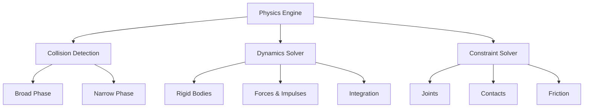
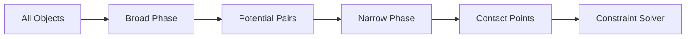
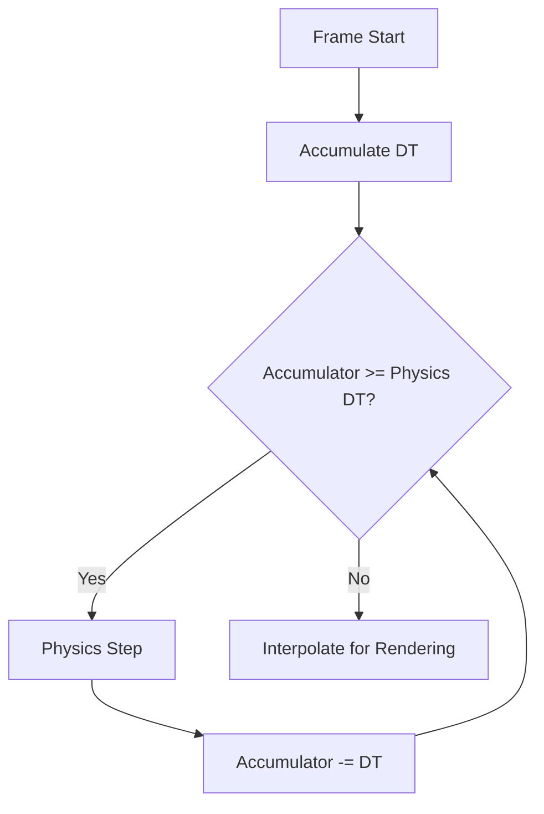
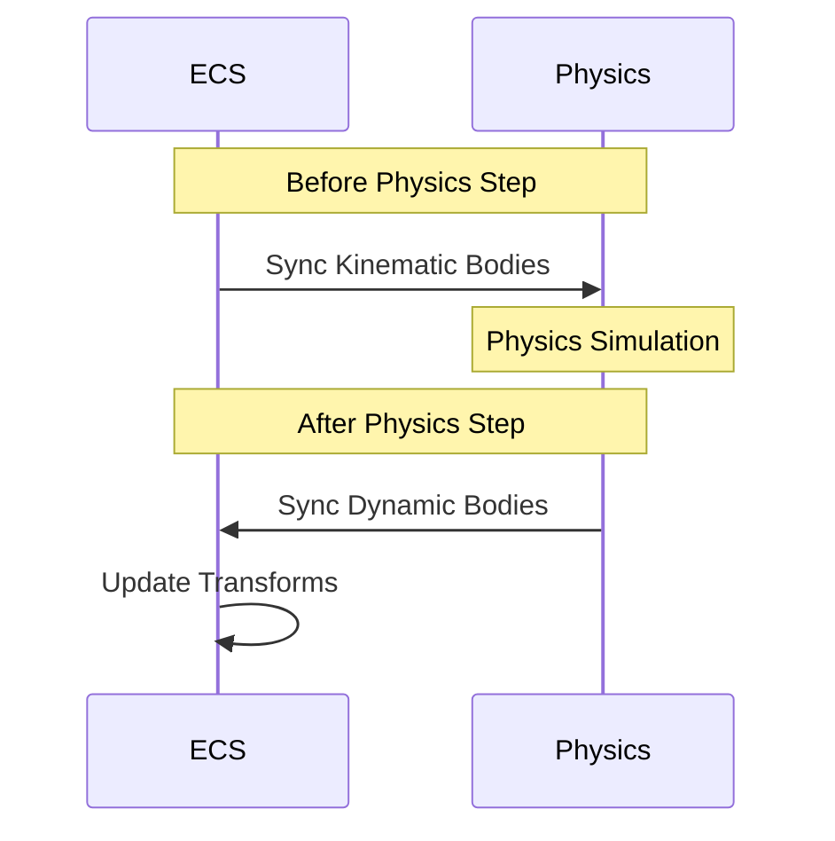

# Module 5: Physics Integration Strategies

**Duration**: 3-4 weeks  
**Complexity**: Intermediate to Advanced

## Abstract

Physics simulation brings realism and interactivity to games through rigid body dynamics, collision detection, and constraint solving. This module explores integration patterns between physics engines and game engines, emphasizing determinism, synchronization, and performance.

## Physics Engine Architecture



### Core Components

```
TYPE RigidBody
    bodyType: BodyType  // STATIC, KINEMATIC, DYNAMIC
    
    // Linear motion
    position: Vector3
    linearVelocity: Vector3
    linearDamping: Float
    mass: Float
    
    // Angular motion
    rotation: Quaternion
    angularVelocity: Vector3
    angularDamping: Float
    inertia: Matrix3x3
    
    // Material properties
    restitution: Float  // Bounciness (0-1)
    friction: Float     // Surface friction
    
    // Flags
    isAwake: Boolean
    gravityEnabled: Boolean
    continuousCollision: Boolean
END TYPE

ENUM BodyType
    STATIC       // Never moves, infinite mass
    KINEMATIC    // Moves but unaffected by forces
    DYNAMIC      // Fully simulated
END ENUM
```

### Collider Shapes

```
INTERFACE Collider
    METHOD ComputeAABB() -> AABB
    METHOD ComputeMass(density: Float) -> (mass: Float, inertia: Matrix3x3)
    METHOD TestPoint(point: Vector3) -> Boolean
END INTERFACE

TYPE BoxCollider IMPLEMENTS Collider
    halfExtents: Vector3
END TYPE

TYPE SphereCollider IMPLEMENTS Collider
    radius: Float
END TYPE

TYPE CapsuleCollider IMPLEMENTS Collider
    radius: Float
    halfHeight: Float
END TYPE

TYPE MeshCollider IMPLEMENTS Collider
    vertices: Array<Vector3>
    indices: Array<Integer>
    convex: Boolean  // Convex vs. concave
END TYPE
```

## Collision Detection Pipeline



### Broad Phase

Quickly eliminate non-colliding pairs:

```
INTERFACE BroadPhase
    METHOD Update(bodies: List<RigidBody>) -> List<CollisionPair>
END INTERFACE

TYPE AABB
    min: Vector3
    max: Vector3
    
    METHOD Intersects(other: AABB) -> Boolean
        RETURN (min.x <= other.max.x AND max.x >= other.min.x) AND
               (min.y <= other.max.y AND max.y >= other.min.y) AND
               (min.z <= other.max.z AND max.z >= other.min.z)
    END METHOD
END TYPE

// Sweep and Prune algorithm
PROCEDURE SweepAndPrune(bodies: List<RigidBody>) -> List<CollisionPair>
    pairs = []
    
    // Create sorted endpoints
    endpoints = []
    FOR EACH body IN bodies DO
        aabb = body.collider.ComputeAABB()
        endpoints.Add((aabb.min.x, body, START))
        endpoints.Add((aabb.max.x, body, END))
    END FOR
    
    Sort(endpoints, BY=value)
    
    // Sweep along axis
    active = Set()
    FOR EACH endpoint IN endpoints DO
        IF endpoint.type == START THEN
            // Check against all active bodies
            FOR EACH other IN active DO
                IF body.aabb.Intersects(other.aabb) THEN
                    pairs.Add((body, other))
                END IF
            END FOR
            active.Add(endpoint.body)
        ELSE
            active.Remove(endpoint.body)
        END IF
    END FOR
    
    RETURN pairs
END PROCEDURE
```

### Spatial Partitioning

```
INTERFACE SpatialGrid
    PROPERTY cellSize: Float
    PROPERTY cells: Map<GridCoord, List<RigidBody>>
    
    METHOD Insert(body: RigidBody)
        aabb = body.collider.ComputeAABB()
        minCell = WorldToGrid(aabb.min)
        maxCell = WorldToGrid(aabb.max)
        
        FOR x = minCell.x TO maxCell.x DO
            FOR y = minCell.y TO maxCell.y DO
                FOR z = minCell.z TO maxCell.z DO
                    cells[(x,y,z)].Add(body)
                END FOR
            END FOR
        END FOR
    END METHOD
    
    METHOD Query(aabb: AABB) -> List<RigidBody>
        results = Set()
        minCell = WorldToGrid(aabb.min)
        maxCell = WorldToGrid(aabb.max)
        
        FOR x = minCell.x TO maxCell.x DO
            FOR y = minCell.y TO maxCell.y DO
                FOR z = minCell.z TO maxCell.z DO
                    results.AddAll(cells[(x,y,z)])
                END FOR
            END FOR
        END FOR
        
        RETURN results.ToList()
    END METHOD
END INTERFACE
```

### Narrow Phase

Precise collision detection:

```
FUNCTION SphereVsSphere(a: SphereCollider, posA: Vector3, 
                        b: SphereCollider, posB: Vector3) -> ContactManifold
    delta = posB - posA
    distanceSquared = Dot(delta, distance)
    radiusSum = a.radius + b.radius
    
    IF distanceSquared > radiusSum * radiusSum THEN
        RETURN NULL  // No collision
    END IF
    
    distance = sqrt(distanceSquared)
    normal = delta / distance
    penetration = radiusSum - distance
    
    contactPoint = posA + normal * a.radius
    
    RETURN ContactManifold(
        pointA = contactPoint,
        pointB = contactPoint - normal * penetration,
        normal = normal,
        penetration = penetration
    )
END FUNCTION

FUNCTION BoxVsBox(a: BoxCollider, transformA: Transform,
                  b: BoxCollider, transformB: Transform) -> ContactManifold
    // SAT (Separating Axis Theorem)
    // Test all 15 potential separating axes
    
    axes = [
        transformA.right, transformA.up, transformA.forward,      // A's face normals
        transformB.right, transformB.up, transformB.forward,      // B's face normals
        Cross(transformA.right, transformB.right),                // Edge combinations
        Cross(transformA.right, transformB.up),
        Cross(transformA.right, transformB.forward),
        Cross(transformA.up, transformB.right),
        Cross(transformA.up, transformB.up),
        Cross(transformA.up, transformB.forward),
        Cross(transformA.forward, transformB.right),
        Cross(transformA.forward, transformB.up),
        Cross(transformA.forward, transformB.forward)
    ]
    
    minPenetration = INFINITY
    separatingAxis = NULL
    
    FOR EACH axis IN axes DO
        IF Length(axis) < EPSILON THEN
            CONTINUE
        END IF
        
        axis = Normalize(axis)
        
        // Project boxes onto axis
        (minA, maxA) = ProjectBox(a, transformA, axis)
        (minB, maxB) = ProjectBox(b, transformB, axis)
        
        // Check overlap
        IF maxA < minB OR maxB < minA THEN
            RETURN NULL  // Separating axis found
        END IF
        
        // Track minimum penetration
        penetration = MIN(maxA - minB, maxB - minA)
        IF penetration < minPenetration THEN
            minPenetration = penetration
            separatingAxis = axis
        END IF
    END FOR
    
    // All axes overlap - collision detected
    RETURN GenerateContactManifold(a, transformA, b, transformB, separatingAxis, minPenetration)
END FUNCTION
```

## Dynamics Integration

### Velocity Verlet Integration

```
PROCEDURE IntegrateVelocity(body: RigidBody, deltaTime: Float)
    IF body.bodyType != DYNAMIC THEN
        RETURN
    END IF
    
    // Apply gravity
    IF body.gravityEnabled THEN
        body.linearVelocity += GRAVITY * deltaTime
    END IF
    
    // Apply damping
    body.linearVelocity *= pow(1.0 - body.linearDamping, deltaTime)
    body.angularVelocity *= pow(1.0 - body.angularDamping, deltaTime)
    
    // Clamp velocities
    body.linearVelocity = Clamp(body.linearVelocity, -MAX_LINEAR_VELOCITY, MAX_LINEAR_VELOCITY)
    body.angularVelocity = Clamp(body.angularVelocity, -MAX_ANGULAR_VELOCITY, MAX_ANGULAR_VELOCITY)
END PROCEDURE

PROCEDURE IntegratePosition(body: RigidBody, deltaTime: Float)
    IF body.bodyType == STATIC THEN
        RETURN
    END IF
    
    // Update position
    body.position += body.linearVelocity * deltaTime
    
    // Update rotation
    angularDisplacement = body.angularVelocity * deltaTime
    rotationDelta = QuaternionFromAngularVelocity(angularDisplacement)
    body.rotation = Normalize(body.rotation * rotationDelta)
END PROCEDURE
```

### Constraint Solver

Resolve contacts and joints:

```
TYPE ContactConstraint
    bodyA: RigidBody
    bodyB: RigidBody
    contactPoint: Vector3
    normal: Vector3
    penetration: Float
    tangent1: Vector3
    tangent2: Vector3
    normalImpulse: Float
    tangentImpulse1: Float
    tangentImpulse2: Float
END TYPE

PROCEDURE SolveContactConstraint(constraint: ContactConstraint, iterations: Integer)
    FOR i = 0 TO iterations DO
        // Solve normal constraint (prevent penetration)
        SolveNormalConstraint(constraint)
        
        // Solve tangent constraints (friction)
        SolveTangentConstraint(constraint, constraint.tangent1)
        SolveTangentConstraint(constraint, constraint.tangent2)
    END FOR
END PROCEDURE

PROCEDURE SolveNormalConstraint(constraint: ContactConstraint)
    bodyA = constraint.bodyA
    bodyB = constraint.bodyB
    
    // Calculate relative velocity at contact point
    relativeVelocity = GetVelocityAtPoint(bodyB, constraint.contactPoint) -
                       GetVelocityAtPoint(bodyA, constraint.contactPoint)
    
    normalVelocity = Dot(relativeVelocity, constraint.normal)
    
    // Calculate impulse magnitude
    effectiveMass = 1.0 / (bodyA.inverseMass + bodyB.inverseMass)
    
    // Add restitution (bounciness)
    restitution = (bodyA.restitution + bodyB.restitution) * 0.5
    bias = (restitution * normalVelocity) + (constraint.penetration / deltaTime) * BAUMGARTE_FACTOR
    
    lambda = -(normalVelocity + bias) * effectiveMass
    
    // Accumulate impulse
    oldImpulse = constraint.normalImpulse
    constraint.normalImpulse = MAX(oldImpulse + lambda, 0.0)  // Only push apart
    lambda = constraint.normalImpulse - oldImpulse
    
    // Apply impulse
    impulse = constraint.normal * lambda
    ApplyImpulse(bodyA, constraint.contactPoint, -impulse)
    ApplyImpulse(bodyB, constraint.contactPoint, impulse)
END PROCEDURE

FUNCTION GetVelocityAtPoint(body: RigidBody, worldPoint: Vector3) -> Vector3
    r = worldPoint - body.position
    RETURN body.linearVelocity + Cross(body.angularVelocity, r)
END FUNCTION

PROCEDURE ApplyImpulse(body: RigidBody, point: Vector3, impulse: Vector3)
    IF body.bodyType != DYNAMIC THEN
        RETURN
    END IF
    
    body.linearVelocity += impulse * body.inverseMass
    
    r = point - body.position
    torque = Cross(r, impulse)
    body.angularVelocity += body.inverseInertia * torque
END PROCEDURE
```

## Fixed Timestep Implementation



### Accumulator Pattern

```
CONSTANT PHYSICS_TIMESTEP = 1.0 / 60.0  // 60 Hz
DATA physics_accumulator = 0.0
DATA previous_state = {}
DATA current_state = {}

PROCEDURE PhysicsUpdate(frameTime: Float)
    // Clamp frame time to prevent spiral of death
    frameTime = MIN(frameTime, 0.25)
    
    physics_accumulator += frameTime
    
    // Fixed timestep loop
    WHILE physics_accumulator >= PHYSICS_TIMESTEP DO
        // Store previous state for interpolation
        previous_state = current_state.Clone()
        
        // Perform physics step
        PhysicsStep(PHYSICS_TIMESTEP)
        
        // Store current state
        current_state = CapturePhysicsState()
        
        physics_accumulator -= PHYSICS_TIMESTEP
    END WHILE
    
    // Calculate interpolation factor
    alpha = physics_accumulator / PHYSICS_TIMESTEP
    
    // Interpolate for rendering
    InterpolatePhysicsState(previous_state, current_state, alpha)
END PROCEDURE

PROCEDURE PhysicsStep(deltaTime: Float)
    // 1. Integrate velocities (forces → velocity)
    FOR EACH body IN physics_world.bodies DO
        IntegrateVelocity(body, deltaTime)
    END FOR
    
    // 2. Collision detection
    collisions = DetectCollisions()
    
    // 3. Solve constraints
    FOR iteration = 0 TO SOLVER_ITERATIONS DO
        FOR EACH contact IN collisions DO
            SolveContactConstraint(contact, 1)
        END FOR
    END FOR
    
    // 4. Integrate positions (velocity → position)
    FOR EACH body IN physics_world.bodies DO
        IntegratePosition(body, deltaTime)
    END FOR
    
    // 5. Update spatial structures
    UpdateBroadPhase()
END PROCEDURE
```

## ECS-Physics Synchronization



### Bidirectional Sync

```
// Components
TYPE RigidBodyComponent
    bodyHandle: PhysicsHandle  // Reference to physics engine
    bodyType: BodyType
END TYPE

// Kinematic → Physics (driven by animation/gameplay)
PROCEDURE SyncTransformsToPhysics()
    QUERY entities WITH (Transform, RigidBodyComponent)
    WHERE rigidbody.bodyType == KINEMATIC
    
    FOR EACH (transform, rigidbody) IN entities DO
        body = physics_world.GetBody(rigidbody.bodyHandle)
        
        // Update physics body from transform
        body.position = transform.position
        body.rotation = transform.rotation
        
        // Calculate velocity for continuous collision
        IF previous_transform EXISTS THEN
            body.linearVelocity = (transform.position - previous_transform.position) / deltaTime
        END IF
    END FOR
END PROCEDURE

// Dynamic → ECS (driven by physics)
PROCEDURE SyncTransformsFromPhysics()
    QUERY entities WITH (Transform, RigidBodyComponent)
    WHERE rigidbody.bodyType == DYNAMIC
    
    FOR EACH (transform, rigidbody) IN entities DO
        body = physics_world.GetBody(rigidbody.bodyHandle)
        
        // Update transform from physics body
        transform.position = body.position
        transform.rotation = body.rotation
        
        // Optionally store velocity for gameplay use
        IF entity.HasComponent(VelocityComponent) THEN
            velocity = entity.GetComponent(VelocityComponent)
            velocity.linear = body.linearVelocity
            velocity.angular = body.angularVelocity
        END IF
    END FOR
END PROCEDURE
```

### Interpolation for Smooth Rendering

```
TYPE InterpolatedTransform
    previous: Transform
    current: Transform
END TYPE

PROCEDURE RenderPhysicsInterpolated(alpha: Float)
    QUERY entities WITH (Transform, RigidBodyComponent, InterpolatedTransform)
    WHERE rigidbody.bodyType == DYNAMIC
    
    FOR EACH (transform, rigidbody, interpolated) IN entities DO
        // Interpolate position
        transform.position = Lerp(interpolated.previous.position, 
                                  interpolated.current.position, 
                                  alpha)
        
        // Interpolate rotation
        transform.rotation = Slerp(interpolated.previous.rotation,
                                   interpolated.current.rotation,
                                   alpha)
    END FOR
END PROCEDURE
```

## Character Controller

Specialized physics for player characters:

```
TYPE CharacterController
    height: Float
    radius: Float
    stepOffset: Float
    slopeLimit: Float  // Maximum walkable angle
    skinWidth: Float   // Collision margin
    
    isGrounded: Boolean
    groundNormal: Vector3
    velocity: Vector3
END TYPE

PROCEDURE MoveCharacter(controller: CharacterController, movement: Vector3, deltaTime: Float)
    // Apply gravity
    IF NOT controller.isGrounded THEN
        controller.velocity.y += GRAVITY * deltaTime
    END IF
    
    // Combine input movement with velocity
    desiredMove = movement + Vector3(0, controller.velocity.y, 0) * deltaTime
    
    // Perform collision-aware movement
    actualMove = CollideAndSlide(controller, desiredMove, 0)
    
    // Apply movement
    controller.position += actualMove
    
    // Check if grounded
    controller.isGrounded = CheckGrounded(controller)
    
    IF controller.isGrounded THEN
        controller.velocity.y = 0
    END IF
END PROCEDURE

FUNCTION CollideAndSlide(controller: CharacterController, velocity: Vector3, depth: Integer) -> Vector3
    IF depth >= MAX_SLIDE_ITERATIONS THEN
        RETURN Vector3.Zero
    END IF
    
    // Raycast in movement direction
    hit = CapsuleCast(controller.position, controller.radius, controller.height, velocity)
    
    IF NOT hit.collided THEN
        RETURN velocity  // Free movement
    END IF
    
    // Move up to collision point
    safeMove = velocity * (hit.distance - controller.skinWidth) / Length(velocity)
    
    // Calculate slide along surface
    remainingMove = velocity - safeMove
    slideDirection = remainingMove - Dot(remainingMove, hit.normal) * hit.normal
    
    // Recursively slide
    RETURN safeMove + CollideAndSlide(controller, slideDirection, depth + 1)
END FUNCTION

FUNCTION CheckGrounded(controller: CharacterController) -> Boolean
    // Raycast down slightly beyond bottom
    rayStart = controller.position
    rayDirection = Vector3(0, -1, 0)
    rayDistance = controller.height * 0.5 + controller.skinWidth + 0.1
    
    hit = Raycast(rayStart, rayDirection, rayDistance)
    
    IF hit.collided THEN
        // Check slope angle
        angle = Acos(Dot(hit.normal, Vector3(0, 1, 0)))
        RETURN angle <= controller.slopeLimit
    END IF
    
    RETURN false
END FUNCTION
```

## Performance Optimization

### Sleeping/Waking

Disable simulation for stationary objects:

```
TYPE RigidBody
    sleepThreshold: Float
    sleepTimer: Float
    isAwake: Boolean
END TYPE

PROCEDURE UpdateSleepState(body: RigidBody, deltaTime: Float)
    IF body.bodyType != DYNAMIC THEN
        RETURN
    END IF
    
    kineticEnergy = 0.5 * body.mass * Dot(body.linearVelocity, body.linearVelocity) +
                    0.5 * Dot(body.angularVelocity, body.inertia * body.angularVelocity)
    
    IF kineticEnergy < body.sleepThreshold THEN
        body.sleepTimer += deltaTime
        
        IF body.sleepTimer > SLEEP_TIME_THRESHOLD THEN
            body.isAwake = false
            body.linearVelocity = Vector3.Zero
            body.angularVelocity = Vector3.Zero
        END IF
    ELSE
        body.sleepTimer = 0
        body.isAwake = true
    END IF
END PROCEDURE

PROCEDURE WakeBody(body: RigidBody)
    body.isAwake = true
    body.sleepTimer = 0
    
    // Wake touching bodies
    FOR EACH contact IN body.contacts DO
        otherBody = contact.GetOtherBody(body)
        IF otherBody.bodyType == DYNAMIC THEN
            WakeBody(otherBody)
        END IF
    END FOR
END PROCEDURE
```

## Assessment Exercises

1. **Implement Fixed Timestep**: Accumulator pattern with interpolation
2. **Collision Detection**: Sphere-sphere and AABB-AABB tests
3. **Broad Phase**: Spatial grid or sweep-and-prune
4. **Constraint Solver**: Contact resolution with restitution
5. **Character Controller**: Collide-and-slide movement
6. **ECS Synchronization**: Bidirectional transform sync

## Key Takeaways

- Fixed timestep ensures deterministic physics simulation
- Collision detection uses broad phase (spatial) then narrow phase (precise)
- Constraint solvers resolve contacts iteratively
- Bidirectional sync: kinematic bodies controlled by game, dynamic bodies controlled by physics
- Interpolation smooths rendering between discrete physics steps
- Character controllers provide specialized player movement
- These patterns apply across all physics engines (Rapier, PhysX, Bullet, Box2D)
