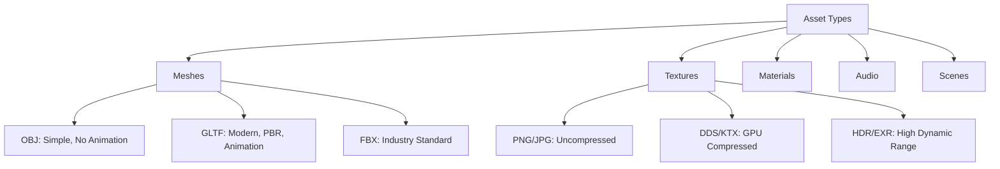
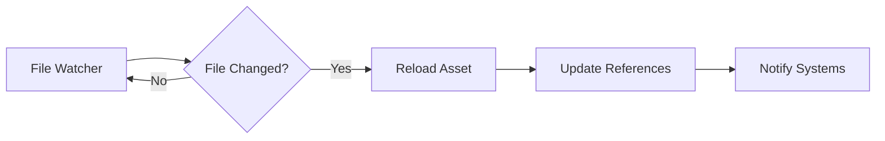

# Module 6: Asset Pipeline Design

**Duration**: 3-4 weeks  
**Complexity**: Intermediate

## Abstract

Asset pipelines manage loading, processing, and lifetime of game resources (meshes, textures, audio, scenes). This module covers file format parsing, asynchronous loading, caching strategies, and hot-reload systems.

## Asset Types and Formats



### Asset Interface

```
INTERFACE Asset
    PROPERTY id: AssetID
    PROPERTY path: String
    PROPERTY state: AssetState
    PROPERTY referenceCount: Integer
    
    METHOD Load() -> Result
    METHOD Unload()
    METHOD IsLoaded() -> Boolean
END INTERFACE

ENUM AssetState
    UNLOADED
    LOADING
    LOADED
    FAILED
END ENUM

TYPE AssetHandle<T>
    id: AssetID
    weakRef: Boolean
    
    METHOD Get() -> Optional<T>
    METHOD IsValid() -> Boolean
END TYPE
```

## Loading Strategies

### Synchronous Loading

```
PROCEDURE LoadAssetSync(path: String) -> Asset
    // Blocking I/O
    fileData = ReadFile(path)
    
    // Parse format
    asset = ParseAsset(fileData, path)
    
    // Upload to GPU (if needed)
    IF asset IS GpuAsset THEN
        UploadToGPU(asset)
    END IF
    
    RETURN asset
END PROCEDURE
```

**Issues**: Blocks game thread, causes frame hitches

### Asynchronous Loading

```
INTERFACE AsyncLoader
    METHOD LoadAsync(path: String) -> Future<Asset>
    METHOD Update()  // Process completed loads
END INTERFACE

PROCEDURE LoadAssetAsync(path: String) -> AssetHandle
    // Allocate handle immediately
    handle = CreateHandle(path)
    handle.state = LOADING
    
    // Queue background task
    backgroundThread.Submit(LAMBDA()
        fileData = ReadFile(path)
        parsedAsset = ParseAsset(fileData, path)
        
        // Queue GPU upload on main thread
        mainThread.Enqueue(LAMBDA()
            UploadToGPU(parsedAsset)
            handle.state = LOADED
            handle.data = parsedAsset
        END LAMBDA)
    END LAMBDA)
    
    RETURN handle
END PROCEDURE
```

**Pattern**: I/O on background thread, GPU upload on main thread

### Streaming

```
TYPE StreamableAsset
    lods: Array<LODLevel>
    currentLOD: Integer
    targetLOD: Integer
END TYPE

PROCEDURE StreamingUpdate()
    FOR EACH asset IN streamableAssets DO
        distance = Distance(asset.position, camera.position)
        targetLOD = CalculateLOD(distance)
        
        IF targetLOD < asset.currentLOD THEN
            // Stream in higher quality
            LoadNextLOD(asset)
        ELSE IF targetLOD > asset.currentLOD THEN
            // Stream out lower quality
            UnloadHighestLOD(asset)
        END IF
    END FOR
END PROCEDURE
```

## File Format Parsing

### OBJ Parser (Simple Example)

```
FUNCTION ParseOBJ(data: String) -> Mesh
    vertices = []
    normals = []
    uvs = []
    indices = []
    
    FOR EACH line IN data.Split('\n') DO
        tokens = line.Split(' ')
        
        MATCH tokens[0]
            CASE "v":  // Vertex position
                vertices.Add(Vector3(
                    ParseFloat(tokens[1]),
                    ParseFloat(tokens[2]),
                    ParseFloat(tokens[3])
                ))
            
            CASE "vt":  // Texture coordinate
                uvs.Add(Vector2(
                    ParseFloat(tokens[1]),
                    ParseFloat(tokens[2])
                ))
            
            CASE "vn":  // Normal
                normals.Add(Vector3(
                    ParseFloat(tokens[1]),
                    ParseFloat(tokens[2]),
                    ParseFloat(tokens[3])
                ))
            
            CASE "f":  // Face
                FOR i = 1 TO 3 DO  // Triangle
                    parts = tokens[i].Split('/')
                    vertexIndex = ParseInt(parts[0]) - 1
                    uvIndex = ParseInt(parts[1]) - 1
                    normalIndex = ParseInt(parts[2]) - 1
                    
                    indices.Add(CreateVertex(
                        vertices[vertexIndex],
                        uvs[uvIndex],
                        normals[normalIndex]
                    ))
                END FOR
        END MATCH
    END FOR
    
    RETURN Mesh(indices, combinedVertices)
END FUNCTION
```

### GLTF Parser (Conceptual)

```
FUNCTION ParseGLTF(jsonData: String, binaryData: ByteArray) -> Scene
    json = ParseJSON(jsonData)
    
    // Parse buffers
    buffers = []
    FOR EACH bufferDesc IN json["buffers"] DO
        buffers.Add(LoadBuffer(bufferDesc, binaryData))
    END FOR
    
    // Parse meshes
    meshes = []
    FOR EACH meshDesc IN json["meshes"] DO
        mesh = Mesh()
        
        FOR EACH primitive IN meshDesc["primitives"] DO
            // Get accessor for positions
            posAccessor = json["accessors"][primitive["attributes"]["POSITION"]]
            positions = ReadAccessor(posAccessor, buffers)
            
            // Get indices
            indexAccessor = json["accessors"][primitive["indices"]]
            indices = ReadAccessor(indexAccessor, buffers)
            
            mesh.AddPrimitive(positions, indices)
        END FOR
        
        meshes.Add(mesh)
    END FOR
    
    // Parse scene hierarchy
    scene = BuildSceneGraph(json["scenes"][0], json["nodes"], meshes)
    
    RETURN scene
END FUNCTION
```

## Asset Manager

```
INTERFACE AssetManager<T extends Asset>
    METHOD Load(path: String) -> AssetHandle<T>
    METHOD Unload(handle: AssetHandle<T>)
    METHOD Get(handle: AssetHandle<T>) -> Optional<T>
    METHOD Update()  // Process async loads
END INTERFACE

CLASS AssetManagerImpl<T> IMPLEMENTS AssetManager<T>
    DATA cache: Map<AssetID, CachedAsset<T>>
    DATA loadQueue: Queue<LoadRequest>
    
    METHOD Load(path: String) -> AssetHandle<T>
        id = HashPath(path)
        
        // Check cache
        IF cache.Contains(id) THEN
            cached = cache[id]
            cached.referenceCount++
            RETURN AssetHandle(id, cached.asset)
        END IF
        
        // Start async load
        request = LoadRequest(id, path)
        loadQueue.Enqueue(request)
        
        // Return handle in loading state
        handle = AssetHandle(id)
        cache[id] = CachedAsset(NULL, LOADING, 1)
        RETURN handle
    END METHOD
    
    METHOD Update()
        // Process completed background loads
        WHILE loadQueue.HasCompleted() DO
            completed = loadQueue.DequeueCompleted()
            
            IF completed.success THEN
                cached = cache[completed.id]
                cached.asset = completed.asset
                cached.state = LOADED
            ELSE
                cache[completed.id].state = FAILED
                LogError("Failed to load: " + completed.path)
            END IF
        END WHILE
    END METHOD
    
    METHOD Unload(handle: AssetHandle<T>)
        cached = cache[handle.id]
        cached.referenceCount--
        
        IF cached.referenceCount <= 0 THEN
            cached.asset.Unload()
            cache.Remove(handle.id)
        END IF
    END METHOD
END CLASS
```

## Caching Strategies

### Reference Counting

```
TYPE CachedAsset<T>
    asset: T
    state: AssetState
    referenceCount: Integer
    lastAccessTime: Timestamp
END TYPE

// Automatic unload when unused
PROCEDURE GarbageCollectAssets()
    FOR EACH (id, cached) IN assetCache DO
        IF cached.referenceCount == 0 THEN
            timeSinceAccess = Now() - cached.lastAccessTime
            
            IF timeSinceAccess > UNLOAD_TIMEOUT THEN
                cached.asset.Unload()
                assetCache.Remove(id)
            END IF
        END IF
    END FOR
END PROCEDURE
```

### LRU Cache

```
INTERFACE LRUCache<K, V>
    PROPERTY maxSize: Integer
    DATA cache: Map<K, Node<V>>
    DATA lruList: DoublyLinkedList<Node<V>>
    
    METHOD Get(key: K) -> Optional<V>
        IF cache.Contains(key) THEN
            node = cache[key]
            MoveToFront(node)
            RETURN node.value
        END IF
        RETURN NULL
    END METHOD
    
    METHOD Put(key: K, value: V)
        IF cache.Contains(key) THEN
            node = cache[key]
            node.value = value
            MoveToFront(node)
        ELSE
            IF cache.Size >= maxSize THEN
                // Evict least recently used
                oldest = lruList.RemoveLast()
                cache.Remove(oldest.key)
                oldest.value.Unload()
            END IF
            
            node = Node(key, value)
            lruList.AddFirst(node)
            cache[key] = node
        END IF
    END METHOD
END INTERFACE
```

## Hot-Reload System



### File Watching

```
INTERFACE FileWatcher
    METHOD Watch(path: String, callback: Function)
    METHOD Update()
END INTERFACE

PROCEDURE SetupHotReload()
    watcher = CreateFileWatcher()
    
    watcher.Watch("assets/", LAMBDA(filePath)
        IF IsAssetFile(filePath) THEN
            ReloadAsset(filePath)
        END IF
    END LAMBDA)
    
    // Update in game loop
    LOOP
        watcher.Update()
    END LOOP
END PROCEDURE

PROCEDURE ReloadAsset(path: String)
    id = HashPath(path)
    cached = assetCache[id]
    
    IF cached IS NULL THEN
        RETURN  // Not loaded
    END IF
    
    // Load new version
    newAsset = LoadAssetSync(path)
    
    // Swap data
    oldAsset = cached.asset
    cached.asset = newAsset
    
    // Clean up old version
    oldAsset.Unload()
    
    // Notify systems
    NotifyAssetReloaded(id)
END PROCEDURE
```

## Dependency Tracking

```
TYPE AssetDependency
    asset: AssetID
    dependencies: Set<AssetID>
END TYPE

INTERFACE DependencyTracker
    METHOD AddDependency(asset: AssetID, dependency: AssetID)
    METHOD GetDependencies(asset: AssetID) -> Set<AssetID>
    METHOD GetDependents(asset: AssetID) -> Set<AssetID>
END INTERFACE

PROCEDURE ReloadWithDependencies(assetID: AssetID)
    // Topological sort for correct reload order
    reloadOrder = []
    visited = Set()
    
    PROCEDURE Visit(id: AssetID)
        IF visited.Contains(id) THEN
            RETURN
        END IF
        
        visited.Add(id)
        
        // Visit dependencies first
        FOR EACH dep IN dependencyTracker.GetDependencies(id) DO
            Visit(dep)
        END FOR
        
        reloadOrder.Add(id)
    END PROCEDURE
    
    Visit(assetID)
    
    // Reload in dependency order
    FOR EACH id IN reloadOrder DO
        ReloadAsset(id)
    END FOR
    
    // Reload dependents
    FOR EACH dependent IN dependencyTracker.GetDependents(assetID) DO
        ReloadAsset(dependent)
    END FOR
END PROCEDURE
```

## GPU Resource Management

```
TYPE GPUMesh
    vertexBuffer: BufferHandle
    indexBuffer: BufferHandle
    vertexCount: Integer
    indexCount: Integer
END TYPE

PROCEDURE UploadMeshToGPU(mesh: Mesh) -> GPUMesh
    // Allocate vertex buffer
    vertexBuffer = AllocateBuffer(
        size = mesh.vertices.Length * VERTEX_SIZE,
        usage = VERTEX_BUFFER,
        memoryType = DEVICE_LOCAL
    )
    
    // Upload via staging buffer
    stagingBuffer = AllocateBuffer(
        size = mesh.vertices.Length * VERTEX_SIZE,
        usage = TRANSFER_SRC,
        memoryType = HOST_VISIBLE
    )
    
    CopyToBuffer(stagingBuffer, mesh.vertices)
    CopyBuffer(stagingBuffer, vertexBuffer)
    FreeBuffer(stagingBuffer)
    
    // Similar for index buffer
    indexBuffer = UploadIndices(mesh.indices)
    
    RETURN GPUMesh(vertexBuffer, indexBuffer, mesh.vertices.Length, mesh.indices.Length)
END PROCEDURE
```

## Asset Bundles

```
TYPE AssetBundle
    metadata: BundleMetadata
    assets: Map<AssetID, ByteArray>
    compressionType: CompressionType
END TYPE

PROCEDURE CreateBundle(assetPaths: List<String>, outputPath: String)
    bundle = AssetBundle()
    
    FOR EACH path IN assetPaths DO
        data = ReadFile(path)
        compressedData = Compress(data, ZSTD)
        
        id = HashPath(path)
        bundle.assets[id] = compressedData
        bundle.metadata.Add(id, path, data.Length, compressedData.Length)
    END FOR
    
    // Write bundle file
    WriteBundle(bundle, outputPath)
END PROCEDURE

PROCEDURE LoadFromBundle(bundlePath: String, assetID: AssetID) -> ByteArray
    bundle = OpenBundle(bundlePath)
    
    compressedData = bundle.assets[assetID]
    data = Decompress(compressedData)
    
    RETURN data
END PROCEDURE
```

## Assessment Exercises

1. **Implement OBJ Parser**: Load simple mesh format
2. **Async Loading**: Background I/O with main thread GPU upload
3. **Asset Manager**: Cache with reference counting
4. **Hot-Reload**: File watching and asset reloading
5. **LRU Cache**: Implement eviction policy
6. **Dependency Tracking**: Reload asset graphs correctly

## Key Takeaways

- Async loading prevents frame hitches during resource loading
- Reference counting manages asset lifetime automatically
- Caching reduces redundant file I/O and parsing
- Hot-reload enables rapid iteration during development
- GPU uploads must occur on main thread in most APIs
- Asset bundles optimize distribution and loading
- These patterns apply across all game engines
