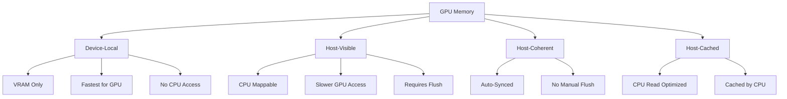
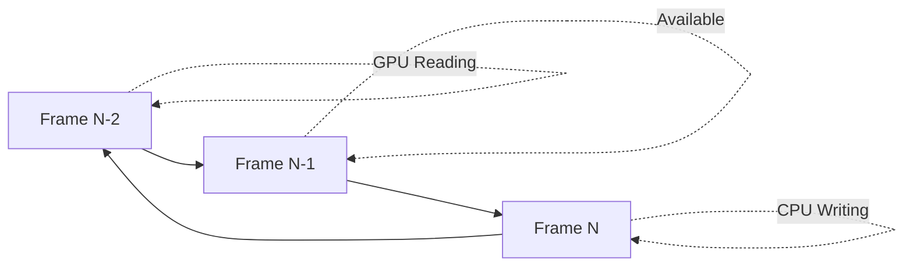

# Module 7: Memory Management Patterns

**Duration**: 2-3 weeks  
**Complexity**: Intermediate to Advanced

## Abstract

Memory management in game engines requires understanding GPU memory types, allocation strategies, and cache optimization. This module covers buffer management, memory pools, and performance-critical allocation patterns.

## GPU Memory Types



### Memory Type Selection

```
FUNCTION SelectMemoryType(usage: BufferUsage) -> MemoryType
    MATCH usage
        CASE VERTEX_BUFFER, INDEX_BUFFER, TEXTURE:
            RETURN DEVICE_LOCAL  // GPU-only, fastest
        
        CASE UNIFORM_BUFFER:
            RETURN DEVICE_LOCAL | HOST_VISIBLE  // Updated frequently
        
        CASE STAGING_BUFFER:
            RETURN HOST_VISIBLE | HOST_COHERENT  // CPU→GPU transfer
        
        CASE READBACK_BUFFER:
            RETURN HOST_VISIBLE | HOST_CACHED  // GPU→CPU transfer
    END MATCH
END FUNCTION
```

### Buffer Abstraction

```
INTERFACE Buffer
    PROPERTY size: Integer
    PROPERTY usage: BufferUsage
    PROPERTY memoryType: MemoryType
    PROPERTY handle: GPUHandle
    
    METHOD Map() -> PointerToMemory
    METHOD Unmap()
    METHOD Write(data: ByteArray, offset: Integer)
    METHOD Read() -> ByteArray
END INTERFACE

TYPE BufferUsage
    VERTEX_BUFFER
    INDEX_BUFFER
    UNIFORM_BUFFER
    STORAGE_BUFFER
    STAGING_BUFFER
END TYPE
```

## Allocation Strategies

### Naive Allocation

```
// One allocation per buffer - simple but inefficient
PROCEDURE NaiveAllocate(size: Integer, usage: BufferUsage) -> Buffer
    memoryType = SelectMemoryType(usage)
    
    // Allocate dedicated memory
    memory = AllocateDeviceMemory(size, memoryType)
    
    // Create buffer
    buffer = CreateBuffer(size, usage)
    
    // Bind buffer to memory
    BindBufferMemory(buffer, memory, offset=0)
    
    RETURN Buffer(buffer, memory, size)
END PROCEDURE
```

**Problems**:
- Allocation overhead (thousands of allocations)
- Memory fragmentation
- Driver limits on allocation count
- Poor performance

### Memory Pool Allocator

```
INTERFACE MemoryPool
    PROPERTY blockSize: Integer
    PROPERTY memoryType: MemoryType
    PROPERTY totalSize: Integer
    PROPERTY usedSize: Integer
    DATA memory: DeviceMemory
    DATA freeBlocks: List<MemoryBlock>
    
    METHOD Allocate(size: Integer) -> MemoryBlock
    METHOD Free(block: MemoryBlock)
END INTERFACE

TYPE MemoryBlock
    offset: Integer
    size: Integer
    pool: MemoryPool
END TYPE

CLASS PoolAllocator IMPLEMENTS MemoryPool
    METHOD Initialize(totalSize: Integer, memoryType: MemoryType)
        this.memory = AllocateDeviceMemory(totalSize, memoryType)
        this.freeBlocks = [MemoryBlock(0, totalSize, this)]
    END METHOD
    
    METHOD Allocate(size: Integer) -> MemoryBlock
        // Align size
        alignedSize = AlignUp(size, ALIGNMENT)
        
        // Find suitable free block (first-fit)
        FOR EACH block IN freeBlocks DO
            IF block.size >= alignedSize THEN
                // Split block
                allocated = MemoryBlock(block.offset, alignedSize, this)
                
                IF block.size > alignedSize THEN
                    remaining = MemoryBlock(
                        block.offset + alignedSize,
                        block.size - alignedSize,
                        this
                    )
                    freeBlocks.Add(remaining)
                END IF
                
                freeBlocks.Remove(block)
                usedSize += alignedSize
                
                RETURN allocated
            END IF
        END FOR
        
        THROW OutOfMemoryError()
    END METHOD
    
    METHOD Free(block: MemoryBlock)
        usedSize -= block.size
        
        // Coalesce adjacent free blocks
        merged = block
        
        FOR EACH free IN freeBlocks DO
            // Check if adjacent
            IF free.offset + free.size == merged.offset THEN
                // Merge before
                merged = MemoryBlock(free.offset, free.size + merged.size, this)
                freeBlocks.Remove(free)
            ELSE IF merged.offset + merged.size == free.offset THEN
                // Merge after
                merged = MemoryBlock(merged.offset, merged.size + free.size, this)
                freeBlocks.Remove(free)
            END IF
        END FOR
        
        freeBlocks.Add(merged)
    END METHOD
END CLASS
```

### Buddy Allocator

```
CLASS BuddyAllocator
    DATA memory: DeviceMemory
    DATA freeLists: Array<List<Block>>  // One list per size class
    CONSTANT MIN_BLOCK_SIZE = 64
    CONSTANT MAX_BLOCK_SIZE = 1GB
    
    METHOD Allocate(size: Integer) -> Block
        // Round up to power of 2
        blockSize = NextPowerOf2(MAX(size, MIN_BLOCK_SIZE))
        level = Log2(blockSize / MIN_BLOCK_SIZE)
        
        // Find free block of suitable size
        WHILE freeLists[level].IsEmpty() DO
            level++
            IF level >= freeLists.Length THEN
                THROW OutOfMemoryError()
            END IF
        END WHILE
        
        // Take block
        block = freeLists[level].Pop()
        
        // Split if too large
        WHILE block.size > blockSize DO
            block.size /= 2
            buddy = Block(block.offset + block.size, block.size)
            freeLists[level - 1].Add(buddy)
            level--
        END WHILE
        
        RETURN block
    END METHOD
    
    METHOD Free(block: Block)
        level = Log2(block.size / MIN_BLOCK_SIZE)
        
        // Try to merge with buddy
        buddyOffset = block.offset XOR block.size
        buddy = FindBlock(freeLists[level], buddyOffset, block.size)
        
        IF buddy EXISTS THEN
            // Merge
            freeLists[level].Remove(buddy)
            merged = Block(MIN(block.offset, buddy.offset), block.size * 2)
            Free(merged)  // Recursively merge
        ELSE
            // No buddy, just add to free list
            freeLists[level].Add(block)
        END IF
    END METHOD
END CLASS
```

## Ring Buffer Pattern

For per-frame uniform data:



### Triple-Buffered Ring Buffer

```
CLASS RingBuffer
    DATA buffer: Buffer
    DATA size: Integer
    DATA framesInFlight: Integer = 3
    DATA currentFrame: Integer = 0
    DATA offsets: Array[framesInFlight] of Integer
    
    METHOD Initialize(totalSize: Integer)
        this.size = totalSize
        this.buffer = CreateBuffer(totalSize * framesInFlight, UNIFORM_BUFFER)
        
        FOR i = 0 TO framesInFlight - 1 DO
            offsets[i] = i * totalSize
        END FOR
    END METHOD
    
    METHOD Allocate(size: Integer) -> BufferView
        frameOffset = offsets[currentFrame]
        
        // Align allocation
        alignedSize = AlignUp(size, UNIFORM_ALIGNMENT)
        
        IF frameOffset + alignedSize > (currentFrame + 1) * this.size THEN
            THROW BufferOverflowError()
        END IF
        
        view = BufferView(buffer, frameOffset, size)
        offsets[currentFrame] += alignedSize
        
        RETURN view
    END METHOD
    
    METHOD NextFrame()
        currentFrame = (currentFrame + 1) MOD framesInFlight
        offsets[currentFrame] = currentFrame * size  // Reset offset
    END METHOD
END CLASS

// Usage
PROCEDURE RenderFrame()
    // Allocate uniform data for this frame
    cameraUniform = ringBuffer.Allocate(SIZEOF(CameraData))
    WriteCameraData(cameraUniform)
    
    modelUniform = ringBuffer.Allocate(SIZEOF(ModelData))
    WriteModelData(modelUniform)
    
    // Render with allocated uniforms
    Render()
    
    // Advance to next frame
    ringBuffer.NextFrame()
END PROCEDURE
```

## Cache Optimization

### Structure of Arrays (SoA) vs Array of Structures (AoS)

```
// Array of Structures (AoS) - Poor cache usage
TYPE Entity_AoS
    position: Vector3     // 12 bytes
    velocity: Vector3     // 12 bytes
    health: Float         // 4 bytes
    padding: [8 bytes]    // Alignment
END TYPE  // 36 bytes per entity

entities: Array<Entity_AoS>

// Iterate positions - loads unnecessary data
FOR EACH entity IN entities DO
    entity.position += entity.velocity * dt  // Loads 36 bytes, uses 24
END FOR

// Structure of Arrays (SoA) - Better cache usage
TYPE EntityData_SoA
    positions: Array<Vector3>   // Contiguous
    velocities: Array<Vector3>  // Contiguous
    healths: Array<Float>       // Contiguous
END TYPE

// Iterate positions - only loads needed data
FOR i = 0 TO count - 1 DO
    positions[i] += velocities[i] * dt  // Loads 24 bytes, uses 24
END FOR
```

### Cache Line Awareness

```
CONSTANT CACHE_LINE_SIZE = 64  // bytes

// Bad: False sharing
TYPE BadSharedData
    threadACounter: Integer  // Offset 0
    threadBCounter: Integer  // Offset 4 - SAME CACHE LINE!
END TYPE

// Good: Each thread owns cache line
TYPE GoodSharedData
    threadACounter: Integer
    padding1: [60 bytes]
    threadBCounter: Integer  // Offset 64 - Different cache line
    padding2: [60 bytes]
END TYPE
```

### Data Alignment

```
FUNCTION AlignUp(value: Integer, alignment: Integer) -> Integer
    RETURN (value + alignment - 1) AND NOT (alignment - 1)
END FUNCTION

FUNCTION AlignDown(value: Integer, alignment: Integer) -> Integer
    RETURN value AND NOT (alignment - 1)
END FUNCTION

// Ensure GPU alignment requirements
CONSTANT UNIFORM_BUFFER_ALIGNMENT = 256  // GPU-specific

TYPE UniformData
    data: ByteArray
    alignedSize: Integer
END TYPE

PROCEDURE CreateUniformBuffer(data: ByteArray) -> Buffer
    alignedSize = AlignUp(data.Length, UNIFORM_BUFFER_ALIGNMENT)
    buffer = AllocateBuffer(alignedSize, UNIFORM_BUFFER)
    WriteBuffer(buffer, data)
    RETURN buffer
END PROCEDURE
```

## Subbuffer Allocation

```
INTERFACE BufferAllocator
    METHOD AllocateSubbuffer(size: Integer) -> Subbuffer
    METHOD FreeSubbuffer(sub: Subbuffer)
END INTERFACE

TYPE Subbuffer
    parentBuffer: Buffer
    offset: Integer
    size: Integer
    
    METHOD GetGPUAddress() -> Integer
        RETURN parentBuffer.GetGPUAddress() + offset
    END METHOD
    
    METHOD Write(data: ByteArray)
        WriteToBuffer(parentBuffer, data, offset)
    END METHOD
END TYPE

CLASS SubbufferAllocator IMPLEMENTS BufferAllocator
    DATA buffer: Buffer
    DATA freeRegions: List<Region>
    
    METHOD Initialize(totalSize: Integer, usage: BufferUsage)
        this.buffer = CreateBuffer(totalSize, usage)
        this.freeRegions = [Region(0, totalSize)]
    END METHOD
    
    METHOD AllocateSubbuffer(size: Integer) -> Subbuffer
        alignedSize = AlignUp(size, 256)
        
        FOR EACH region IN freeRegions DO
            IF region.size >= alignedSize THEN
                sub = Subbuffer(buffer, region.offset, alignedSize)
                
                // Split region
                IF region.size > alignedSize THEN
                    region.offset += alignedSize
                    region.size -= alignedSize
                ELSE
                    freeRegions.Remove(region)
                END IF
                
                RETURN sub
            END IF
        END FOR
        
        THROW OutOfMemoryError()
    END METHOD
END CLASS
```

## Memory Defragmentation

```
PROCEDURE DefragmentMemory(pool: MemoryPool)
    // Collect all allocated blocks
    allocatedBlocks = GetAllocatedBlocks(pool)
    
    // Sort by offset
    Sort(allocatedBlocks, BY=offset)
    
    // Compact blocks
    newOffset = 0
    FOR EACH block IN allocatedBlocks DO
        IF block.offset != newOffset THEN
            // Move block data
            CopyMemory(
                pool.memory,
                sourceOffset = block.offset,
                destOffset = newOffset,
                size = block.size
            )
            
            // Update block offset
            block.offset = newOffset
            
            // Update any references to this block
            UpdateBlockReferences(block)
        END IF
        
        newOffset += block.size
    END FOR
    
    // Consolidate free space
    pool.freeBlocks = [MemoryBlock(newOffset, pool.totalSize - newOffset)]
END PROCEDURE
```

## Profiling Memory Usage

```
TYPE MemoryStats
    totalAllocated: Integer
    totalUsed: Integer
    allocationCount: Integer
    peakUsage: Integer
    fragmentationRatio: Float
END TYPE

INTERFACE MemoryProfiler
    METHOD RecordAllocation(size: Integer, type: String)
    METHOD RecordDeallocation(size: Integer, type: String)
    METHOD GetStats() -> MemoryStats
    METHOD PrintReport()
END INTERFACE

CLASS MemoryProfilerImpl IMPLEMENTS MemoryProfiler
    DATA allocations: Map<String, Integer>
    DATA allocationSizes: Map<String, Integer>
    DATA currentUsage: Integer
    DATA peakUsage: Integer
    
    METHOD RecordAllocation(size: Integer, type: String)
        allocations[type]++
        allocationSizes[type] += size
        currentUsage += size
        peakUsage = MAX(peakUsage, currentUsage)
    END METHOD
    
    METHOD PrintReport()
        Print("=== Memory Report ===")
        Print("Current Usage: " + FormatBytes(currentUsage))
        Print("Peak Usage: " + FormatBytes(peakUsage))
        Print("\nBy Type:")
        
        FOR EACH (type, count) IN allocations DO
            size = allocationSizes[type]
            Print("  " + type + ": " + count + " allocations, " + FormatBytes(size))
        END FOR
    END METHOD
END CLASS
```

## Staging Buffer Pattern

For CPU→GPU transfers:

```
PROCEDURE UploadDataToGPU(data: ByteArray, targetBuffer: Buffer)
    // Create staging buffer (CPU-accessible)
    stagingBuffer = CreateBuffer(
        size = data.Length,
        usage = TRANSFER_SRC,
        memoryType = HOST_VISIBLE | HOST_COHERENT
    )
    
    // Write to staging buffer
    mappedMemory = stagingBuffer.Map()
    Copy(mappedMemory, data)
    stagingBuffer.Unmap()
    
    // Copy to device-local buffer
    commandBuffer = CreateCommandBuffer()
    commandBuffer.BeginRecording()
    commandBuffer.CopyBuffer(
        source = stagingBuffer,
        destination = targetBuffer,
        size = data.Length
    )
    commandBuffer.EndRecording()
    
    // Submit and wait
    SubmitAndWait(commandBuffer)
    
    // Clean up
    DestroyBuffer(stagingBuffer)
END PROCEDURE
```

## Assessment Exercises

1. **Implement Memory Pool**: Allocate/free with coalescing
2. **Ring Buffer**: Triple-buffered uniform allocator
3. **Profile Memory**: Track allocations by type
4. **SoA Transformation**: Convert AoS to SoA for performance
5. **Buddy Allocator**: Power-of-2 allocation with merging
6. **Staging Uploads**: Efficient CPU→GPU transfers

## Key Takeaways

- GPU memory types have different performance characteristics
- Memory pools reduce allocation overhead and fragmentation
- Ring buffers enable efficient per-frame data with multiple frames in flight
- Cache-friendly data layout (SoA) improves performance significantly
- Alignment is critical for GPU buffer requirements
- Staging buffers enable efficient uploads to device-local memory
- These patterns apply across Vulkan, DirectX 12, and Metal
