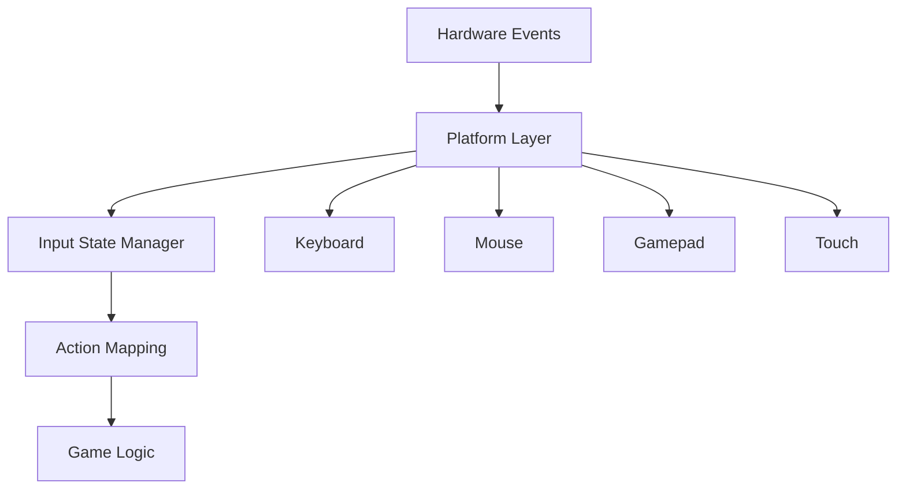
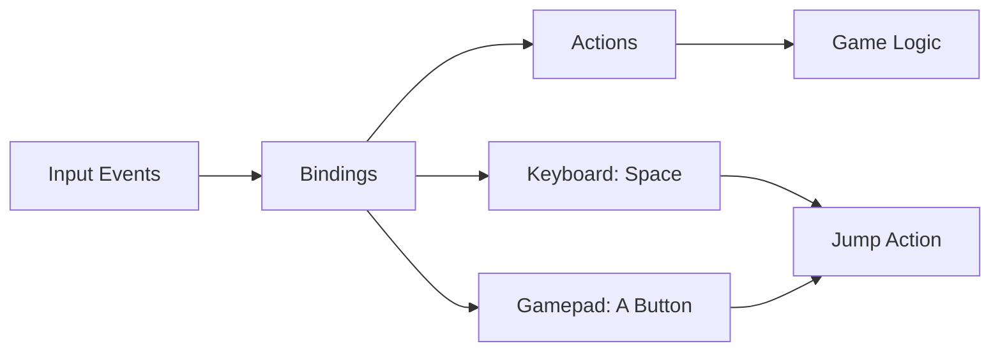

# Module 8: Input Abstraction

**Duration**: 1-2 weeks  
**Complexity**: Beginner to Intermediate

## Abstract

Input systems translate hardware events into game actions. This module covers device abstraction, action mapping, state management, and multi-device support.

## Input Architecture



### Input State Interface

```
INTERFACE InputState
    // Keyboard
    METHOD IsKeyDown(key: KeyCode) -> Boolean
    METHOD IsKeyPressed(key: KeyCode) -> Boolean  // This frame
    METHOD IsKeyReleased(key: KeyCode) -> Boolean
    
    // Mouse
    METHOD GetMousePosition() -> Vector2
    METHOD GetMouseDelta() -> Vector2
    METHOD IsMouseButtonDown(button: MouseButton) -> Boolean
    METHOD GetScrollDelta() -> Float
    
    // Gamepad
    METHOD GetGamepadAxis(pad: Integer, axis: GamepadAxis) -> Float
    METHOD IsGamepadButtonDown(pad: Integer, button: GamepadButton) -> Boolean
    
    METHOD Update()  // Called each frame
END INTERFACE
```

### State Management

```
TYPE InputStateImpl
    currentKeyboard: Set<KeyCode>
    previousKeyboard: Set<KeyCode>
    
    currentMouse: MouseState
    previousMouse: MouseState
    
    gamepads: Array<GamepadState>
END TYPE

TYPE MouseState
    position: Vector2
    buttons: Set<MouseButton>
    scrollDelta: Float
END TYPE

PROCEDURE UpdateInputState(state: InputStateImpl)
    // Save previous frame state
    state.previousKeyboard = state.currentKeyboard.Clone()
    state.previousMouse = state.currentMouse.Clone()
    
    // Poll new state from platform
    state.currentKeyboard = PollKeyboardState()
    state.currentMouse = PollMouseState()
    
    FOR i = 0 TO state.gamepads.Length - 1 DO
        state.gamepads[i] = PollGamepadState(i)
    END FOR
END PROCEDURE

FUNCTION IsKeyPressed(state: InputStateImpl, key: KeyCode) -> Boolean
    // Rising edge: not down last frame, down this frame
    RETURN state.currentKeyboard.Contains(key) AND
           NOT state.previousKeyboard.Contains(key)
END FUNCTION

FUNCTION GetMouseDelta(state: InputStateImpl) -> Vector2
    RETURN state.currentMouse.position - state.previousMouse.position
END FUNCTION
```

## Action Mapping System



### Action Interface

```
TYPE Action
    name: String
    bindings: List<InputBinding>
    state: ActionState
    value: Float
END TYPE

ENUM ActionState
    INACTIVE
    PRESSED    // Just activated
    ACTIVE     // Held
    RELEASED   // Just deactivated
END ENUM

TYPE InputBinding
    device: InputDevice
    control: InputControl
    modifiers: Set<KeyCode>  // Ctrl, Shift, Alt
END TYPE

ENUM InputDevice
    KEYBOARD
    MOUSE
    GAMEPAD
END ENUM

// Example bindings
jumpAction = Action("Jump", [
    InputBinding(KEYBOARD, KEY_SPACE),
    InputBinding(GAMEPAD, BUTTON_A)
])

moveForwardAction = Action("MoveForward", [
    InputBinding(KEYBOARD, KEY_W),
    InputBinding(GAMEPAD, LEFT_STICK_Y)
])
```

### Action Evaluation

```
PROCEDURE EvaluateActions(actions: List<Action>, inputState: InputState)
    FOR EACH action IN actions DO
        wasActive = (action.state == ACTIVE OR action.state == PRESSED)
        isActive = false
        maxValue = 0.0
        
        // Check all bindings
        FOR EACH binding IN action.bindings DO
            value = EvaluateBinding(binding, inputState)
            
            IF value > 0.0 THEN
                isActive = true
                maxValue = MAX(maxValue, value)
            END IF
        END FOR
        
        // Update action state
        IF isActive AND NOT wasActive THEN
            action.state = PRESSED
        ELSE IF isActive AND wasActive THEN
            action.state = ACTIVE
        ELSE IF NOT isActive AND wasActive THEN
            action.state = RELEASED
        ELSE
            action.state = INACTIVE
        END IF
        
        action.value = maxValue
    END FOR
END PROCEDURE

FUNCTION EvaluateBinding(binding: InputBinding, state: InputState) -> Float
    // Check modifiers
    FOR EACH modifier IN binding.modifiers DO
        IF NOT state.IsKeyDown(modifier) THEN
            RETURN 0.0
        END IF
    END FOR
    
    // Evaluate based on device
    MATCH binding.device
        CASE KEYBOARD:
            RETURN state.IsKeyDown(binding.control) ? 1.0 : 0.0
        
        CASE MOUSE:
            RETURN state.IsMouseButtonDown(binding.control) ? 1.0 : 0.0
        
        CASE GAMEPAD:
            IF IsButton(binding.control) THEN
                RETURN state.IsGamepadButtonDown(0, binding.control) ? 1.0 : 0.0
            ELSE
                RETURN state.GetGamepadAxis(0, binding.control)
            END IF
    END MATCH
END FUNCTION
```

## Device-Specific Handling

### Gamepad Dead Zones

```
FUNCTION ApplyDeadZone(value: Float, deadZone: Float) -> Float
    IF Abs(value) < deadZone THEN
        RETURN 0.0
    END IF
    
    // Rescale to 0-1 range outside dead zone
    sign = Sign(value)
    normalized = (Abs(value) - deadZone) / (1.0 - deadZone)
    RETURN sign * Clamp(normalized, 0.0, 1.0)
END FUNCTION

FUNCTION ApplyRadialDeadZone(x: Float, y: Float, deadZone: Float) -> (Float, Float)
    magnitude = Sqrt(x*x + y*y)
    
    IF magnitude < deadZone THEN
        RETURN (0.0, 0.0)
    END IF
    
    // Rescale
    normalized = (magnitude - deadZone) / (1.0 - deadZone)
    normalized = Clamp(normalized, 0.0, 1.0)
    
    RETURN (x / magnitude * normalized, y / magnitude * normalized)
END FUNCTION
```

### Mouse Sensitivity Curves

```
FUNCTION ApplySensitivityCurve(delta: Vector2, settings: MouseSettings) -> Vector2
    // Apply base sensitivity
    scaled = delta * settings.sensitivity
    
    // Apply curve (quadratic for acceleration)
    IF settings.acceleration > 0.0 THEN
        length = Length(scaled)
        direction = Normalize(scaled)
        
        accelerated = length + (length * length * settings.acceleration)
        scaled = direction * accelerated
    END IF
    
    // Apply per-axis sensitivity
    scaled.x *= settings.horizontalScale
    scaled.y *= settings.verticalScale
    
    // Invert axes if needed
    IF settings.invertY THEN
        scaled.y = -scaled.y
    END IF
    
    RETURN scaled
END FUNCTION
```

## Input Contexts

Different input schemes for different game states:

```
TYPE InputContext
    name: String
    actions: Map<String, Action>
    enabled: Boolean
    priority: Integer
END TYPE

CLASS InputContextManager
    DATA contexts: List<InputContext>
    
    METHOD PushContext(context: InputContext)
        contexts.Add(context)
        Sort(contexts, BY=priority, DESCENDING)
    END METHOD
    
    METHOD PopContext(contextName: String)
        contexts.RemoveWhere(ctx => ctx.name == contextName)
    END METHOD
    
    METHOD EvaluateActions(inputState: InputState)
        FOR EACH context IN contexts DO
            IF NOT context.enabled THEN
                CONTINUE
            END IF
            
            FOR EACH action IN context.actions.Values() DO
                EvaluateAction(action, inputState)
                
                // Stop if action consumed (higher priority contexts first)
                IF action.state != INACTIVE AND context.consumesInput THEN
                    BREAK
                END IF
            END FOR
        END FOR
    END METHOD
END CLASS

// Usage
gameplayContext = InputContext("Gameplay", {
    "Move": moveAction,
    "Jump": jumpAction,
    "Attack": attackAction
})

menuContext = InputContext("Menu", {
    "Navigate": navigateAction,
    "Select": selectAction,
    "Back": backAction
}, priority=100)  // Higher priority than gameplay

// Push menu over gameplay
inputManager.PushContext(gameplayContext)
inputManager.PushContext(menuContext)  // Menu actions processed first
```

## Input Recording and Playback

```
TYPE InputFrame
    frameNumber: Integer
    keyboardState: Set<KeyCode>
    mousePosition: Vector2
    mouseButtons: Set<MouseButton>
    gamepadState: Array<GamepadState>
END TYPE

CLASS InputRecorder
    DATA recording: List<InputFrame>
    DATA isRecording: Boolean
    DATA currentFrame: Integer
    
    METHOD StartRecording()
        recording.Clear()
        isRecording = true
        currentFrame = 0
    END METHOD
    
    METHOD RecordFrame(inputState: InputState)
        IF NOT isRecording THEN
            RETURN
        END IF
        
        frame = InputFrame(
            frameNumber = currentFrame,
            keyboardState = inputState.currentKeyboard.Clone(),
            mousePosition = inputState.currentMouse.position,
            mouseButtons = inputState.currentMouse.buttons.Clone(),
            gamepadState = inputState.gamepads.Clone()
        )
        
        recording.Add(frame)
        currentFrame++
    END METHOD
    
    METHOD StopRecording()
        isRecording = false
    END METHOD
    
    METHOD SaveToFile(path: String)
        // Serialize recording
    END METHOD
END CLASS

CLASS InputPlayback
    DATA recording: List<InputFrame>
    DATA playbackFrame: Integer
    
    METHOD LoadFromFile(path: String)
        recording = DeserializeRecording(path)
        playbackFrame = 0
    END METHOD
    
    METHOD GetFrameInput() -> InputFrame
        IF playbackFrame >= recording.Length THEN
            RETURN NULL
        END IF
        
        frame = recording[playbackFrame]
        playbackFrame++
        RETURN frame
    END METHOD
END CLASS
```

## Text Input Handling

```
INTERFACE TextInputHandler
    METHOD OnTextInput(character: String)
    METHOD OnKeyPress(key: KeyCode, modifiers: Set<KeyCode>)
END INTERFACE

CLASS TextInputField IMPLEMENTS TextInputHandler
    DATA text: String
    DATA cursorPosition: Integer
    DATA selection: (start: Integer, end: Integer)
    
    METHOD OnTextInput(character: String)
        IF HasSelection() THEN
            DeleteSelection()
        END IF
        
        text = text.Insert(cursorPosition, character)
        cursorPosition += character.Length
    END METHOD
    
    METHOD OnKeyPress(key: KeyCode, modifiers: Set<KeyCode>)
        MATCH key
            CASE BACKSPACE:
                IF cursorPosition > 0 THEN
                    text = text.Remove(cursorPosition - 1, 1)
                    cursorPosition--
                END IF
            
            CASE DELETE:
                IF cursorPosition < text.Length THEN
                    text = text.Remove(cursorPosition, 1)
                END IF
            
            CASE LEFT:
                cursorPosition = MAX(0, cursorPosition - 1)
            
            CASE RIGHT:
                cursorPosition = MIN(text.Length, cursorPosition + 1)
            
            CASE HOME:
                cursorPosition = 0
            
            CASE END:
                cursorPosition = text.Length
            
            CASE C:
                IF modifiers.Contains(CTRL) THEN
                    CopySelectionToClipboard()
                END IF
            
            CASE V:
                IF modifiers.Contains(CTRL) THEN
                    PasteFromClipboard()
                END IF
        END MATCH
    END METHOD
END CLASS
```

## Multi-Device Support

```
TYPE ConnectedDevice
    deviceID: Integer
    deviceType: DeviceType
    name: String
    capabilities: Set<InputCapability>
END TYPE

ENUM DeviceType
    KEYBOARD
    MOUSE
    GAMEPAD_XBOX
    GAMEPAD_PLAYSTATION
    GAMEPAD_GENERIC
    TOUCH_SCREEN
END ENUM

CLASS DeviceManager
    DATA devices: Map<Integer, ConnectedDevice>
    
    METHOD OnDeviceConnected(deviceID: Integer, deviceType: DeviceType)
        device = ConnectedDevice(deviceID, deviceType)
        devices[deviceID] = device
        NotifyDeviceConnected(device)
    END METHOD
    
    METHOD OnDeviceDisconnected(deviceID: Integer)
        IF devices.Contains(deviceID) THEN
            device = devices[deviceID]
            NotifyDeviceDisconnected(device)
            devices.Remove(deviceID)
        END IF
    END METHOD
    
    METHOD GetDevicesByType(type: DeviceType) -> List<ConnectedDevice>
        result = []
        FOR EACH device IN devices.Values() DO
            IF device.deviceType == type THEN
                result.Add(device)
            END IF
        END FOR
        RETURN result
    END METHOD
END CLASS
```

## Assessment Exercises

1. **Implement Input State**: Frame-based keyboard/mouse state tracking
2. **Action Mapping**: Bind multiple inputs to named actions
3. **Dead Zone Application**: Radial dead zone for analog sticks
4. **Input Context Stack**: Priority-based input handling
5. **Text Input Field**: Handle text editing with cursor
6. **Input Recording**: Record and playback input sequences

## Key Takeaways

- Frame-based state tracking enables "just pressed" detection
- Action mapping decouples hardware inputs from game logic
- Dead zones improve analog stick feel
- Input contexts enable different control schemes for different game states
- Text input requires special handling beyond simple key presses
- Hot-swappable device support improves user experience
- These patterns apply across all platforms and input devices
