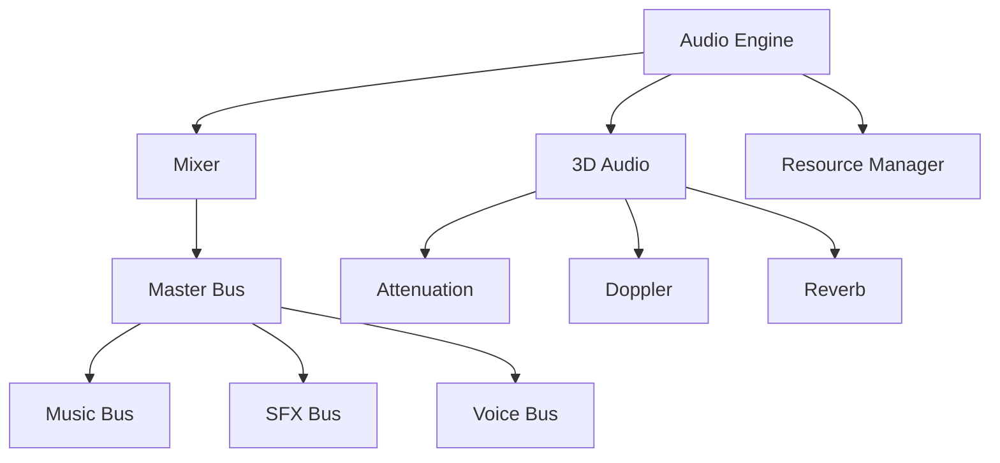
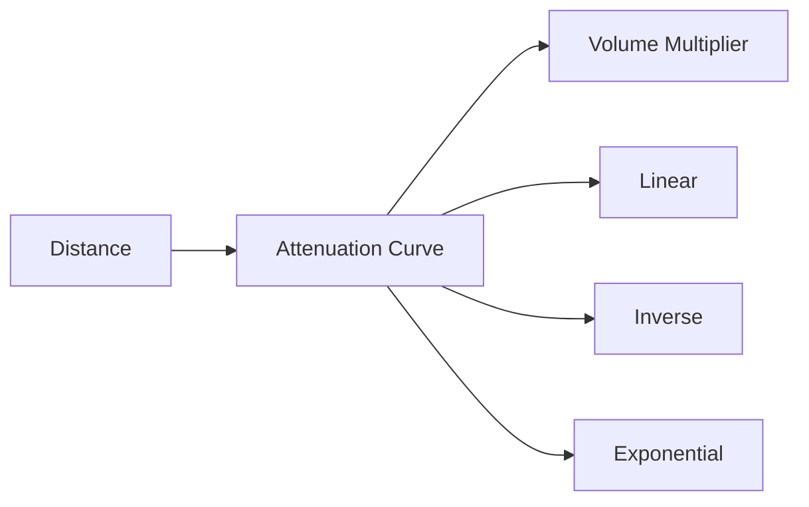

# Module 9: Audio Architectures

**Duration**: 2 weeks  
**Complexity**: Intermediate

## Abstract

Audio systems bring games to life through sound effects, music, and spatial audio. This module covers audio playback, 3D positioning, mixing, and resource management.

## Audio System Architecture



### Core Audio Interface

```
INTERFACE AudioSource
    PROPERTY clip: AudioClip
    PROPERTY volume: Float
    PROPERTY pitch: Float
    PROPERTY loop: Boolean
    PROPERTY spatial: Boolean
    PROPERTY position: Vector3
    
    METHOD Play()
    METHOD Pause()
    METHOD Stop()
    METHOD IsPlaying() -> Boolean
END INTERFACE

TYPE AudioClip
    samples: ByteArray
    sampleRate: Integer
    channels: Integer
    duration: Float
    format: AudioFormat
END TYPE

ENUM AudioFormat
    PCM_8
    PCM_16
    PCM_24
    PCM_32
    FLOAT_32
    COMPRESSED_OGG
    COMPRESSED_MP3
END ENUM
```

## Audio Playback

### Basic Playback

```
INTERFACE AudioDevice
    PROPERTY sampleRate: Integer
    PROPERTY bufferSize: Integer
    
    METHOD FillBuffer(outputBuffer: FloatArray)
END INTERFACE

PROCEDURE AudioCallbackFunction(device: AudioDevice, outputBuffer: FloatArray)
    // Clear buffer
    Fill(outputBuffer, 0.0)
    
    // Mix all active sources
    FOR EACH source IN activeAudioSources DO
        IF NOT source.IsPlaying() THEN
            CONTINUE
        END IF
        
        // Read samples from source
        samples = source.ReadSamples(device.bufferSize)
        
        // Mix into output
        FOR i = 0 TO device.bufferSize - 1 DO
            outputBuffer[i] += samples[i] * source.volume
        END FOR
    END FOR
    
    // Apply master volume
    FOR i = 0 TO device.bufferSize - 1 DO
        outputBuffer[i] *= masterVolume
    END FOR
    
    // Clamp to prevent clipping
    FOR i = 0 TO device.bufferSize - 1 DO
        outputBuffer[i] = Clamp(outputBuffer[i], -1.0, 1.0)
    END FOR
END PROCEDURE
```

### Sample Rate Conversion

```
FUNCTION ResampleAudio(input: FloatArray, inputRate: Integer, outputRate: Integer) -> FloatArray
    ratio = outputRate / inputRate
    outputLength = Floor(input.Length * ratio)
    output = FloatArray(outputLength)
    
    FOR i = 0 TO outputLength - 1 DO
        // Calculate source position
        sourcePos = i / ratio
        sourceIndex = Floor(sourcePos)
        fraction = sourcePos - sourceIndex
        
        // Linear interpolation
        IF sourceIndex + 1 < input.Length THEN
            output[i] = Lerp(input[sourceIndex], input[sourceIndex + 1], fraction)
        ELSE
            output[i] = input[sourceIndex]
        END IF
    END FOR
    
    RETURN output
END FUNCTION
```

## 3D Spatial Audio

### Attenuation (Distance Falloff)



```
ENUM AttenuationModel
    NONE
    LINEAR
    INVERSE
    EXPONENTIAL
END ENUM

FUNCTION CalculateAttenuation(distance: Float, model: AttenuationModel, params: AttenuationParams) -> Float
    IF distance <= params.minDistance THEN
        RETURN 1.0  // Full volume
    END IF
    
    IF distance >= params.maxDistance THEN
        RETURN 0.0  // Silent
    END IF
    
    normalizedDist = (distance - params.minDistance) / (params.maxDistance - params.minDistance)
    
    MATCH model
        CASE NONE:
            RETURN 1.0
        
        CASE LINEAR:
            RETURN 1.0 - normalizedDist
        
        CASE INVERSE:
            RETURN params.minDistance / distance
        
        CASE EXPONENTIAL:
            RETURN Pow(1.0 - normalizedDist, params.rolloffFactor)
    END MATCH
END FUNCTION

TYPE AttenuationParams
    minDistance: Float  // Distance at which attenuation starts
    maxDistance: Float  // Distance at which sound is inaudible
    rolloffFactor: Float
END TYPE
```

### Stereo Panning

```
FUNCTION CalculateStereoPan(listenerPos: Vector3, listenerForward: Vector3, sourcePos: Vector3) -> (leftGain: Float, rightGain: Float)
    // Calculate direction to source
    toSource = Normalize(sourcePos - listenerPos)
    
    // Get listener right vector
    listenerRight = Cross(listenerForward, Vector3(0, 1, 0))
    
    // Calculate pan (-1 = full left, 0 = center, 1 = full right)
    pan = Dot(toSource, listenerRight)
    
    // Convert pan to stereo gains using constant power panning
    angle = pan * PI / 4  // -45° to +45°
    leftGain = Cos(angle)
    rightGain = Sin(angle)
    
    RETURN (leftGain, rightGain)
END FUNCTION

PROCEDURE Apply3DAudio(source: AudioSource, listener: AudioListener, samples: FloatArray)
    // Calculate distance
    distance = Distance(source.position, listener.position)
    
    // Apply attenuation
    attenuation = CalculateAttenuation(distance, source.attenuationModel, source.attenuationParams)
    
    // Calculate stereo pan
    (leftGain, rightGain) = CalculateStereoPan(listener.position, listener.forward, source.position)
    
    // Apply gains
    FOR i = 0 TO samples.Length / 2 - 1 DO
        samples[i * 2] *= leftGain * attenuation      // Left channel
        samples[i * 2 + 1] *= rightGain * attenuation // Right channel
    END FOR
END PROCEDURE
```

### Doppler Effect

```
FUNCTION CalculateDopplerPitch(sourceVel: Vector3, listenerVel: Vector3, sourceToListener: Vector3) -> Float
    CONSTANT SPEED_OF_SOUND = 343.0  // meters/second
    
    direction = Normalize(sourceToListener)
    
    // Project velocities onto direction
    sourceSpeed = Dot(sourceVel, direction)
    listenerSpeed = Dot(listenerVel, direction)
    
    // Doppler formula
    dopplerFactor = (SPEED_OF_SOUND + listenerSpeed) / (SPEED_OF_SOUND + sourceSpeed)
    
    // Clamp to reasonable range
    RETURN Clamp(dopplerFactor, 0.5, 2.0)
END FUNCTION
```

## Audio Mixing

### Mix Buses

```
TYPE AudioBus
    name: String
    volume: Float
    muted: Boolean
    parent: AudioBus
    effects: List<AudioEffect>
END TYPE

CLASS AudioMixer
    DATA buses: Map<String, AudioBus>
    DATA sources: Map<AudioSource, String>  // Source -> Bus name
    
    METHOD CreateBus(name: String, parent: String)
        bus = AudioBus(name, volume=1.0, muted=false)
        
        IF parent EXISTS THEN
            bus.parent = buses[parent]
        END IF
        
        buses[name] = bus
    END METHOD
    
    METHOD SetSourceBus(source: AudioSource, busName: String)
        sources[source] = busName
    END METHOD
    
    METHOD MixToBuffer(outputBuffer: FloatArray)
        // Group sources by bus
        sourcesByBus = Map<AudioBus, List<AudioSource>>()
        
        FOR EACH (source, busName) IN sources DO
            IF source.IsPlaying() THEN
                bus = buses[busName]
                sourcesByBus[bus].Add(source)
            END IF
        END FOR
        
        // Mix each bus
        FOR EACH (bus, busSources) IN sourcesByBus DO
            busBuffer = FloatArray(outputBuffer.Length)
            
            // Mix sources in this bus
            FOR EACH source IN busSources DO
                samples = source.ReadSamples(outputBuffer.Length)
                MixSamples(busBuffer, samples, source.volume)
            END FOR
            
            // Apply bus effects
            FOR EACH effect IN bus.effects DO
                effect.Process(busBuffer)
            END FOR
            
            // Apply bus volume hierarchy
            volume = CalculateBusVolume(bus)
            
            // Mix into output
            IF NOT bus.muted THEN
                MixSamples(outputBuffer, busBuffer, volume)
            END IF
        END FOR
    END METHOD
    
    FUNCTION CalculateBusVolume(bus: AudioBus) -> Float
        volume = bus.volume
        current = bus.parent
        
        WHILE current IS NOT NULL DO
            volume *= current.volume
            current = current.parent
        END WHILE
        
        RETURN volume
    END FUNCTION
END CLASS
```

### Voice Management

```
TYPE VoicePool
    maxVoices: Integer
    activeVoices: List<Voice>
    freeVoices: List<Voice>
END TYPE

TYPE Voice
    source: AudioSource
    priority: Integer
    age: Float
END TYPE

PROCEDURE PlaySound(clip: AudioClip, priority: Integer) -> Voice
    voice = NULL
    
    IF freeVoices.IsEmpty() THEN
        // Steal lowest priority voice
        lowestPriority = FindLowestPriorityVoice(activeVoices)
        
        IF priority > lowestPriority.priority THEN
            voice = lowestPriority
            voice.source.Stop()
            activeVoices.Remove(voice)
        ELSE
            RETURN NULL  // Can't play, all voices higher priority
        END IF
    ELSE
        voice = freeVoices.Pop()
    END IF
    
    // Configure voice
    voice.source.clip = clip
    voice.priority = priority
    voice.age = 0.0
    voice.source.Play()
    
    activeVoices.Add(voice)
    RETURN voice
END PROCEDURE
```

## Audio Effects

### Low-Pass Filter

```
CLASS LowPassFilter IMPLEMENTS AudioEffect
    DATA cutoffFrequency: Float
    DATA resonance: Float
    DATA state: Float = 0.0
    
    METHOD Process(buffer: FloatArray)
        // Simple one-pole low-pass filter
        rc = 1.0 / (cutoffFrequency * 2.0 * PI)
        dt = 1.0 / sampleRate
        alpha = dt / (rc + dt)
        
        FOR i = 0 TO buffer.Length - 1 DO
            state = state + alpha * (buffer[i] - state)
            buffer[i] = state
        END FOR
    END METHOD
END CLASS
```

### Reverb (Simple)

```
CLASS SimpleReverb IMPLEMENTS AudioEffect
    DATA delayLines: Array<DelayLine>
    DATA feedback: Float
    DATA wetMix: Float
    
    METHOD Initialize()
        // Create multiple delay lines for reverb effect
        delayLines = [
            DelayLine(37ms),
            DelayLine(41ms),
            DelayLine(43ms),
            DelayLine(47ms)
        ]
    END METHOD
    
    METHOD Process(buffer: FloatArray)
        wetBuffer = FloatArray(buffer.Length)
        
        FOR i = 0 TO buffer.Length - 1 DO
            wet = 0.0
            
            // Sum all delay lines
            FOR EACH delay IN delayLines DO
                wet += delay.Read()
                delay.Write(buffer[i] + wet * feedback)
            END FOR
            
            wetBuffer[i] = wet / delayLines.Length
        END FOR
        
        // Mix dry and wet
        FOR i = 0 TO buffer.Length - 1 DO
            buffer[i] = buffer[i] * (1.0 - wetMix) + wetBuffer[i] * wetMix
        END FOR
    END METHOD
END CLASS

CLASS DelayLine
    DATA buffer: CircularBuffer<Float>
    
    METHOD Read() -> Float
        RETURN buffer.Read()
    END METHOD
    
    METHOD Write(sample: Float)
        buffer.Write(sample)
    END METHOD
END CLASS
```

## Streaming Audio

```
TYPE StreamingAudioSource
    stream: FileStream
    buffers: CircularQueue<AudioBuffer>
    bufferSize: Integer
    isLooping: Boolean
END TYPE

PROCEDURE StreamingAudioUpdate()
    FOR EACH source IN streamingAudioSources DO
        // Refill buffers as they're consumed
        WHILE source.buffers.FreeSlots() > 0 DO
            buffer = AllocateAudioBuffer(source.bufferSize)
            
            bytesRead = source.stream.Read(buffer.data, source.bufferSize)
            
            IF bytesRead < source.bufferSize THEN
                IF source.isLooping THEN
                    source.stream.Seek(0)
                    // Read remainder
                    remainingBytes = source.bufferSize - bytesRead
                    source.stream.Read(buffer.data + bytesRead, remainingBytes)
                ELSE
                    // Pad with silence
                    Fill(buffer.data + bytesRead, 0, source.bufferSize - bytesRead)
                END IF
            END IF
            
            source.buffers.Enqueue(buffer)
        END FOR
    END FOR
END PROCEDURE
```

## Audio Resource Management

```
CLASS AudioManager
    DATA clips: Map<AssetID, AudioClip>
    DATA sources: Pool<AudioSource>
    DATA streaming: List<StreamingAudioSource>
    
    METHOD LoadClip(path: String) -> AudioClip
        id = HashPath(path)
        
        IF clips.Contains(id) THEN
            RETURN clips[id]
        END IF
        
        // Load and decode audio file
        clip = LoadAudioFile(path)
        clips[id] = clip
        
        RETURN clip
    END METHOD
    
    METHOD PlayOneShot(clip: AudioClip, volume: Float, position: Vector3)
        source = sources.Acquire()
        source.clip = clip
        source.volume = volume
        source.position = position
        source.spatial = true
        source.loop = false
        source.Play()
        
        // Auto-release when finished
        ScheduleCallback(clip.duration, LAMBDA()
            sources.Release(source)
        END LAMBDA)
    END METHOD
    
    METHOD PlayMusic(path: String, fadeTime: Float)
        // Stop current music with fade
        IF currentMusic IS NOT NULL THEN
            FadeOut(currentMusic, fadeTime)
        END IF
        
        // Start new music with fade
        music = CreateStreamingSource(path)
        music.volume = 0.0
        music.loop = true
        music.Play()
        FadeIn(music, fadeTime)
        
        currentMusic = music
    END METHOD
END CLASS
```

## Assessment Exercises

1. **Implement Audio Mixer**: Mix multiple sources into output buffer
2. **3D Audio**: Calculate attenuation and stereo panning
3. **Voice Management**: Prioritize and steal voices
4. **Simple Effect**: Implement low-pass filter or delay
5. **Streaming**: Load and play large audio files in chunks
6. **Music System**: Crossfade between background tracks

## Key Takeaways

- Audio mixing combines multiple sources into final output
- 3D audio requires attenuation, panning, and Doppler
- Mix buses enable hierarchical volume control and effects
- Voice pools limit simultaneous sounds with priority
- Streaming is essential for large audio files (music)
- Audio resource management prevents loading duplicates
- These patterns apply across audio engines (FMOD, Wwise, Kira, OpenAL)
