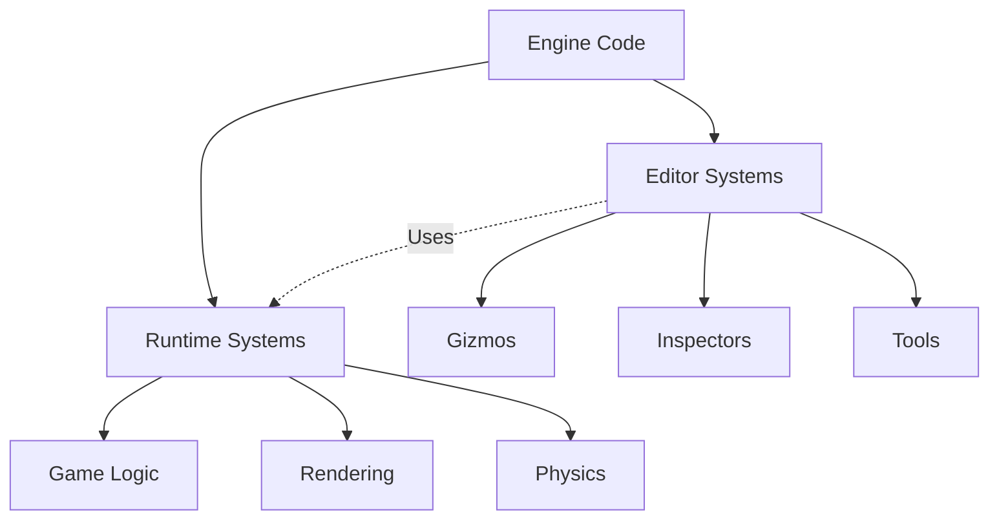
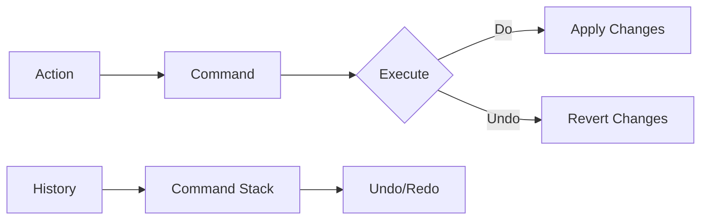
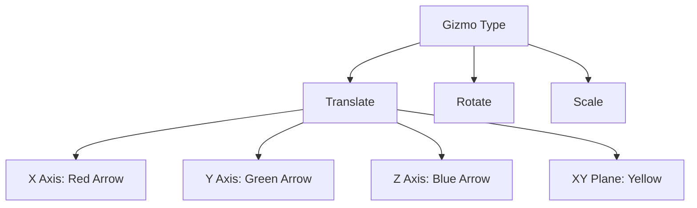

# Module 10: Editor Architecture

**Duration**: 3-4 weeks  
**Complexity**: Advanced

## Abstract

Game editors enable content creation, debugging, and iteration. This module covers editor/runtime separation, undo/redo systems, gizmos, selection, and immediate-mode GUI integration.

## Editor vs Runtime Separation



### Separation Strategies

```
// Conditional compilation
#IF EDITOR_BUILD
    TYPE EditorComponent
        selectedInEditor: Boolean
        hiddenInEditor: Boolean
        editorIcon: Texture
    END TYPE
#END IF

// Separate assemblies/crates
Module: game_runtime
    - Core gameplay
    - No editor dependencies

Module: game_editor
    - Depends on: game_runtime
    - Editor-only features

// Runtime detection
FUNCTION IsEditorMode() -> Boolean
    RETURN compilationFlags.Contains(EDITOR) OR
           environment.Get("EDITOR_MODE") == "true"
END FUNCTION
```

## Undo/Redo System (Command Pattern)



### Command Interface

```
INTERFACE Command
    METHOD Execute()
    METHOD Undo()
    METHOD Merge(other: Command) -> Boolean  // Optional: merge similar commands
    PROPERTY description: String
END INTERFACE

CLASS CommandHistory
    DATA undoStack: Stack<Command>
    DATA redoStack: Stack<Command>
    DATA maxHistorySize: Integer = 100
    
    METHOD ExecuteCommand(command: Command)
        command.Execute()
        undoStack.Push(command)
        redoStack.Clear()  // Clear redo on new command
        
        // Limit history size
        IF undoStack.Size() > maxHistorySize THEN
            undoStack.RemoveAt(0)
        END IF
    END METHOD
    
    METHOD Undo()
        IF undoStack.IsEmpty() THEN
            RETURN
        END IF
        
        command = undoStack.Pop()
        command.Undo()
        redoStack.Push(command)
    END METHOD
    
    METHOD Redo()
        IF redoStack.IsEmpty() THEN
            RETURN
        END IF
        
        command = redoStack.Pop()
        command.Execute()
        undoStack.Push(command)
    END METHOD
    
    METHOD CanUndo() -> Boolean
        RETURN NOT undoStack.IsEmpty()
    END METHOD
    
    METHOD CanRedo() -> Boolean
        RETURN NOT redoStack.IsEmpty()
    END METHOD
END CLASS
```

### Example Commands

```
CLASS SetTransformCommand IMPLEMENTS Command
    DATA entity: Entity
    DATA oldTransform: Transform
    DATA newTransform: Transform
    
    METHOD Execute()
        SetComponent(entity, Transform, newTransform)
    END METHOD
    
    METHOD Undo()
        SetComponent(entity, Transform, oldTransform)
    END METHOD
    
    PROPERTY description = "Move Entity"
END CLASS

CLASS DeleteEntityCommand IMPLEMENTS Command
    DATA entity: Entity
    DATA savedData: EntitySnapshot
    
    METHOD Execute()
        savedData = SerializeEntity(entity)
        DestroyEntity(entity)
    END METHOD
    
    METHOD Undo()
        entity = DeserializeEntity(savedData)
    END METHOD
    
    PROPERTY description = "Delete Entity"
END CLASS

CLASS CompoundCommand IMPLEMENTS Command
    DATA commands: List<Command>
    
    METHOD Execute()
        FOR EACH cmd IN commands DO
            cmd.Execute()
        END FOR
    END METHOD
    
    METHOD Undo()
        // Undo in reverse order
        FOR i = commands.Length - 1 DOWN TO 0 DO
            commands[i].Undo()
        END FOR
    END METHOD
    
    PROPERTY description = "Multiple Actions"
END CLASS
```

### Command Merging

```
CLASS SetPropertyCommand IMPLEMENTS Command
    DATA target: Object
    DATA propertyName: String
    DATA oldValue: Value
    DATA newValue: Value
    DATA timestamp: Float
    
    METHOD Merge(other: Command) -> Boolean
        IF other IS NOT SetPropertyCommand THEN
            RETURN false
        END IF
        
        otherCmd = CAST<SetPropertyCommand>(other)
        
        // Can merge if same target/property and recent
        IF otherCmd.target == target AND
           otherCmd.propertyName == propertyName AND
           (otherCmd.timestamp - timestamp) < 0.5 THEN  // Within 0.5 seconds
            
            newValue = otherCmd.newValue
            timestamp = otherCmd.timestamp
            RETURN true
        END IF
        
        RETURN false
    END METHOD
END CLASS
```

## Selection System

```
TYPE SelectionState
    primarySelection: Entity
    selectedEntities: Set<Entity>
END TYPE

INTERFACE SelectionManager
    METHOD Select(entity: Entity, additive: Boolean)
    METHOD Deselect(entity: Entity)
    METHOD ClearSelection()
    METHOD IsSelected(entity: Entity) -> Boolean
    METHOD GetSelection() -> List<Entity>
END INTERFACE

CLASS SelectionManagerImpl IMPLEMENTS SelectionManager
    DATA selection: SelectionState
    
    METHOD Select(entity: Entity, additive: Boolean)
        IF NOT additive THEN
            ClearSelection()
        END IF
        
        selection.selectedEntities.Add(entity)
        
        IF selection.selectedEntities.Count == 1 THEN
            selection.primarySelection = entity
        END IF
        
        NotifySelectionChanged()
    END METHOD
    
    METHOD RaycastSelect(ray: Ray, additive: Boolean)
        hit = RaycastWorld(ray)
        
        IF hit.entity IS NOT NULL THEN
            Select(hit.entity, additive)
        ELSE IF NOT additive THEN
            ClearSelection()
        END IF
    END METHOD
    
    METHOD BoxSelect(screenRect: Rectangle, additive: Boolean)
        IF NOT additive THEN
            ClearSelection()
        END IF
        
        frustum = CalculateSelectionFrustum(screenRect)
        
        QUERY entities WITH (Transform, Renderable)
        FOR EACH (transform, renderable) IN entities DO
            IF frustum.Contains(transform.position) THEN
                Select(transform.GetEntity(), additive=true)
            END IF
        END FOR
    END METHOD
END CLASS
```

### Selection Rendering

```
PROCEDURE RenderSelectionOutline(selectedEntities: List<Entity>)
    // First pass: Render selected objects to stencil buffer
    BeginRenderPass(stencilPass)
    SetStencilOp(REPLACE, value=1)
    
    FOR EACH entity IN selectedEntities DO
        RenderEntity(entity)
    END FOR
    
    EndRenderPass()
    
    // Second pass: Render outline where stencil != 1
    BeginRenderPass(outlinePass)
    SetStencilTest(NOT_EQUAL, reference=1)
    
    FOR EACH entity IN selectedEntities DO
        // Render slightly larger
        scaledTransform = ScaleTransform(entity.transform, 1.05)
        RenderEntityWithTransform(entity, scaledTransform, outlineColor)
    END FOR
    
    EndRenderPass()
END PROCEDURE
```

## Transform Gizmos



### Gizmo Interaction

```
ENUM GizmoMode
    TRANSLATE
    ROTATE
    SCALE
END ENUM

TYPE GizmoState
    mode: GizmoMode
    space: TransformSpace  // LOCAL or WORLD
    activeAxis: Axis       // Which axis is being dragged
    dragStartPos: Vector3
    dragStartValue: Transform
END TYPE

INTERFACE TransformGizmo
    METHOD Render(transform: Transform, camera: Camera)
    METHOD HandleInput(mouseRay: Ray, mouseDelta: Vector2) -> Transform
END INTERFACE

CLASS TranslateGizmo IMPLEMENTS TransformGizmo
    METHOD Render(transform: Transform, camera: Camera)
        gizmoPos = transform.position
        gizmoSize = CalculateScreenSpaceSize(gizmoPos, camera)
        
        // Draw X axis (red arrow)
        DrawArrow(gizmoPos, gizmoPos + Vector3(1,0,0) * gizmoSize, RED)
        
        // Draw Y axis (green arrow)
        DrawArrow(gizmoPos, gizmoPos + Vector3(0,1,0) * gizmoSize, GREEN)
        
        // Draw Z axis (blue arrow)
        DrawArrow(gizmoPos, gizmoPos + Vector3(0,0,1) * gizmoSize, BLUE)
        
        // Draw plane handles
        DrawPlaneHandle(gizmoPos, Vector3(1,1,0), gizmoSize * 0.3, YELLOW)
        DrawPlaneHandle(gizmoPos, Vector3(1,0,1), gizmoSize * 0.3, MAGENTA)
        DrawPlaneHandle(gizmoPos, Vector3(0,1,1), gizmoSize * 0.3, CYAN)
    END METHOD
    
    METHOD HandleInput(mouseRay: Ray, mouseDelta: Vector2) -> Transform
        IF NOT state.isDragging THEN
            // Test which axis/plane was clicked
            state.activeAxis = RaycastGizmo(mouseRay)
            
            IF state.activeAxis != NONE THEN
                state.isDragging = true
                state.dragStartPos = transform.position
            END IF
        ELSE
            // Calculate movement along axis
            movement = CalculateAxisMovement(mouseRay, state.activeAxis)
            
            // Apply movement
            newTransform = transform.Clone()
            newTransform.position = state.dragStartPos + movement
            
            RETURN newTransform
        END IF
        
        RETURN transform
    END METHOD
    
    FUNCTION CalculateAxisMovement(mouseRay: Ray, axis: Axis) -> Vector3
        // Project ray onto axis
        axisDirection = GetAxisDirection(axis)
        axisOrigin = state.dragStartPos
        
        // Find closest point on ray to axis
        closestPoint = ClosestPointRayToRay(mouseRay, axisOrigin, axisDirection)
        
        // Project onto axis
        offset = closestPoint - axisOrigin
        projection = Dot(offset, axisDirection)
        
        RETURN axisDirection * projection
    END FUNCTION
END CLASS

CLASS RotateGizmo IMPLEMENTS TransformGizmo
    METHOD Render(transform: Transform, camera: Camera)
        gizmoPos = transform.position
        gizmoSize = CalculateScreenSpaceSize(gizmoPos, camera)
        
        // Draw rotation circles
        DrawCircle(gizmoPos, Vector3(1,0,0), gizmoSize, RED)    // X rotation
        DrawCircle(gizmoPos, Vector3(0,1,0), gizmoSize, GREEN)  // Y rotation
        DrawCircle(gizmoPos, Vector3(0,0,1), gizmoSize, BLUE)   // Z rotation
    END METHOD
    
    METHOD HandleInput(mouseRay: Ray, mouseDelta: Vector2) -> Transform
        IF state.isDragging THEN
            // Calculate rotation angle from mouse movement
            angle = CalculateRotationAngle(mouseDelta, state.activeAxis)
            
            // Apply rotation
            newTransform = transform.Clone()
            axis = GetAxisDirection(state.activeAxis)
            rotation = QuaternionFromAxisAngle(axis, angle)
            newTransform.rotation = rotation * state.dragStartValue.rotation
            
            RETURN newTransform
        END IF
        
        RETURN transform
    END METHOD
END CLASS
```

### Gizmo Snapping

```
FUNCTION SnapValue(value: Float, snapIncrement: Float) -> Float
    IF snapIncrement == 0 THEN
        RETURN value
    END IF
    
    RETURN Round(value / snapIncrement) * snapIncrement
END FUNCTION

FUNCTION SnapPosition(position: Vector3, gridSize: Float) -> Vector3
    RETURN Vector3(
        SnapValue(position.x, gridSize),
        SnapValue(position.y, gridSize),
        SnapValue(position.z, gridSize)
    )
END FUNCTION

FUNCTION SnapRotation(angle: Float, snapDegrees: Float) -> Float
    RETURN SnapValue(angle, DegreesToRadians(snapDegrees))
END FUNCTION
```

## Immediate Mode GUI (IMGUI)

```
// Dear ImGui-style API
PROCEDURE EditorGUI()
    IF BeginWindow("Inspector") THEN
        IF selection.primarySelection IS NOT NULL THEN
            entity = selection.primarySelection
            
            Text("Entity: " + entity.name)
            Separator()
            
            // Transform component
            IF BeginSection("Transform") THEN
                transform = GetComponent(entity, Transform)
                
                IF InputFloat3("Position", transform.position) THEN
                    // Value changed, create undo command
                    command = SetTransformCommand(entity, oldTransform, newTransform)
                    commandHistory.ExecuteCommand(command)
                END IF
                
                IF InputFloat3("Rotation", ToEuler(transform.rotation)) THEN
                    UpdateRotation(transform)
                END IF
                
                IF InputFloat3("Scale", transform.scale) THEN
                    UpdateScale(transform)
                END IF
                
                EndSection()
            END IF
            
            // Other components
            RenderComponentInspectors(entity)
        END IF
        
        EndWindow()
    END IF
    
    // Scene hierarchy
    IF BeginWindow("Hierarchy") THEN
        QUERY entities WITH (Name) WITHOUT (Parent)  // Root entities
        FOR EACH entity IN entities DO
            RenderEntityHierarchy(entity)
        END FOR
        
        EndWindow()
    END IF
END PROCEDURE

PROCEDURE RenderEntityHierarchy(entity: Entity)
    flags = TreeNodeFlags.OPEN_ON_ARROW
    
    IF selection.IsSelected(entity) THEN
        flags |= TreeNodeFlags.SELECTED
    END IF
    
    children = GetComponent(entity, Children)
    hasChildren = children IS NOT NULL AND children.entities.Count > 0
    
    IF hasChildren THEN
        IF BeginTreeNode(entity.name, flags) THEN
            FOR EACH child IN children.entities DO
                RenderEntityHierarchy(child)
            END FOR
            EndTreeNode()
        END IF
    ELSE
        TreeLeaf(entity.name, flags)
    END IF
    
    // Handle selection
    IF IsItemClicked() THEN
        additive = IsKeyDown(KEY_CTRL)
        selectionManager.Select(entity, additive)
    END IF
END PROCEDURE
```

## Scene Serialization

```
FUNCTION SerializeScene(entities: List<Entity>) -> JSONObject
    scene = JSONObject()
    scene["entities"] = []
    
    FOR EACH entity IN entities DO
        entityData = JSONObject()
        entityData["id"] = entity.id
        entityData["name"] = entity.name
        entityData["components"] = []
        
        // Serialize each component
        FOR EACH component IN entity.GetComponents() DO
            componentData = SerializeComponent(component)
            entityData["components"].Add(componentData)
        END FOR
        
        scene["entities"].Add(entityData)
    END FOR
    
    RETURN scene
END FUNCTION

FUNCTION DeserializeScene(sceneData: JSONObject) -> List<Entity>
    entities = []
    idMapping = Map<Integer, Entity>()
    
    // First pass: Create entities
    FOR EACH entityData IN sceneData["entities"] DO
        entity = CreateEntity()
        entity.name = entityData["name"]
        idMapping[entityData["id"]] = entity
        entities.Add(entity)
    END FOR
    
    // Second pass: Add components and resolve references
    FOR i = 0 TO entities.Length - 1 DO
        entityData = sceneData["entities"][i]
        entity = entities[i]
        
        FOR EACH componentData IN entityData["components"] DO
            component = DeserializeComponent(componentData, idMapping)
            AddComponent(entity, component)
        END FOR
    END FOR
    
    RETURN entities
END FUNCTION
```

## Editor Camera Controller

```
CLASS EditorCamera
    DATA position: Vector3
    DATA target: Vector3
    DATA distance: Float
    DATA yaw: Float
    DATA pitch: Float
    
    METHOD Update(input: InputState, deltaTime: Float)
        // Orbit with right mouse button
        IF input.IsMouseButtonDown(MOUSE_RIGHT) THEN
            mouseDelta = input.GetMouseDelta()
            yaw += mouseDelta.x * sensitivity
            pitch += mouseDelta.y * sensitivity
            pitch = Clamp(pitch, -89.0, 89.0)
        END IF
        
        // Pan with middle mouse button
        IF input.IsMouseButtonDown(MOUSE_MIDDLE) THEN
            mouseDelta = input.GetMouseDelta()
            right = GetRightVector()
            up = Vector3(0, 1, 0)
            target += right * -mouseDelta.x * panSpeed
            target += up * mouseDelta.y * panSpeed
        END IF
        
        // Zoom with scroll wheel
        scrollDelta = input.GetScrollDelta()
        distance *= 1.0 - scrollDelta * zoomSpeed
        distance = Clamp(distance, minDistance, maxDistance)
        
        // Calculate position from target
        direction = Vector3(
            Cos(pitch) * Sin(yaw),
            Sin(pitch),
            Cos(pitch) * Cos(yaw)
        )
        position = target - direction * distance
    END METHOD
    
    METHOD GetViewMatrix() -> Matrix4x4
        RETURN LookAt(position, target, Vector3(0, 1, 0))
    END METHOD
END CLASS
```

## Assessment Exercises

1. **Implement Undo/Redo**: Command pattern with history stack
2. **Selection System**: Raycast and box selection
3. **Transform Gizmo**: Interactive translation tool
4. **Property Inspector**: Edit component values with undo
5. **Scene Serialization**: Save/load scene to JSON
6. **Editor Camera**: Orbit, pan, zoom controls

## Key Takeaways

- Command pattern enables robust undo/redo
- Selection system uses raycasting and frustum culling
- Gizmos provide visual, interactive transformation
- IMGUI simplifies tool UI development
- Scene serialization requires careful reference handling
- Editor/runtime separation prevents tool code in shipped builds
- These patterns apply across Unity, Unreal, Godot, and custom editors
