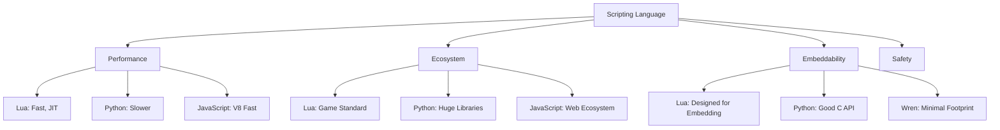
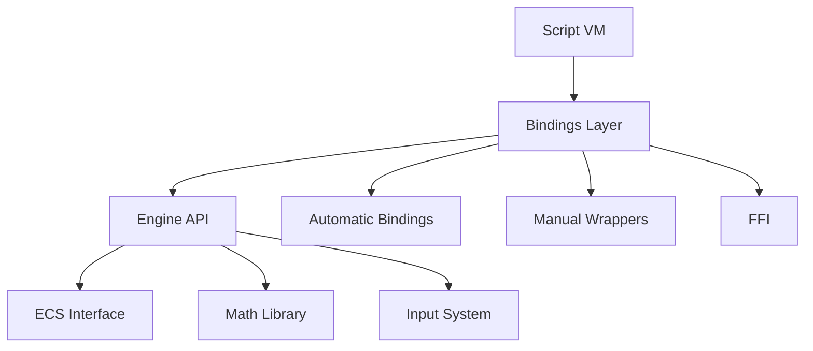
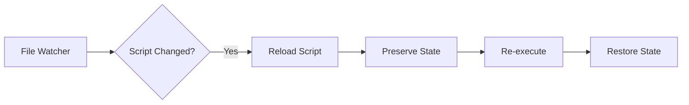

# Module 11: Scripting Integration

**Duration**: 2-3 weeks  
**Complexity**: Intermediate to Advanced

## Abstract

Scripting languages enable rapid iteration and mod support. This module covers embedding scripting runtimes, exposing engine APIs, hot-reload, sandboxing, and performance considerations.

## Language Selection Criteria



### Language Comparison

```
Lua:
    + Designed for embedding
    + Small footprint (~200KB)
    + Fast (especially LuaJIT)
    + Industry standard for games
    - Limited standard library
    - 1-indexed arrays (unusual)

Python:
    + Rich ecosystem
    + Familiar to many
    + Great for tools
    - Large runtime
    - GIL limits parallelism
    - Slower than Lua

JavaScript (V8):
    + Very fast (JIT)
    + Familiar syntax
    + Good debugging tools
    - Large runtime
    - Complex embedding

Wren:
    + Tiny (<4000 LOC)
    + Class-based
    + Fiber support
    - Small community
    - Limited libraries
```

## Embedding Architecture



### VM Initialization

```
INTERFACE ScriptingEngine
    METHOD Initialize(config: ScriptingConfig)
    METHOD Shutdown()
    METHOD LoadScript(name: String, code: String) -> Script
    METHOD ExecuteScript(script: Script) -> Result
    METHOD CallFunction(functionName: String, args: Array<Value>) -> Value
END INTERFACE

TYPE ScriptingConfig
    sandboxLevel: SandboxLevel
    memoryLimit: Integer
    executionTimeout: Float
    enableDebugger: Boolean
END TYPE

ENUM SandboxLevel
    NONE        // Full access
    MODERATE    // Restrict file I/O, networking
    STRICT      // Minimal API, no dangerous functions
END ENUM

CLASS LuaScriptingEngine IMPLEMENTS ScriptingEngine
    DATA vm: LuaState
    DATA loadedScripts: Map<String, Script>
    
    METHOD Initialize(config: ScriptingConfig)
        // Create Lua state
        vm = CreateLuaState()
        
        // Load standard libraries based on sandbox level
        MATCH config.sandboxLevel
            CASE NONE:
                LoadAllStandardLibraries(vm)
            CASE MODERATE:
                LoadLibraries(vm, [BASE, TABLE, STRING, MATH])
            CASE STRICT:
                LoadLibraries(vm, [BASE, TABLE])
        END MATCH
        
        // Register engine bindings
        RegisterEngineAPI(vm)
        
        // Set memory limit
        SetMemoryLimit(vm, config.memoryLimit)
        
        // Set execution timeout
        SetHook(vm, INSTRUCTION_COUNT, config.executionTimeout)
    END METHOD
    
    METHOD LoadScript(name: String, code: String) -> Script
        // Compile script
        script = CompileLua(vm, code, name)
        
        IF script.HasErrors() THEN
            LogError("Script compilation failed: " + script.GetErrors())
            RETURN NULL
        END IF
        
        loadedScripts[name] = script
        RETURN script
    END METHOD
    
    METHOD ExecuteScript(script: Script) -> Result
        // Execute in protected mode (catches errors)
        result = vm.ExecuteProtected(script)
        
        IF NOT result.success THEN
            LogError("Script execution failed: " + result.error)
        END IF
        
        RETURN result
    END METHOD
END CLASS
```

## Engine API Bindings

### Manual Binding Approach

```
// Engine-side function
FUNCTION SpawnEntity(position: Vector3, prefabName: String) -> Entity
    prefab = assetManager.LoadPrefab(prefabName)
    entity = InstantiatePrefab(prefab)
    SetPosition(entity, position)
    RETURN entity
END FUNCTION

// Lua binding
FUNCTION Lua_SpawnEntity(luaState: LuaState) -> Integer
    // Check argument count
    IF GetArgumentCount(luaState) != 2 THEN
        RaiseLuaError(luaState, "SpawnEntity expects 2 arguments")
        RETURN 0
    END IF
    
    // Extract arguments
    position = ToVector3(luaState, argument=1)
    prefabName = ToString(luaState, argument=2)
    
    // Call engine function
    entity = SpawnEntity(position, prefabName)
    
    // Push result
    PushUserData(luaState, entity)
    
    RETURN 1  // Number of return values
END FUNCTION

// Registration
PROCEDURE RegisterEngineAPI(luaState: LuaState)
    RegisterFunction(luaState, "SpawnEntity", Lua_SpawnEntity)
    RegisterFunction(luaState, "DestroyEntity", Lua_DestroyEntity)
    RegisterFunction(luaState, "GetComponent", Lua_GetComponent)
    RegisterFunction(luaState, "SetComponent", Lua_SetComponent)
    // ... more bindings
END PROCEDURE
```

### Type Marshalling

```
FUNCTION ToVector3(luaState: LuaState, index: Integer) -> Vector3
    // Expect table with x, y, z fields
    IF NOT IsTable(luaState, index) THEN
        RaiseLuaError(luaState, "Expected Vector3 table")
    END IF
    
    GetField(luaState, index, "x")
    x = ToNumber(luaState, -1)
    Pop(luaState, 1)
    
    GetField(luaState, index, "y")
    y = ToNumber(luaState, -1)
    Pop(luaState, 1)
    
    GetField(luaState, index, "z")
    z = ToNumber(luaState, -1)
    Pop(luaState, 1)
    
    RETURN Vector3(x, y, z)
END FUNCTION

FUNCTION PushVector3(luaState: LuaState, vec: Vector3)
    CreateTable(luaState)
    
    PushNumber(luaState, vec.x)
    SetField(luaState, -2, "x")
    
    PushNumber(luaState, vec.y)
    SetField(luaState, -2, "y")
    
    PushNumber(luaState, vec.z)
    SetField(luaState, -2, "z")
END FUNCTION
```

### Object-Oriented Binding

```
// Create metatables for engine types
PROCEDURE RegisterEntityMetatable(luaState: LuaState)
    CreateMetatable(luaState, "Entity")
    
    // Methods
    RegisterMethod(luaState, "GetPosition", Entity_GetPosition)
    RegisterMethod(luaState, "SetPosition", Entity_SetPosition)
    RegisterMethod(luaState, "GetComponent", Entity_GetComponent)
    RegisterMethod(luaState, "Destroy", Entity_Destroy)
    
    // Garbage collection
    RegisterMethod(luaState, "__gc", Entity_GC)
    
    Pop(luaState, 1)
END PROCEDURE

// Method implementation
FUNCTION Entity_GetPosition(luaState: LuaState) -> Integer
    // Get 'self' (first argument)
    entity = ToEntity(luaState, 1)
    
    // Call engine function
    transform = GetComponent(entity, Transform)
    position = transform.position
    
    // Return result
    PushVector3(luaState, position)
    RETURN 1
END FUNCTION

// Lua usage:
/*
entity = SpawnEntity(Vector3(0, 0, 0), "Enemy")
pos = entity:GetPosition()  -- Method call syntax
entity:SetPosition(Vector3(10, 0, 5))
*/
```

## ECS Script Bindings

```
PROCEDURE RegisterECSBindings(luaState: LuaState)
    // Entity creation/destruction
    RegisterFunction(luaState, "CreateEntity", Lua_CreateEntity)
    RegisterFunction(luaState, "DestroyEntity", Lua_DestroyEntity)
    
    // Component access
    RegisterFunction(luaState, "AddComponent", Lua_AddComponent)
    RegisterFunction(luaState, "GetComponent", Lua_GetComponent)
    RegisterFunction(luaState, "RemoveComponent", Lua_RemoveComponent)
    RegisterFunction(luaState, "HasComponent", Lua_HasComponent)
    
    // Queries
    RegisterFunction(luaState, "Query", Lua_Query)
END PROCEDURE

// Example: Script query interface
FUNCTION Lua_Query(luaState: LuaState) -> Integer
    // Get component types from arguments
    componentTypes = []
    FOR i = 1 TO GetArgumentCount(luaState) DO
        typeName = ToString(luaState, i)
        componentTypes.Add(GetComponentType(typeName))
    END FOR
    
    // Execute query
    results = []
    QUERY entities WITH componentTypes
    FOR EACH entity IN entities DO
        // Create Lua table with entity and components
        CreateTable(luaState)
        
        PushEntity(luaState, entity)
        SetField(luaState, -2, "entity")
        
        FOR EACH type IN componentTypes DO
            component = GetComponent(entity, type)
            PushComponent(luaState, component)
            SetField(luaState, -2, type.name)
        END FOR
        
        results.Add(luaState, -1)
        Pop(luaState, 1)
    END FOR
    
    // Return array of results
    CreateTable(luaState)
    FOR i = 0 TO results.Length - 1 DO
        PushValue(luaState, results[i])
        RawSetI(luaState, -2, i + 1)  // Lua is 1-indexed
    END FOR
    
    RETURN 1
END PROCEDURE

// Lua usage:
/*
results = Query("Transform", "Health")
for i, result in ipairs(results) do
    local entity = result.entity
    local transform = result.Transform
    local health = result.Health
    
    if health.current <= 0 then
        DestroyEntity(entity)
    end
end
*/
```

## Hot-Reload System



### Hot-Reload Implementation

```
CLASS ScriptHotReload
    DATA watcher: FileWatcher
    DATA scriptStates: Map<String, ScriptState>
    
    METHOD Initialize(watchPath: String)
        watcher = CreateFileWatcher(watchPath)
        watcher.OnFileChanged = OnScriptFileChanged
    END METHOD
    
    METHOD OnScriptFileChanged(filePath: String)
        scriptName = GetScriptName(filePath)
        
        // Capture current state
        state = CaptureScriptState(scriptName)
        scriptStates[scriptName] = state
        
        // Reload script
        code = ReadFile(filePath)
        newScript = scriptEngine.LoadScript(scriptName, code)
        
        IF newScript.HasErrors() THEN
            LogError("Hot-reload failed: " + newScript.GetErrors())
            RETURN
        END IF
        
        // Execute new version
        scriptEngine.ExecuteScript(newScript)
        
        // Restore state
        RestoreScriptState(scriptName, state)
        
        LogInfo("Hot-reloaded: " + scriptName)
    END METHOD
    
    FUNCTION CaptureScriptState(scriptName: String) -> ScriptState
        state = ScriptState()
        
        // Get global variables
        vm.PushGlobal("_G")
        vm.PushNil()
        WHILE vm.Next(-2) DO
            key = vm.ToString(-2)
            
            // Skip built-in functions
            IF IsEngineFunction(key) THEN
                vm.Pop(1)
                CONTINUE
            END IF
            
            // Serialize value
            value = vm.ToValue(-1)
            state.globals[key] = Serialize(value)
            
            vm.Pop(1)
        END WHILE
        vm.Pop(1)
        
        RETURN state
    END FUNCTION
    
    FUNCTION RestoreScriptState(scriptName: String, state: ScriptState)
        FOR EACH (key, value) IN state.globals DO
            deserializedValue = Deserialize(value)
            vm.PushValue(deserializedValue)
            vm.SetGlobal(key)
        END FOR
    END FUNCTION
END CLASS
```

## Sandboxing

```
PROCEDURE SetupSandbox(luaState: LuaState, level: SandboxLevel)
    MATCH level
        CASE STRICT:
            // Remove dangerous functions
            RemoveGlobal(luaState, "dofile")
            RemoveGlobal(luaState, "loadfile")
            RemoveGlobal(luaState, "load")
            RemoveGlobal(luaState, "require")
            
            // Remove I/O
            RemoveGlobal(luaState, "io")
            RemoveGlobal(luaState, "os")
            
            // Remove debug
            RemoveGlobal(luaState, "debug")
            
            // Limit string functions
            GetGlobal(luaState, "string")
            RemoveField(luaState, "dump")
            Pop(luaState, 1)
        
        CASE MODERATE:
            // Allow some I/O but not arbitrary code execution
            RemoveGlobal(luaState, "dofile")
            RemoveGlobal(luaState, "loadfile")
            RemoveGlobal(luaState, "load")
            
            // Restrict os functions
            GetGlobal(luaState, "os")
            RemoveField(luaState, "execute")
            RemoveField(luaState, "exit")
            RemoveField(luaState, "remove")
            RemoveField(luaState, "rename")
            Pop(luaState, 1)
    END MATCH
END PROCEDURE

// Execution time limiting
PROCEDURE SetExecutionTimeout(luaState: LuaState, timeoutSeconds: Float)
    instructionLimit = Floor(timeoutSeconds * INSTRUCTIONS_PER_SECOND)
    
    SetHook(luaState, LAMBDA(state)
        instructionCount++
        
        IF instructionCount > instructionLimit THEN
            RaiseLuaError(state, "Script execution timeout")
        END IF
    END LAMBDA, EVERY_INSTRUCTION)
END PROCEDURE

// Memory limiting
PROCEDURE SetMemoryLimit(luaState: LuaState, maxBytes: Integer)
    SetAllocator(luaState, LAMBDA(userData, pointer, oldSize, newSize)
        IF newSize > 0 THEN
            totalAllocated += (newSize - oldSize)
            
            IF totalAllocated > maxBytes THEN
                RaiseLuaError(luaState, "Script memory limit exceeded")
                RETURN NULL
            END IF
        ELSE
            totalAllocated -= oldSize
        END IF
        
        RETURN Reallocate(pointer, newSize)
    END LAMBDA)
END PROCEDURE
```

## Performance Monitoring

```
TYPE ScriptPerformanceStats
    executionTime: Float
    memoryUsage: Integer
    callCount: Integer
    errors: List<String>
END TYPE

CLASS ScriptProfiler
    DATA stats: Map<String, ScriptPerformanceStats>
    
    METHOD BeginProfile(scriptName: String)
        IF NOT stats.Contains(scriptName) THEN
            stats[scriptName] = ScriptPerformanceStats()
        END IF
        
        currentScript = scriptName
        profileStartTime = GetCurrentTime()
        profileStartMemory = GetScriptMemoryUsage()
    END METHOD
    
    METHOD EndProfile()
        executionTime = GetCurrentTime() - profileStartTime
        memoryUsed = GetScriptMemoryUsage() - profileStartMemory
        
        stat = stats[currentScript]
        stat.executionTime += executionTime
        stat.memoryUsage = MAX(stat.memoryUsage, memoryUsed)
        stat.callCount++
        
        // Warn if slow
        IF executionTime > SLOW_SCRIPT_THRESHOLD THEN
            LogWarning("Slow script: " + currentScript + " took " + executionTime + "ms")
        END IF
    END METHOD
    
    METHOD PrintReport()
        Print("=== Script Performance Report ===")
        
        FOR EACH (name, stat) IN stats DO
            avgTime = stat.executionTime / stat.callCount
            Print(name + ":")
            Print("  Calls: " + stat.callCount)
            Print("  Avg Time: " + FormatTime(avgTime))
            Print("  Total Time: " + FormatTime(stat.executionTime))
            Print("  Peak Memory: " + FormatBytes(stat.memoryUsage))
            
            IF stat.errors.Length > 0 THEN
                Print("  Errors: " + stat.errors.Length)
            END IF
        END FOR
    END METHOD
END CLASS
```

## Script System Integration

```
PROCEDURE ScriptUpdateSystem()
    QUERY entities WITH (ScriptComponent)
    FOR EACH scriptComponent IN entities DO
        // Profile script execution
        profiler.BeginProfile(scriptComponent.scriptName)
        
        // Call update function
        script = scriptComponent.script
        TRY
            scriptEngine.CallFunction(script, "update", [deltaTime])
        CATCH error
            LogError("Script error in " + scriptComponent.scriptName + ": " + error)
            scriptComponent.errors.Add(error)
        END TRY
        
        profiler.EndProfile()
    END FOR
END PROCEDURE

// Script component
TYPE ScriptComponent
    scriptName: String
    script: Script
    errors: List<String>
    enabled: Boolean
END TYPE

// Example script:
/*
-- enemy_ai.lua
local target = nil

function init()
    -- Called once when component added
    target = FindNearestPlayer()
end

function update(dt)
    if target == nil then
        return
    end
    
    local myPos = GetComponent(entity, "Transform").position
    local targetPos = GetComponent(target, "Transform").position
    
    -- Move towards target
    local direction = Normalize(targetPos - myPos)
    local velocity = GetComponent(entity, "Velocity")
    velocity.linear = direction * 5.0
    
    -- Attack if in range
    if Distance(myPos, targetPos) < 2.0 then
        DealDamage(target, 10)
    end
end
*/
```

## Assessment Exercises

1. **Embed Scripting Language**: Initialize Lua/Python VM
2. **Create Bindings**: Expose engine functions to scripts
3. **Implement Hot-Reload**: Watch and reload changed scripts
4. **Sandbox Scripts**: Restrict dangerous operations
5. **Profile Scripts**: Measure execution time and memory
6. **Script Component**: Execute per-entity update scripts

## Key Takeaways

- Scripting enables rapid iteration without recompilation
- Bindings layer bridges script VM and engine code
- Hot-reload preserves state across script changes
- Sandboxing prevents malicious or accidental damage
- Performance monitoring identifies slow scripts
- These patterns apply across Lua, Python, JavaScript, Wren
- Modern engines (Unity C#, Unreal Blueprints) use similar concepts
