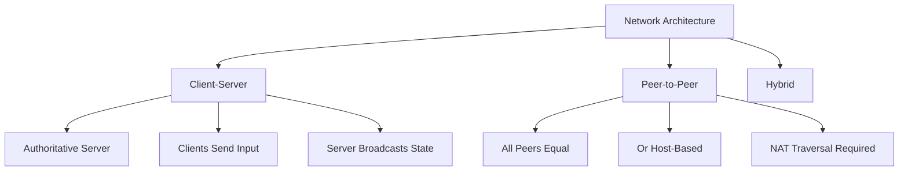
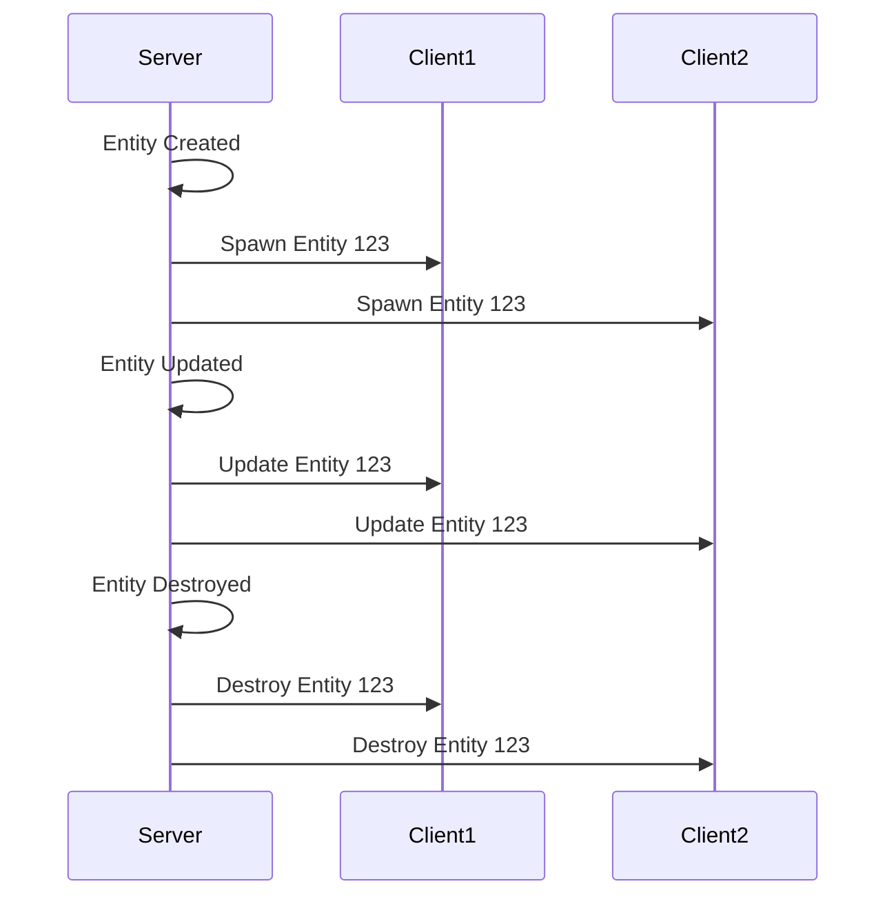
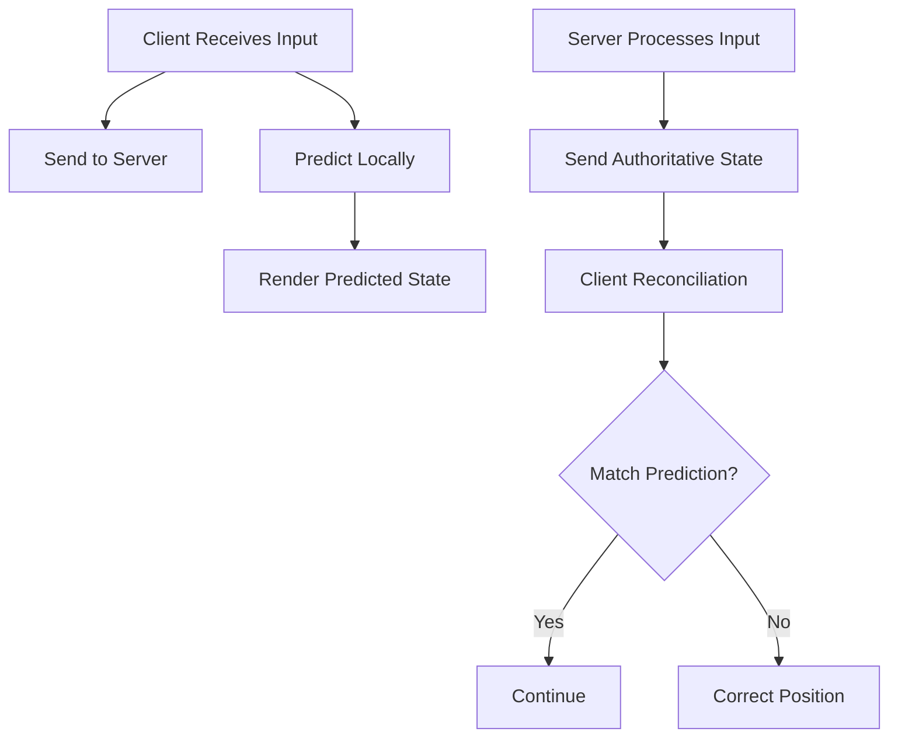
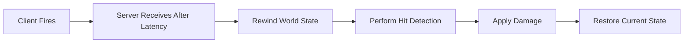

# Module 12: Networking Foundations

**Duration**: 4-5 weeks  
**Complexity**: Advanced

## Abstract

Multiplayer networking synchronizes game state across machines. This module covers network architectures, entity replication, client prediction, lag compensation, and bandwidth optimization.

## Network Architectures



### Client-Server Model

```
INTERFACE NetworkServer
    METHOD Start(port: Integer)
    METHOD Stop()
    METHOD Update()
    METHOD BroadcastMessage(message: NetworkMessage)
    METHOD SendToClient(clientID: Integer, message: NetworkMessage)
    METHOD OnClientConnected(callback: Function)
    METHOD OnClientDisconnected(callback: Function)
END INTERFACE

INTERFACE NetworkClient
    METHOD Connect(address: String, port: Integer)
    METHOD Disconnect()
    METHOD Update()
    METHOD SendMessage(message: NetworkMessage)
    METHOD OnConnected(callback: Function)
    METHOD OnDisconnected(callback: Function)
    METHOD OnMessageReceived(callback: Function)
END INTERFACE

// Server architecture
CLASS GameServer
    DATA server: NetworkServer
    DATA connectedClients: Map<Integer, ClientInfo>
    DATA world: GameWorld
    
    METHOD Initialize()
        server.OnClientConnected = OnClientJoined
        server.OnClientDisconnected = OnClientLeft
        server.Start(DEFAULT_PORT)
    END METHOD
    
    METHOD Update(deltaTime: Float)
        // Process client inputs
        server.Update()
        
        // Simulate world
        UpdatePhysics(deltaTime)
        UpdateGameLogic(deltaTime)
        
        // Broadcast state to clients
        BroadcastWorldState()
    END METHOD
    
    METHOD OnClientJoined(clientID: Integer)
        client = ClientInfo(clientID)
        connectedClients[clientID] = client
        
        // Send initial state
        SendWorldSnapshot(clientID)
        
        // Notify other clients
        BroadcastMessage(PlayerJoinedMessage(clientID))
    END METHOD
    
    METHOD BroadcastWorldState()
        state = SerializeWorldState(world)
        
        FOR EACH (clientID, client) IN connectedClients DO
            // Cull irrelevant entities
            relevantState = CullStateForClient(state, client)
            SendToClient(clientID, StateUpdateMessage(relevantState))
        END FOR
    END METHOD
END CLASS

// Client architecture
CLASS GameClient
    DATA client: NetworkClient
    DATA localWorld: GameWorld
    DATA serverTime: Float
    DATA inputBuffer: Queue<InputCommand>
    
    METHOD Initialize()
        client.OnConnected = OnConnectedToServer
        client.OnMessageReceived = OnMessageFromServer
        client.Connect(SERVER_ADDRESS, SERVER_PORT)
    END METHOD
    
    METHOD Update(deltaTime: Float)
        client.Update()
        
        // Capture input
        input = CapturePlayerInput()
        inputBuffer.Enqueue(input)
        
        // Send to server
        client.SendMessage(InputMessage(input))
        
        // Client prediction
        PredictLocalState(input, deltaTime)
    END METHOD
    
    METHOD OnMessageFromServer(message: NetworkMessage)
        MATCH message.type
            CASE STATE_UPDATE:
                ApplyServerState(message.state)
                ReconcileWithPrediction()
            
            CASE PLAYER_JOINED:
                SpawnPlayer(message.playerID)
            
            CASE PLAYER_LEFT:
                DespawnPlayer(message.playerID)
        END MATCH
    END METHOD
END CLASS
```

## Entity Replication



### Replication System

```
TYPE ReplicatedEntity
    networkID: Integer
    ownerClientID: Integer
    components: Map<ComponentType, ReplicatedComponent>
END TYPE

INTERFACE ReplicatedComponent
    METHOD Serialize() -> ByteArray
    METHOD Deserialize(data: ByteArray)
    METHOD ShouldReplicate() -> Boolean
END INTERFACE

CLASS ReplicationRegistry
    DATA replicatedTypes: Map<ComponentType, ReplicationInfo>
    
    METHOD RegisterComponent(type: ComponentType, info: ReplicationInfo)
        replicatedTypes[type] = info
    END METHOD
    
    METHOD IsReplicated(type: ComponentType) -> Boolean
        RETURN replicatedTypes.Contains(type)
    END METHOD
END CLASS

TYPE ReplicationInfo
    serializeFunc: Function
    deserializeFunc: Function
    replicateToOwner: Boolean
    updateRate: Float  // Hz
END TYPE

// Server-side replication
PROCEDURE ServerReplicationSystem()
    currentTime = GetServerTime()
    
    QUERY entities WITH (NetworkID, Transform)
    FOR EACH (networkID, transform) IN entities DO
        entity = transform.GetEntity()
        
        // Determine which clients need updates
        FOR EACH (clientID, client) IN connectedClients DO
            // Check if relevant to this client
            IF NOT IsRelevantToClient(entity, client) THEN
                CONTINUE
            END IF
            
            // Check if time to update
            lastUpdate = client.lastEntityUpdate[networkID.id]
            IF currentTime - lastUpdate < 1.0 / UPDATE_RATE THEN
                CONTINUE
            END IF
            
            // Serialize entity state
            state = SerializeEntityState(entity)
            
            // Send update
            SendToClient(clientID, EntityUpdateMessage(networkID.id, state))
            client.lastEntityUpdate[networkID.id] = currentTime
        END FOR
    END FOR
END PROCEDURE

// Client-side receiving
PROCEDURE OnEntityUpdate(message: EntityUpdateMessage)
    networkID = message.networkID
    
    // Find or create local entity
    entity = networkEntities.Get(networkID)
    IF entity IS NULL THEN
        entity = CreateEntity()
        AddComponent(entity, NetworkID, NetworkID(networkID))
        networkEntities[networkID] = entity
    END IF
    
    // Deserialize and apply state
    DeserializeEntityState(entity, message.state)
END PROCEDURE
```

### Delta Compression

```
TYPE EntitySnapshot
    networkID: Integer
    timestamp: Float
    components: Map<ComponentType, ByteArray>
END TYPE

FUNCTION DeltaCompress(baseline: EntitySnapshot, current: EntitySnapshot) -> ByteArray
    delta = ByteArrayWriter()
    
    delta.WriteInt(current.networkID)
    delta.WriteFloat(current.timestamp)
    
    // Only send changed components
    FOR EACH (type, currentData) IN current.components DO
        IF NOT baseline.components.Contains(type) THEN
            // New component
            delta.WriteByte(COMPONENT_ADDED)
            delta.WriteComponentType(type)
            delta.WriteBytes(currentData)
        ELSE
            baselineData = baseline.components[type]
            
            IF currentData != baselineData THEN
                // Changed component
                delta.WriteByte(COMPONENT_CHANGED)
                delta.WriteComponentType(type)
                
                // Write diff
                diff = ComputeDiff(baselineData, currentData)
                delta.WriteBytes(diff)
            END IF
        END IF
    END FOR
    
    // Detect removed components
    FOR EACH (type, _) IN baseline.components DO
        IF NOT current.components.Contains(type) THEN
            delta.WriteByte(COMPONENT_REMOVED)
            delta.WriteComponentType(type)
        END IF
    END FOR
    
    RETURN delta.ToByteArray()
END FUNCTION
```

## Client Prediction



### Prediction Implementation

```
TYPE InputCommand
    sequence: Integer
    timestamp: Float
    moveDirection: Vector2
    actions: Set<PlayerAction>
END TYPE

CLASS ClientPrediction
    DATA pendingInputs: Queue<InputCommand>
    DATA nextSequence: Integer = 0
    DATA lastServerState: EntitySnapshot
    DATA lastServerSequence: Integer = 0
    
    METHOD SendInput(moveDirection: Vector2, actions: Set<PlayerAction>)
        input = InputCommand(
            sequence = nextSequence++,
            timestamp = GetClientTime(),
            moveDirection = moveDirection,
            actions = actions
        )
        
        // Send to server
        client.SendMessage(InputMessage(input))
        
        // Store for reconciliation
        pendingInputs.Enqueue(input)
        
        // Apply locally (prediction)
        ApplyInput(localPlayer, input, deltaTime)
    END METHOD
    
    METHOD OnServerStateUpdate(state: EntitySnapshot, lastProcessedSequence: Integer)
        lastServerState = state
        lastServerSequence = lastProcessedSequence
        
        // Remove acknowledged inputs
        WHILE NOT pendingInputs.IsEmpty() AND 
              pendingInputs.Peek().sequence <= lastProcessedSequence DO
            pendingInputs.Dequeue()
        END WHILE
        
        // Reconcile: replay unacknowledged inputs
        Reconcile()
    END METHOD
    
    METHOD Reconcile()
        // Start from server state
        playerState = lastServerState
        
        // Re-apply pending inputs
        FOR EACH input IN pendingInputs DO
            playerState = SimulateInput(playerState, input, FIXED_DT)
        END FOR
        
        // Apply reconciled state
        ApplyState(localPlayer, playerState)
    END METHOD
END CLASS

FUNCTION SimulateInput(state: EntitySnapshot, input: InputCommand, dt: Float) -> EntitySnapshot
    // Replicate server physics simulation
    newState = state.Clone()
    
    // Apply movement
    velocity = input.moveDirection * MOVE_SPEED
    newState.position += velocity * dt
    
    // Apply actions
    IF input.actions.Contains(JUMP) AND newState.isGrounded THEN
        newState.velocity.y = JUMP_FORCE
    END IF
    
    // Physics integration
    newState.velocity.y += GRAVITY * dt
    newState.position += newState.velocity * dt
    
    RETURN newState
END FUNCTION
```

## Server Reconciliation

```
CLASS ServerSimulation
    DATA clientInputBuffers: Map<Integer, Queue<InputCommand>>
    DATA lastProcessedSequence: Map<Integer, Integer>
    
    METHOD OnClientInput(clientID: Integer, input: InputCommand)
        // Buffer input
        IF NOT clientInputBuffers.Contains(clientID) THEN
            clientInputBuffers[clientID] = Queue()
        END IF
        
        clientInputBuffers[clientID].Enqueue(input)
    END METHOD
    
    METHOD Update(deltaTime: Float)
        // Process inputs for all clients
        FOR EACH (clientID, inputBuffer) IN clientInputBuffers DO
            WHILE NOT inputBuffer.IsEmpty() DO
                input = inputBuffer.Dequeue()
                
                // Apply to player entity
                player = GetPlayerEntity(clientID)
                ApplyInput(player, input, FIXED_DT)
                
                lastProcessedSequence[clientID] = input.sequence
            END FOR
        END FOR
        
        // Physics simulation
        StepPhysics(deltaTime)
        
        // Send state updates
        BroadcastState()
    END METHOD
    
    METHOD BroadcastState()
        FOR EACH (clientID, client) IN connectedClients DO
            player = GetPlayerEntity(clientID)
            state = SerializePlayerState(player)
            
            SendToClient(clientID, StateUpdateMessage(
                state = state,
                lastProcessedSequence = lastProcessedSequence[clientID]
            ))
        END FOR
    END METHOD
END CLASS
```

## Lag Compensation



### Rewind Implementation

```
CLASS LagCompensation
    DATA stateHistory: CircularBuffer<WorldSnapshot>
    DATA maxHistoryTime: Float = 1.0  // 1 second
    
    METHOD RecordState()
        snapshot = CaptureWorldSnapshot()
        stateHistory.Add(snapshot)
        
        // Remove old snapshots
        cutoffTime = GetServerTime() - maxHistoryTime
        WHILE stateHistory.Oldest().timestamp < cutoffTime DO
            stateHistory.RemoveOldest()
        END WHILE
    END METHOD
    
    METHOD PerformLagCompensatedAction(clientID: Integer, action: PlayerAction)
        client = connectedClients[clientID]
        targetTime = GetServerTime() - client.latency
        
        // Find closest historical state
        snapshot = FindClosestSnapshot(targetTime)
        
        // Rewind world
        currentState = CaptureWorldSnapshot()
        RestoreWorldSnapshot(snapshot)
        
        // Perform action (e.g., raycast for shooting)
        result = ProcessAction(action)
        
        // Restore current state
        RestoreWorldSnapshot(currentState)
        
        // Apply result (damage, etc.)
        IF result.hit THEN
            ApplyDamage(result.target, action.damage)
        END IF
    END METHOD
    
    FUNCTION FindClosestSnapshot(targetTime: Float) -> WorldSnapshot
        closest = stateHistory.First()
        minDelta = Abs(closest.timestamp - targetTime)
        
        FOR EACH snapshot IN stateHistory DO
            delta = Abs(snapshot.timestamp - targetTime)
            IF delta < minDelta THEN
                minDelta = delta
                closest = snapshot
            END IF
        END FOR
        
        RETURN closest
    END FUNCTION
END CLASS

TYPE WorldSnapshot
    timestamp: Float
    entities: Map<Entity, EntityState>
END TYPE

TYPE EntityState
    position: Vector3
    rotation: Quaternion
    velocity: Vector3
END TYPE
```

## Interpolation and Extrapolation

```
CLASS EntityInterpolation
    DATA snapshots: CircularBuffer<EntitySnapshot>
    DATA interpolationDelay: Float = 0.1  // 100ms
    
    METHOD AddSnapshot(snapshot: EntitySnapshot)
        snapshots.Add(snapshot)
        
        // Keep only recent snapshots
        WHILE snapshots.Count > 10 DO
            snapshots.RemoveOldest()
        END WHILE
    END METHOD
    
    METHOD GetInterpolatedState(currentTime: Float) -> EntityState
        // Interpolate between two snapshots
        renderTime = currentTime - interpolationDelay
        
        // Find snapshots to interpolate between
        from = NULL
        to = NULL
        
        FOR i = 0 TO snapshots.Count - 2 DO
            IF snapshots[i].timestamp <= renderTime AND
               snapshots[i + 1].timestamp >= renderTime THEN
                from = snapshots[i]
                to = snapshots[i + 1]
                BREAK
            END IF
        END FOR
        
        IF from IS NULL OR to IS NULL THEN
            // Fallback to latest
            RETURN snapshots.Latest()
        END IF
        
        // Interpolate
        duration = to.timestamp - from.timestamp
        t = (renderTime - from.timestamp) / duration
        
        RETURN InterpolateStates(from, to, t)
    END METHOD
END CLASS

FUNCTION InterpolateStates(from: EntityState, to: EntityState, t: Float) -> EntityState
    RETURN EntityState(
        position = Lerp(from.position, to.position, t),
        rotation = Slerp(from.rotation, to.rotation, t),
        velocity = Lerp(from.velocity, to.velocity, t)
    )
END FUNCTION

// Extrapolation for high latency
FUNCTION ExtrapolateState(latest: EntityState, deltaTime: Float) -> EntityState
    // Simple dead reckoning
    RETURN EntityState(
        position = latest.position + latest.velocity * deltaTime,
        rotation = latest.rotation,
        velocity = latest.velocity
    )
END FUNCTION
```

## Bandwidth Optimization

### Quantization

```
FUNCTION QuantizePosition(position: Vector3, precision: Float) -> ByteArray
    // Encode position with reduced precision
    quantizedX = Floor(position.x / precision)
    quantizedY = Floor(position.y / precision)
    quantizedZ = Floor(position.z / precision)
    
    buffer = ByteArrayWriter()
    buffer.WriteInt16(quantizedX)
    buffer.WriteInt16(quantizedY)
    buffer.WriteInt16(quantizedZ)
    
    RETURN buffer.ToByteArray()
END FUNCTION

FUNCTION DequantizePosition(data: ByteArray, precision: Float) -> Vector3
    reader = ByteArrayReader(data)
    quantizedX = reader.ReadInt16()
    quantizedY = reader.ReadInt16()
    quantizedZ = reader.ReadInt16()
    
    RETURN Vector3(
        quantizedX * precision,
        quantizedY * precision,
        quantizedZ * precision
    )
END FUNCTION

FUNCTION QuantizeQuaternion(quat: Quaternion) -> ByteArray
    // Smallest three components encoding
    largestIndex = FindLargestComponent(quat)
    
    buffer = ByteArrayWriter()
    buffer.WriteBits(largestIndex, 2)  // 2 bits for index
    
    // Write three smallest components (16 bits each)
    FOR i = 0 TO 3 DO
        IF i == largestIndex THEN
            CONTINUE
        END IF
        
        value = quat[i]
        quantized = Floor(value * 32767)  // 16-bit signed
        buffer.WriteInt16(quantized)
    END FOR
    
    RETURN buffer.ToByteArray()
END FUNCTION
```

### Relevancy Filtering

```
FUNCTION IsRelevantToClient(entity: Entity, client: ClientInfo) -> Boolean
    playerPos = client.playerEntity.position
    entityPos = entity.transform.position
    
    distance = Distance(playerPos, entityPos)
    
    // Distance-based relevancy
    IF distance > MAX_RELEVANCY_DISTANCE THEN
        RETURN false
    END IF
    
    // Visibility-based relevancy
    IF NOT IsInViewFrustum(entityPos, client.viewFrustum) THEN
        RETURN false
    END IF
    
    // Interest-based relevancy
    IF entity.team == client.team THEN
        RETURN true  // Always relevant
    END IF
    
    RETURN true
END FUNCTION
```

## Network Profiling

```
TYPE NetworkStats
    bytesSent: Integer
    bytesReceived: Integer
    packetsSent: Integer
    packetsReceived: Integer
    averageLatency: Float
    packetLoss: Float
END TYPE

CLASS NetworkProfiler
    DATA stats: NetworkStats
    DATA sampleWindow: CircularBuffer<Sample>
    
    METHOD RecordSend(bytes: Integer)
        stats.bytesSent += bytes
        stats.packetsSent++
    END METHOD
    
    METHOD RecordReceive(bytes: Integer, latency: Float)
        stats.bytesReceived += bytes
        stats.packetsReceived++
        
        sample = Sample(timestamp=Now(), latency=latency)
        sampleWindow.Add(sample)
        
        UpdateAverages()
    END METHOD
    
    METHOD UpdateAverages()
        // Calculate average latency
        totalLatency = 0.0
        FOR EACH sample IN sampleWindow DO
            totalLatency += sample.latency
        END FOR
        stats.averageLatency = totalLatency / sampleWindow.Count
        
        // Estimate packet loss (simplified)
        expectedPackets = stats.packetsSent
        receivedPackets = stats.packetsReceived
        stats.packetLoss = 1.0 - (receivedPackets / expectedPackets)
    END METHOD
    
    METHOD PrintReport()
        Print("=== Network Statistics ===")
        Print("Bandwidth:")
        Print("  Sent: " + FormatBytes(stats.bytesSent) + " (" + stats.packetsSent + " packets)")
        Print("  Received: " + FormatBytes(stats.bytesReceived) + " (" + stats.packetsReceived + " packets)")
        Print("Latency:")
        Print("  Average: " + stats.averageLatency + "ms")
        Print("Packet Loss: " + (stats.packetLoss * 100) + "%")
    END METHOD
END CLASS
```

## Assessment Exercises

1. **Implement Client-Server**: Basic connection and messaging
2. **Entity Replication**: Sync transform components
3. **Client Prediction**: Local simulation with reconciliation
4. **Lag Compensation**: Rewind hit detection
5. **Interpolation**: Smooth remote entity movement
6. **Bandwidth Optimization**: Quantization and delta compression

## Key Takeaways

- Client-server provides authoritative game state
- Entity replication synchronizes game objects across network
- Client prediction maintains responsiveness despite latency
- Server reconciliation ensures authoritative simulation
- Lag compensation makes shooting feel fair
- Interpolation smooths network jitter
- Bandwidth optimization critical for scalability
- These patterns apply to all multiplayer games (FPS, MOBA, MMO)
