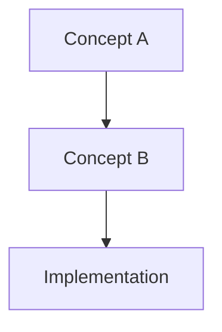

# Course Modules - Universal Concepts

This directory contains language-agnostic educational modules for game engine architecture. Each module focuses on **fundamental concepts** that apply across all programming languages, platforms, and engines.

## Module Structure

Each module follows a consistent structure:

1. **Abstract**: High-level overview of the concept
2. **Conceptual Models**: Architecture diagrams (Mermaid.js)
3. **Abstract Interfaces**: Language-independent API designs
4. **Algorithms**: Pseudocode implementations
5. **Patterns**: Reusable design patterns
6. **Assessment Exercises**: Hands-on learning tasks
7. **Key Takeaways**: Essential principles

## Module List

### Foundation (Beginner)

- [Module 1: Game Loop Fundamentals](01-game-loop-fundamentals.md)
  - Timestep strategies (fixed, variable, semi-fixed)
  - Event processing patterns
  - Frame budgeting and synchronization

- [Module 8: Input Abstraction](08-input-abstraction.md)
  - Device abstraction
  - Action mapping systems
  - Multi-device support

### Core Systems (Intermediate)

- [Module 2: Rendering Architecture Patterns](02-rendering-architecture-patterns.md)
  - Command buffer patterns
  - Pipeline state management
  - Render pass organization

- [Module 3: Entity Management Systems](03-entity-management-systems.md)
  - ECS architecture
  - Archetype-based storage
  - Query patterns and parallel execution

- [Module 4: Transform Hierarchies](04-transform-hierarchies.md)
  - Coordinate space transformations
  - Hierarchy propagation strategies
  - Quaternion mathematics

- [Module 6: Asset Pipeline Design](06-asset-pipeline-design.md)
  - File format parsing
  - Asynchronous loading
  - Hot-reload systems

- [Module 7: Memory Management Patterns](07-memory-management-patterns.md)
  - GPU memory types
  - Allocation strategies
  - Cache optimization

- [Module 9: Audio Architectures](09-audio-architectures.md)
  - 3D spatial audio
  - Mixing and effects
  - Streaming systems

### Advanced Systems

- [Module 5: Physics Integration Strategies](05-physics-integration-strategies.md)
  - Collision detection pipeline
  - Constraint solving
  - ECS-physics synchronization

- [Module 10: Editor Architecture](10-editor-architecture.md)
  - Undo/redo (command pattern)
  - Selection and gizmos
  - Scene serialization

- [Module 11: Scripting Integration](11-scripting-integration.md)
  - VM embedding
  - Engine bindings
  - Hot-reload and sandboxing

- [Module 12: Networking Foundations](12-networking-foundations.md)
  - Client-server architecture
  - Entity replication
  - Client prediction and lag compensation

## Learning Paths

### For Graphics Programmers
**Primary**: Modules 2, 4, 7  
**Secondary**: Modules 1, 3, 5  
**Optional**: All others

### For Gameplay Programmers
**Primary**: Modules 3, 5, 8, 11  
**Secondary**: Modules 1, 4, 6  
**Optional**: All others

### For Engine Architects
**All modules recommended**, suggested order:
1 → 3 → 4 → 2 → 7 → 5 → 6 → 8 → 9 → 11 → 10 → 12

### For Technical Artists
**Primary**: Modules 6, 10  
**Secondary**: Modules 2, 4, 8, 11  
**Optional**: All others

## How to Use These Modules

### 1. **Language-Agnostic Learning**
All code examples use **pseudocode** rather than specific programming languages. This ensures concepts are transferable to:
- Rust (Praxis reference implementation)
- C++ (Unreal, custom engines)
- C# (Unity, custom engines)
- Any other language

### 2. **Concept First, Implementation Second**
- Study the **abstract interfaces** to understand what a system should do
- Review **architecture diagrams** to see how components interact
- Read **algorithm pseudocode** to understand the "how"
- Only then look at Praxis (or other) concrete implementations

### 3. **Progressive Complexity**
Each module includes:
- **Beginner sections**: Core concepts everyone must understand
- **Intermediate sections**: Production patterns and optimizations
- **Advanced sections**: Edge cases and specialized techniques

### 4. **Practical Exercises**
Complete the **Assessment Exercises** at the end of each module to:
- Solidify understanding through implementation
- Identify gaps in comprehension
- Build a portfolio of engine components

### 5. **Cross-Reference with Praxis**
While modules are language-agnostic, each includes "Praxis Implementation Reference" sections showing:
- Where to find concrete examples in the Praxis codebase
- How Rust-specific features enable the patterns
- Performance characteristics in a real engine

## Pedagogical Approach

### Universal Patterns
These modules teach **patterns**, not **code**:
- ✅ How entity-component systems organize data
- ✅ Why fixed timesteps ensure deterministic physics
- ✅ When to use delta compression in networking
- ❌ Specific syntax of Rust/C++/C#
- ❌ Framework-specific APIs

### Conceptual Understanding
Focus on **why** and **what**, not just **how**:
- **Why** do we need transform hierarchies? (Coordinate space relationships)
- **What** problem does client prediction solve? (Input latency in multiplayer)
- **How** is implementation-dependent (language, framework, performance needs)

### Industry Relevance
All patterns are **battle-tested** in production engines:
- Unity uses similar ECS in DOTS
- Unreal uses command pattern for undo/redo
- Source engine pioneered lag compensation
- Every modern engine has transform hierarchies

## Module Format

### Mermaid Diagrams
Architecture and flow diagrams use [Mermaid.js](https://mermaid.js.org/) syntax:



These render automatically on GitHub and in many Markdown viewers.

### Pseudocode Conventions

```
// Variables
DATA variableName: Type
CONSTANT CONSTANT_NAME = value

// Functions
FUNCTION FunctionName(param: Type) -> ReturnType
    // Implementation
    RETURN value
END FUNCTION

// Procedures (no return value)
PROCEDURE ProcedureName(param: Type)
    // Implementation
END PROCEDURE

// Control flow
IF condition THEN
    // ...
ELSE IF otherCondition THEN
    // ...
ELSE
    // ...
END IF

WHILE condition DO
    // ...
END WHILE

FOR i = 0 TO count DO
    // ...
END FOR

FOR EACH item IN collection DO
    // ...
END FOR

MATCH value
    CASE pattern1:
        // ...
    CASE pattern2:
        // ...
    DEFAULT:
        // ...
END MATCH

// Types
TYPE TypeName
    field1: Type
    field2: Type
END TYPE

INTERFACE InterfaceName
    METHOD MethodName(param: Type) -> ReturnType
    PROPERTY propertyName: Type
END INTERFACE

CLASS ClassName IMPLEMENTS InterfaceName
    DATA privateField: Type
    
    METHOD MethodName(param: Type) -> ReturnType
        // Implementation
    END METHOD
END CLASS
```

### Interface Definitions
Abstract interfaces define **contracts** without implementation details:

```
INTERFACE PhysicsWorld
    METHOD Step(deltaTime: Float)
    METHOD AddBody(body: RigidBody)
    METHOD RemoveBody(body: RigidBody)
    METHOD Raycast(origin: Vector3, direction: Vector3, distance: Float) -> Hit
END INTERFACE
```

This approach:
- ✅ Focuses on **what** the system provides
- ✅ Allows multiple implementations (Rapier, PhysX, Bullet, custom)
- ✅ Makes testing easier (mock implementations)
- ✅ Documents expected behavior

## Contributing

When adding or updating modules:

1. **Maintain Language Neutrality**: No language-specific syntax in core explanations
2. **Provide Context**: Explain **why** a pattern exists, not just **how** to implement it
3. **Use Visual Aids**: Mermaid diagrams for architecture, flow, state machines
4. **Include Trade-offs**: Discuss when to use (and not use) each approach
5. **Add Exercises**: Practical tasks that reinforce learning
6. **Cross-Reference**: Link related concepts across modules

## Additional Resources

- **Main Curriculum**: [docs/course/CURRICULUM.md](../CURRICULUM.md)
- **Praxis Documentation**: [docs/README.md](../../README.md)
- **Architecture Overview**: [docs/architecture.md](../../architecture.md)
- **Reference Documentation**: [docs/reference/](../../reference/)

## Glossary

Quick reference for terminology used across modules:

| Term | Definition |
|------|------------|
| **Entity** | Unique identifier for a game object |
| **Component** | Data attached to an entity |
| **System** | Logic that operates on components |
| **Archetype** | Set of entities with identical component types |
| **Transform** | Position, rotation, and scale in 3D space |
| **Pipeline** | Sequence of GPU operations |
| **Descriptor** | Binding of resources to shaders |
| **Uniform** | Read-only data passed to shaders |
| **Replication** | Synchronizing data across network |
| **Timestep** | Time increment per simulation update |

---

**Note**: These modules are living documents. As game engine techniques evolve and Praxis grows, modules will be updated to reflect current best practices while maintaining their language-agnostic focus.
