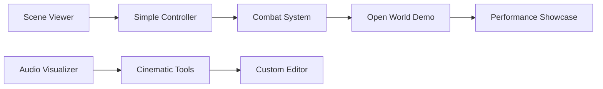

# Projects

Complete project walkthroughs from simple demos to full games. Build real applications while learning engine architecture.

## Project Catalog

### Beginner Projects
Beginner

  

    <h3>🎨 Scene Viewer</h3>
    
<strong>Duration:</strong> 1 week

    
Load and display 3D models with basic camera controls and lighting.

    
<strong>Skills:</strong> Rendering, Camera, Input

  

  
  

    <h3>🎵 Audio Visualizer</h3>
    
<strong>Duration:</strong> 1 week

    
Visualize audio playback with animated meshes.

    
<strong>Skills:</strong> Audio, Animation, Rendering

  

  
  

    <h3>🎮 Simple Controller</h3>
    
<strong>Duration:</strong> 1 week

    
Character with physics-based movement.

    
<strong>Skills:</strong> Physics, Input, Animation

  

### Intermediate Projects
Intermediate

  

    <h3>🌲 Open World Demo</h3>
    
<strong>Duration:</strong> 2-3 weeks

    
Large outdoor scene with terrain, trees, and optimizations.

    
<strong>Skills:</strong> LOD, Culling, Terrain, Streaming

  

  
  

    <h3>🤺 Combat System</h3>
    
<strong>Duration:</strong> 2 weeks

    
Melee combat with hitboxes, combos, and animations.

    
<strong>Skills:</strong> Animation, Physics, Input, AI

  

  
  

    <h3>🎬 Cinematic Tools</h3>
    
<strong>Duration:</strong> 2 weeks

    
Camera sequencer and timeline editor.

    
<strong>Skills:</strong> Editor, Animation, Rendering

  

### Advanced Projects
Advanced

  

    <h3>🌐 Multiplayer Game</h3>
    
<strong>Duration:</strong> 4-6 weeks

    
Complete networked game with client-server architecture.

    
<strong>Skills:</strong> Networking, Replication, Lag Comp

  

  
  

    <h3>🎯 Performance Showcase</h3>
    
<strong>Duration:</strong> 3-4 weeks

    
Optimized demo rendering 100,000+ objects at 60 FPS.

    
<strong>Skills:</strong> GPU Culling, Instancing, Compute

  

  
  

    <h3>🛠️ Custom Editor</h3>
    
<strong>Duration:</strong> 4-5 weeks

    
Build a complete level editor from scratch.

    
<strong>Skills:</strong> Editor, Serialization, Tools

  

## Project Structure

Each project includes:

1. **Overview** - Project goals and scope
2. **Prerequisites** - Required knowledge
3. **Architecture** - System design
4. **Implementation** - Step-by-step guide
5. **Testing** - How to verify it works
6. **Extensions** - Ideas for expansion

## Multi-Language Projects

Projects include complete implementations in:

- **Rust (Praxis)** - Full reference implementation
- **C++ (Unreal-style)** - OOP approach
- **C# (Unity-style)** - Component-based approach

## Learning Outcomes

### Beginner Projects
After completing beginner projects, you can:

- ✅ Render 3D scenes with lighting
- ✅ Handle user input
- ✅ Implement basic physics
- ✅ Play audio and animations

### Intermediate Projects
After intermediate projects, you can:

- ✅ Optimize for performance
- ✅ Build complex game mechanics
- ✅ Create editor tools
- ✅ Implement advanced graphics

### Advanced Projects
After advanced projects, you can:

- ✅ Architect complete systems
- ✅ Build networked applications
- ✅ Optimize at scale
- ✅ Create production-quality tools

## Recommended Path

## Gallery

!!! info "Coming Soon"
    Project screenshots and videos will be added as implementations are completed.

## Sharing Your Work

Completed a project? Share it!

1. Post screenshots/videos
2. Write a devlog
3. Submit to the community showcase
4. Help others learn from your experience

---

  
<strong>Ready to build?</strong>

  
Projects are being developed. Start with <a href="../exercises/">exercises</a> for now!

